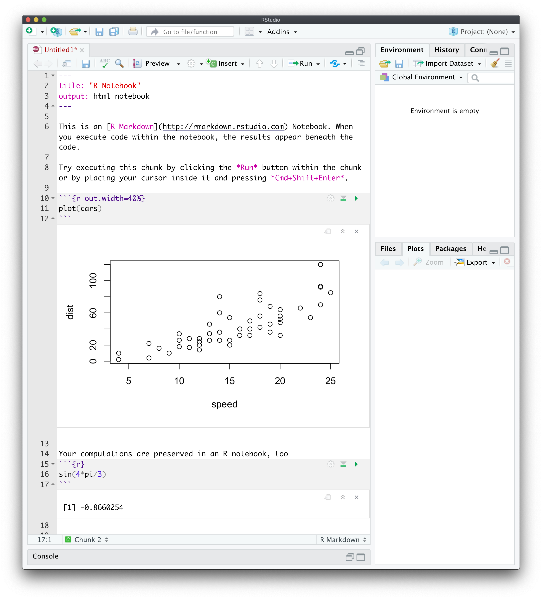

--- 
title: Lecture notes for \"Introduction to Stochastic Processes\"
author: "Gordan Zitkovic"
date: "last updated -  `r Sys.Date()`"
documentclass: book
github-repo: gordanz/M362M
description: "A set of lecture notes for *M362M: Introduction to Stochastic Processes*"
site: bookdown::bookdown_site
output: 
  bookdown::gitbook
---
```{r include=FALSE, cache=FALSE}
## To be loaded before each chapter
rm(list = ls(all = TRUE))
library(knitr)
library(tidyverse)
library(kableExtra)
library(lanci)

knitr::opts_chunk$set(
  collapse = TRUE,
  cache = TRUE,
  fig.align="center",
  fig.pos="t",
  strip.white = TRUE,
  tidy = TRUE
  )
set.seed(2016)
# options(digits = 4)
options(dplyr.print_min = 4, dplyr.print_max = 4)
```


# Preface {-}


This is an always-evolving set of lecture notes for **Introduction to Stochastic Processes (M362M)**. It should start with me explaining what stochastic processes are. Instead, here is a list of several questions you will be able to give answers to when you complete this course. 


**Question 1** In a simplistic model, the price of a  share of a stock goes either up or down by $\$1$ each day, with probability $1/2$. You own a single share whose value today is $\$100$, so that its tomorrow's price will be $\$101$ or $\$99$ with probability $1/2$, etc. Your strategy is to hold onto your share until one of the following two things happen: you go bankrupt (the stock price hits $0$), or you make a $\$50$ dollar profit (the stock price hits $\$150$.) 

1. How likely is it that you will make a profit before you go bankrupt?
2. How long will it take? 
3. Is it possible that it takes forever, i.e., that the stock price hovers between $\$1$ and $\$149$ forever? 

**Question 2.** A person carrying a certain disease infects a random number of people in a week, and then stops being infectious. Each of the infected people transmits the disease in the same way, etc. Suppose that the number of people each (infectious) individual infects is either $0$, $1$ or $2$ or $3$, each with probability $1/4$  and that different infectious individuals may infect different number of people and behave independently of each other.

1. What is the probability that the disease will ever be eradicated?
2. What is the probability that every single individual in the  population of $328,000,000$ will eventually be infected?

**Question 3.** In a game of tennis, Player $1$ wins against Player $2$ in each rally (the smallest chunk of the match that leads to point, i.e., to a score change from $15-30$ to $30-30$, for example) with probability $p$. 
What is the probability that Player $1$ wins 

1. a game (the chunk of the match that leads to a score change such as $5-3$ to $6-3$ within a set)?
2. a set? the entire match?
4. Is the game of tennis set up in such a way that is *amplifies* or *reduces* the difference in skill between players?

```{r echo=FALSE, out.width= "35%", out.extra='style="float:right; padding:10px"'}
knitr::include_graphics('pics/knight1.png')
```

**Question 4.** 
A knight starts in the lower left corner of the chess board and starts moving ``randomly''. That means that from any position, it chooses one of the possible (legal) moves and takes it, with all legal moves having the same probability. It keeps doing the same thing until it comes back to the square it started from. 

1. What is the expected number of moves the knight will make before it returns to "square one"?
2. How about the same problem, but using a different chess piece? Which one do you think will come back is the smallest (expected) number of steps?
3. (\*) How about the same problem, but until *all* squares have been visited at least once?

**Question 5.** How does Google search work?

<!--chapter:end:index.Rmd-->

```{r include=FALSE, cache=FALSE}
## To be loaded before each chapter
rm(list = ls(all = TRUE))
library(knitr)
library(tidyverse)
library(kableExtra)
library(lanci)

knitr::opts_chunk$set(
  collapse = TRUE,
  cache = TRUE,
  fig.align="center",
  fig.pos="t",
  strip.white = TRUE,
  tidy = TRUE
  )
set.seed(2016)
# options(digits = 4)
options(dplyr.print_min = 4, dplyr.print_max = 4)
```
# An intro to R and RStudio {#intro}

## Setting up an R environment on your computer

### Installing R

Learning basic R is an important part of this course, and the first order of business is to download and install an R distribution on your personal computer. We will be using RStudio as an IDE (integrated development environment). Like R itself, it is free and readily available for all major platforms. To download R to your computer, go to
[https://cloud.r-project.org](https://cloud.r-project.org) and 
download the version of R for your operating system (Windows, Mac or Linux). If you are on a Mac, you want the "Latest release" which, at the time of writing, is 4.0.2. On Windows, follow the link "install R for the first time".  We are not going to do any cutting edge stuff in this class, so an older release should be fine, too, if you happen to have it already installed on your system. Once you download the installation file (.pkg on a Mac or .exe on Windows), run it and follow instructions. If you are running Linux, you don't need me to tell you what to do. Once it is successfully installed, **don't run the installed app**. We will use RStudio for that.

### Installing RStudio

To install RStudio, go to [https://rstudio.com/products/rstudio/download/](https://rstudio.com/products/rstudio/download/). There are several versions to choose from - the one you are looking for is "RStudio desktop - Free". After you download and install it, you are ready to run it. When it opens, you will see something like this

```{r echo=FALSE, out.width= "100%", fig.align='center',out.extra='style="padding:10px"'}
knitr::include_graphics('pics/RStudio_IDE.png')
```

The part on the left is called the *console* and that is (one of the places) where you enter commands. Before you do, it is important to adjust a few settings. Open the options window by navigating to to Tools->Global Options. In there, uncheck "Restore .RData into workspace on startup" and set "Save workspace to .RData on exit" to "Never", as shown below:
```{r echo=FALSE,out.width= "75%",out.extra='style="margin-left: 12.5%;margin-right:12.5%; padding:10px"'} 
knitr::include_graphics("pics/Restore_RData.png")
```

This way, R will not pollute your environment with values you defined two weeks ago and completely forgot about. These settings are really an atavism and serve no purpose (for users like us) other than to introduce hard-to-track bugs. 

There are many other settings you can play with in RStudio, but the two I mentioned above are the only ones that I really recommend setting as soon as you install it. 


### Installing basic packages

Finally, we need to install several R packages we will be using (mostly implicitly) during the class. First, run the following command in your console
```markdown
install.packages( "tidyverse")
```
This will install a number of useful packages and should only take about a minute or two. The next part is a bit longer, and can take up to 15 minutes if you have a slow computer/internet connection.
You only have to do it once, though. Skip both steps involving `tinytex` below if you have LaTeX already installed on your system^[it may interfere with your existing installation].  Start with 
```markdown
install.packages("tinytex")
```
followed by 

```markdown
tinytex::install_tinytex()
```
Note that if you go to the top right corner of each of the code blocks (gray boxes) containing instructions above, an icon will appear. If you click on it, it will copy the content of the box into your clipboard, and you can simply paste it into RStudio. You can do that with any code block in these notes.

## Learning the  basics of R

Once R and RStudio are on your computer, it is time to get acquainted with the basics of R. This class is not about the finer points of R itself, and I will try to make your R experience as smooth as possible. After all, R is a tool that will help us explore and understand stochastic processes. Having said  that, it is important to realize that R is a powerful programming language specifically created for statistical and probabilistic applications. Some knowledge of R is a valuable skill to have in today's job market, and you should take this opportunity to learn it. The best way, of course, is by using it, but before you start, you need to know the very basics. Don't worry, R is very user friendly and easy to get started in. In addition, it has been around for a long time (its predecessor S appeared in 1976) and is extremely well documented -  google *introduction to R* or a similar phrase, and you will get lots of useful hits. 

My plan is to give you a bare minimum in the next few paragraphs, and then to explain additional R concepts as we need them. This way, you will not be overwhelmed right from the start, and you will get a bit of a mathematical context as you learn more. Conversely, learning R commands will help with the math, too.

### The console, Scripts and R Notebooks

There at least  three different ways of inputting commands into R - through console, scripts and R-notebooks.  

**The console**, as I already mentioned, is a window in RStudio where you can enter your R commands one by one. As a command is entered (and enter pressed) R will run it and display the result below. A typical console session looks like this
```{r echo=FALSE, out.width= "100%", fig.align='center',out.extra='style="padding:10px"'}
knitr::include_graphics('pics/console_session.png')
```
If you define a variable in a command, it will be available in all the subsequent commands. This way of interacting with R is perfect for quick-and-dirty computations and, what is somewhat euphemistically called "prototyping". In other words, this way you are using R as a calculator. There is another reason why you might be using the console. It is perfect for package installation and for help-related commands. If you type `help('log')`, the output will appear in the `Help` pane on the right. You can also see all the  available variables in the `Environment` pane on the (top) right. 

As your needs increase, you will need more complex (and longer) code to meet them. This is where **scripts** come in. They are text files (but have the extension `.R`) that hold R code. Scripts can run as a whole, and be saved for later. To create a new script, go to File->New File->R Script. That will split your RStudio window in two:
```{r echo=FALSE, out.width= "100%", fig.align='center',out.extra='style="padding:10px"'}
knitr::include_graphics("pics/script_console.png")
```
The top part will become a script editor, and your console will shrink to occupy the bottom part. You can write you code in there, edit and update it, and then run the whole script by clicking on Source, or pressing the associated shortcut key. 

Inspired by Python Jupyter notebooks, **R notebooks** are a creature somewhere between scripts and the console, but also have some features of their own. 
An R notebook is nothing other than a specially formatted text file which contains *chunks* of R code mixed with regular text. You can think of these chunks as mini scripts. What differentiates them from scripts is that chunks can be executed (evaluated) and the output becomes a part of the notebook:
```{r echo=FALSE, out.width= "100%", fig.align='center',out.extra='style="padding:10px"'}

```
R notebooks are R's implementation of  *literate programming*. The idea is that documentation should be written at the same time as the program itself. As far as this course if concerned, R notebooks are just the right medium for homework and exam submission. You can run code and provide the interpretation of its output in a single document. See [here](other/Homework-instructions.html) for more information.

Each chapter in these lecture notes is an R notebook!

### Asking for help
The most important thing about **learning R** (and many other things, for that matter) is knowing whom (and how) to ask for help. Luckily, R is a well established language, and you can get a lot of information by simply googling your problem. For example, if you google `logarithm in R` the top hit (at the time of writing) gives a nice overview and some examples. 

Another way to get information about a command or a concept in R is to use the command `help`. For example, if you input `help("log")` or `?log` in your console, the right hand of your screen will display information on the function `log` and some of its cousins. Almost every help entry has examples at the bottom, and that is where I always go first. 

### Vectors {#vectors}

Objects we will be manipulating in this class are almost exclusively vectors and matrices. The simplest vectors are those that have a single component, in other words, numbers. In R, you can assign a number to a variable using two different notations. Both
```{r}
a <- 1
```
and
```{r}
a = 1
```
will assign the value $1$ to the variable `a`. If you want to create a longer vector, you can use the **concatenation operator** `c` as follows:
```{r}
x = c(1,2,3,4)
```
Once you evaluate the above in your console, the value of `x` is stored and you can access it by using the command `print`
```{r}
print(x)
```

or simply evaluating `x` itself:
```{r}
x
```
Unlike all code blocks above them, the last two contain both input and output. It is standard not to mark the output by any symbol (like the usual `>`), and to mark the output by `##` which otherwise marks comments. This way, you can copy any code block from these notes and paste it into the console (or your script) without having to modify it in any way. Try it!

We built the vector `x` above by concatenating four numbers (vectors of length 1). You can concatenate  vectors of different sizes, too:
```{r}
a = c(1,2,3)
b = c(4,5,6)
(x = c(a,b,7))
```
You may be wondering why I put `x = c(a,b,7)` in parentheses. Without them, `x` would still become (1,2,3,4,5,6,7), but its value would not be printed out. A statement in parentheses is not only evaluated, but its result is also printed out. This way, `(x = 2+3)` is equivalent to `x = 2+3` followed by `x` or `print(x)`. 


Vectors can contain things other than numbers. Strings, for example:
```{r}
(x = c("Picard", "Data", "Geordi"))
```
If you need a vector consisting of consecutive numbers, use the colon `:` notation:
```{r}
1:10
```
For sequences of equally spaced numbers, use the command `seq` (check its help for details)
```{r}
seq(from=5, to=20, by=3)
```
An important feature or R is that many of its functions are **vectorized**. That means that if you give such a function a  vector as an argument, the returned value will be a vector of results of that operation performed element by element. For example 
```{r}
x = c(10,20,30)
y = c(2,4,5)
x+y
x*y
x^2
cos(x)
```
The vectors do not need to be of the same size. R uses the **recycling rule** -
it recycles the values of the shorter one, starting from the beginning, until
its size matches the longer one:
```{r}
x = c(10, 20, 30, 40, 50, 60)
y= c(1,3)
x+y
```
The case where the shorter vector is of length 1 is particularly useful:
```{r}
x = c(10,20,30,40)
x+1
x*(-2)
```
Extracting parts of the vector is accomplished by using the **indexing** operator `[]`. Here are some examples (what do negative numbers do?)
```{r}
x = c(10,20,30,40,50)
x[1]
x[c(1,2)]
x[-1]
x[-c(3,4)]
x[1:4]
x[c(1,1,2,2,5,4)]
```
People familiar with Python should be aware of the following two differences: 1. indexing starts at 1 and not 0, and 2. negative indexing removes components; it does not start counting from the end!

It is important to note that the thing you put inside `[]` needs to be a vector itself. The above examples all dealt with numerical indices, but you can use logical indices, too. A variable is said to be **logical** or **Boolean** if it can take only one of the two values `TRUE` or `FALSE`. A vector whose components are all logical, are called, of course, logical vectors. You can think of logical indexing as the operation where you go through your original vector, and choose which components you want to keep (`TRUE`) and which you want the throw away (`FALSE`). For example
```{r}
x = c(10,20,30,40,50)
y = c(TRUE, FALSE, FALSE, TRUE, TRUE)
x[y]
```
This is especially useful when used together with the **comparison operators**. The expressions like `x < y` or `x == y` are  operators^[be careful, though.  The expression `x = y` is not the same as `x == y`. It does not return a logical value - it assigns the value of `y` to `x`] in R, just like `x + y` or `x / y`. The difference is that `<` and `==` return logical values. For example
```{r}
1 == 2
3 > 4
3 >= 2
```
These operators are vectorized, so you can do things like this
```{r}
x = c( 1,2,3,4,5)
y = c( 1,3,3,2,5)
x==y
```
or, using recycling,
```{r}
x = c(1,2,3,4,5)
x > 3
```
Let's combine that with indexing. Suppose that we want to keep only the values greater than 4 in the vector `x`. The vector `y = ( x > 4 )` is going to be of the same length as `x` and contain logical values.
When we index `x` using it, only the values of `x` on positions where `x > 4` will survive, and these are exactly the values we needed:
```{r}
x = c(3,2,5,3,1,5,6,4)
y = (x>4)
x[y]
```
or, simply,
```{r}
x[x>4]
```
Indexing can be used to set the values of a vector just as easily
```{r}
x = c( 10, 20, 30, 40, 50)
x[2:4] = c( 0, 1 ,2)
x
```
Recycling rules apply in the same way as above
```{r}
x = c(10,20,30,40,50)
x[ c(1,2,5) ] = 7
x
```

### Matrices

A matrix in R can be created using the command `matrix`. The unusual part is that the input is a vector and R populates the components of the matrix by filling it in column by column or row by row. As always, an example will make this clear
```{r}
x = c(1,2,3,4,5,6)
(A = matrix(x, nrow = 2, ncol = 3, byrow = TRUE))
```

The first argument of the function `matrix` is the vector which contains all the values. If you want a matrix with m rows and n columns, this vector should be of size $m n$. The arguments `ncol` and `nrow` are self-explanatory, and `byrow` is a logical argument which signals whether to fill by columns or by rows. Here is what happens when we set `byrow = FALSE`
```{r}
x = c(1,2,3,4,5,6)
(A = matrix(x, nrow = 2, ncol = 3, byrow = FALSE))
```
Accessing components of a matrix is as intuitive as it gets
```{r}
(A = matrix( c(1, -1, 7, 2), nrow = 2, ncol = 2))

A[1,2]
```
Note that I did not use the argument `byrow` at all. In such cases, R always uses the default value (documented in the function's help). For `matrix` the default value of `byrow` is `FALSE`, i.e., it fills the matrix column by column. This is not what we usually want because we tend to think of matrices as composed of rows. Moral: do not forget `byrow = TRUE` if that is what you, indeed, want. 

Usual matrix operations can be performed in R in the obvious way
```{r}
 (A = matrix( c(1, -1, 7, 2), nrow = 2, ncol = 2))
 (B = matrix( c(2, 2, -3, -4), nrow = 2, ncol = 2))
A+B
```
You should be careful with matrix multiplication. The naive operator `*` yields a matrix, but probably not the one you want (what does `*` do?)
```{r}
 (A = matrix( c(1, 2, 0, 1), nrow = 2, ncol = 2))
 (B = matrix( c(3, 5, 1, 0), nrow = 2, ncol = 2))
A*B
```
If you want the matrix product, you have to use `%*%`
```{r}
A%*%B
```

### Functions

The following syntax is used to define functions in R:
```{r}
my_function = function(x,y,z) {
  return(x+y+z)
}
```
The function `my_function` returns the sum of its arguments. Having defined it, as above, we can use it like this
```{r}
my_function(1,3,9)
```
Neither the output nor the arguments of a function in R are restricted to numbers. Our next example function, named `winners`, takes two vectors as arguments and returns a  vector. Its components are those components of the first input vector (`x`) that are larger than the corresponding components of the second input vector (`y`)
```{r}
winners = function(x,y) {
  z = x>y
  return(x[z])
}
winners( c(1,4,5,6,2), c(2,3,3,9,2))
```
Note how we used several things we learned above in this function. First, we defined the logical vector which indicates where `x` is larger than `y`. Then, we used logical indexing to return only certain components of `x`. 

### If-else statements

Our final element of R is its `if-else` statement. The syntax of the `if` statement is
```{r eval=FALSE}
if (condition) {
  statement
}
```
where `condition` is anything that has a logical value, and statement is any R statement. First R evaluates `condition`. If it is true, it runs `statement`. If it is false, nothing happens. If you want something to happen if (and only if) your condition is false, you need an `if-else` statement:
```{r eval=FALSE}
if (condition) {
  statement1
} else {
  statement2
}
```
This way, `statement1` is evaluated when `condition` is true and `statement1` when it is false. Since conditions inside the `if` statement return logical values, we can combine them using *ands*, *ors* or *nots*. The R notation for these operations is &, | and !  respectively, and to remind you what they do, here is a simple table

```{r echo=FALSE}
df = data.frame( 
  x = c(TRUE, TRUE, FALSE, FALSE),
  y = c(TRUE, FALSE, TRUE, FALSE),
  `and` = c(TRUE, FALSE, FALSE, FALSE),
  `or`  = c(TRUE,TRUE,TRUE,FALSE),
  `not x` = c(FALSE,FALSE,TRUE,TRUE)
)
kable(df, col.names = c("x","y", "x & y (and)", "x | y (or)", "!x (not)") )
```


Let's put what we learned about functions and if-else statements together to write a function `distance_or_zero` whose arguments are coordinates `x` and `y` of a point in the plane, and whose output is  the distance from the point (x,y) to the origin if this distance happens to be between 1 and 2, and  and 0 otherwise. We will use similar functions later when we discuss Monte Carlo methods:
```{r}
distance_or_zero =  function(x,y){
  distance = sqrt(x^2+y^2)
  if (distance <= 2 & distance >=1) {
    return(distance)
  } else {
    return(0)
  }
}
distance_or_zero(1.2,1.6)
distance_or_zero(2,3)
```


## Problems

Here are several simple problems. Their goal is to give you an idea of exactly how much R is required to get started in this course. 

<div class="problem">
```{r child = 'problems/00_R/R-calc_prb.Rmd'}
```
</div>
<div class="solution">
```{r child = 'problems/00_R/R-calc_sol.Rmd'}
```
</div>

<div class="problem">
```{r child = 'problems/00_R/R-vars_prb.Rmd'}
```
</div>
<div class="solution">
```{r child = 'problems/00_R/R-vars_sol.Rmd'}
```
</div>

<div class="problem">
```{r child = 'problems/00_R/R-vect_prb.Rmd'}
```
</div>
<div class="solution">
```{r child = 'problems/00_R/R-vect_sol.Rmd'}
```
</div>

<div class="problem">
```{r child = 'problems/00_R/R-func_prb.Rmd'}
```
</div>
<div class="solution">
```{r child = 'problems/00_R/R-func_sol.Rmd'}
```
</div>


⬇︎ In case you were wondering, the text below belongs to footnotes from somewhere high above.⬇︎

<!--chapter:end:01-R.Rmd-->

```{r include=FALSE, cache=FALSE}
## To be loaded before each chapter
rm(list = ls(all = TRUE))
library(knitr)
library(tidyverse)
library(kableExtra)
library(lanci)

knitr::opts_chunk$set(
  collapse = TRUE,
  cache = TRUE,
  fig.align="center",
  fig.pos="t",
  strip.white = TRUE,
  tidy = TRUE
  )
set.seed(2016)
# options(digits = 4)
options(dplyr.print_min = 4, dplyr.print_max = 4)
```
```{r child="mydefs.Rmd"}
```

# Simulation of Random Variables and Monte Carlo
<div style="counter-reset: thechapter 2;"> </div>


In the spirit of "learn by doing", these lecture notes contain many "Problems".
The green ones come with solutions and usually introduce new concepts and feature a *Comments* section right after the solution. These comments are subdivided into *R* and
*Math* comments focusing on the computational or conceptual features,
respectively. Note that you are not expected to be able to do the green
problems before reading their solutions and comments, so don't worry if you
cannot. It is a good practice to try, though. Problems in the Additional Problems section,  which are left unsolved,
however, do not require any new ideas and are there to help you practice the
skills presented before.

## Simulation of some common probability distributions

... where we also review some probability along the way.

<div class="example">
''Draw'' 50 simulations from the geometric distribution with parameter $p=0.4$.
</div>

<p class="solution">
```{r}
rgeom(50,prob=0.4)
```
</p>

<div class="comments">

*R:* R makes it very easy to simulate draws from a large class of *named
distributions*^[There are infinitely many ways random variables can be
distributed. Indeed, in the discrete ${\mathbb N}$-valued case only, any
sequence of nonnegative numbers $(p_n)_n$ such that $\sum_n p_n=1$ defines
*a* probability distribution. It turns out, however, that a small-ish number of
distributions appear in nature much more often then the rest. These
distributions, like the normal, uniform, exponential, binomial, etc. turn out to
be so important that they each get a name (hence *named distributions*). ],
such as geometric, binomial, uniform, normal, etc. For a list of all available
distributions, run `help("distributions")` Each available distribution has an *R
name*; the uniform is `unif` the normal is `norm` and the binomial is `binom`,
etc. If you want to simulate $n$ draws (aka a *sample* of size $n$) from a
distribution, you form a full command by appending the letter `r` to its R name
and use $n$ as an argument. That is how we arrived to `rgeom(50)` in the
solution above. The additional arguments of the function `rgeom` have to do with
the parameters of that distribution. Which parameters go with which
distributions, and how to input them as arguments to `rgeom` or `rnorm` is best
looked up in R's extensive documentation. Try `help("rnorm")`, for example. 

*Math:* 
You could spend your whole life trying to understand what it really means to
"simulate" or "generate" a random number. The numbers you obtain from so-called
*random number generators* (RNG) are never random. In fact, they are completely
deterministically generated. Still, sequences of numbers obtained from (good)
random number generators share so many properties with sequences of mythical
*truly* random numbers, that we can use them as if they were truly random. For
the purposes of this class, you can assume that the numbers R gives you as
*random* are random enough. Random number generation is a fascinating topic at
the intersection of number theory, probability, statistics, computer science and
even philosophy, but we do not have the time to cover any of it in this class.
If you want to read a story about a particularly bad random number generator, go
[here](https://en.wikipedia.org/wiki/RANDU).


You might have encountered a geometric distribution before. A random variable with that
distribution can take any positive integer value or $0$, i.e., its support is 
${\mathbb N}_0=\{0,1,2,3,\dots\}$. 
As you can see from the output above, the value $0$ appears more often than the value $3$,
and the value $23$ does not appear at all in this particular simulation run. The 
probability of seeing the value $k\in \{0,1,2,3,\dots\}$ as a result of a single 
draw is given by $(1-p)^k p$, where $p$ is called the *parameter* of the distribution. 

That corresponds to the following interpretation of the geometric distribution:
keep tossing a biased coin (with probability p of obtaining H) until you see the first H; the  number Ts before that is that value your geometric random variable^[Some books will define the geometric random variables as the number of *tosses* (and not Ts) before the first H is obtained. In that case, the final H is included into the count. Clearly, this definition and the one we have given differ by $1$, and this is really not a big deal, but you have to be careful about what is meant when a geometric random variable is mentioned.]
If we put these probabilities in a single table (and choose $p=0.4$, for example) it is 
going to look like this:
```{r echo=FALSE}
k=0:7
df = data.frame(dgeom(k, prob=0.4))
names(df)=c("Prob.")
tf=data.frame(t(df))
tf$elip = c("...")
names(tf) = c(0:7,'...')
knitr::kable(tf, digits=3)
```

Of course, the possible values our random variable can take do not stop at $7$.
In fact, there are infinitely many possible values, but we do not have infinite
space. Note that even though the value $23$ does not appear in the output of the
command `rgeom` above, it probably would if we simulated many more than $50$
values. Let's try it with $500$ draws - the table below counts how many $0s$,
$1s$, $2s$, etc. we got:

```{r echo=FALSE}
X = rgeom(500, prob = 0.4)
knitr::kable(t(table(X)))
```

Still no luck, but we do observe values above 5 more often. By trial and error,
we arrive at about $1,000,000$ as the required number of simulations:

```{r echo=FALSE, message=FALSE}
library(tidyverse)
cts = as.vector(table(rgeom(1000000, prob = 0.4)))
out  = as_tibble(t(cts), .name_repair = "unique")
names(out) = as.character(c(-1+1:length(out)))
out = select(out, head(names(out),4), tail(names(out),5) )
out[,5]=c("...")
names(out)[5]="..." 
kable(out)
```
</div>

<div class="example">
Compute the probability that among $1,000,000$ draws of a geometric random
variable with parameter $p=0.4$, we never see a number greater than $22$.
</div>

<p class="solution">
First, we compute the probability that the value seen in a *single* draw does not exceed $22$:
```{r echo=2}
options(digits=7)
pgeom(22,prob=0.4)
```
Different draws are *independent* of each other, so we need to raise this to the power $1,000,000$. 
```{r}
(pgeom(22,prob=0.4))^(1000000)
```
</p>

<div class="comments">
*R.* The command we used here is `pgeom` which is a cousin of `rgeom`. In
general, R commands that involve named probability distributions consist of two
parts. The prefix, i.e., the initial letter (`p` in this case) stands for the
operation you want to perform, and the rest is the R name of the distribution.
There are 4 prefixes, and the commands they produce are

| Prefix   | Description                                    |
|:----------|:------------------------------------------------|
| `r` | Simulate **r**andom draws from the distribution.  |
| `p` | Compute the cumulative **p**robability distribution function (cdf) (**NOT pdf**)|
| `d` | Compute the probability **d**ensity (pdf) or the probability mass function (pmf) 
| `q` | Compute the **q**uantile function |

(see the Math section below for the reminder of what these things are). In this
problem, we are dealing with a geometric random variable $X$, which has a
discrete distribution with support $0,1,2,3,\dots$. Therefore, the R name is
`geom`. We are interested in the probability $\PP[ X\leq 22]$, which
corresponds to the cdf of $X$ at $x=22$, so we use the 
the prefix `p`. Finally, we used the named parameter `p` and gave it the value `p = 0.4`, because the geometric distribution has a single parameter $p$.

This problem also gives us a chance to discuss precision. As you can see, the
probability of a single draw not exceeding $22$ is very close to $1$. In fact,
it is equal to it to 5 decimal places. By default, R displays 7 significant
digits of a number. That is enough for most applications (and barely enough for
this one), but sometimes we need more. For example, let's try to compute the
probability of seeing no T (tails) in 10 tosses of a biased coin, where the
probability of H (heads) is 0.9.
```{r almost-one}
1-0.1^10
```
While very close to it, this probability is clearly not equal to $1$, as suggested by the output above. 
The culprit is the default precision. We can increase the precision (up to $22$ digits) using the  `options` command
```{r echo = 1:2}
options(digits=17)
1-0.1^10
options(digits=7)
```
Precision issues like this one should not appear in this course, but they will
out there "in the wild", so it might be a good idea to be aware of them.

*Math.* If you forgot all about pdfs, cdfs and such things here is a little reminder:

|   |   |
|---|--------------------|
| cdf | $F(x) = \PP[X\leq x]$|
| pdf | $f(x)$ such that $\PP[X \in [a,b]] = \int_a^b f(x) \, dx$ for all $a<b$ |
| pmf | $p(x)$ such that $\PP[X=a_n] = p(a_n)$ for some sequence $a_n$ |
| qf | $q(p)$ is a number such that $\PP[ X \leq q(p)] = p$


Those random variables that admit a pdf are called **continuous**. The prime
examples are the normal, or the exponential distribution. The ones where a pmf
exists are called **discrete**. The sequence $a_n$ covers all values that such
a, discrete, random variable can take. Most often, $a_n$ either covers the set
of all natural numbers $0,1,2,\dots$ or a finite subset such as $1,2,3,4,5,6$. 

Coming back to our original problem, we note that the probability we obtained is
quite small. Since $1/0.000372$ is about $2690$, we would have to run about
$2690$ rounds of $1,000,000$ simulations before the largest number falls below
$23$.
</div>


<div class="example"> 
Compute the $0.05$, $0.1$, $0.4$, $0.6$ and $0.95$ quantiles of the normal 
distribution with mean $1$ and standard deviation $2$.
</div>

<p class="solution">
```{r}
qnorm( c(0.05, 0.1, 0.4, 0.6, 0.95), mean = 1, sd = 2)
```
</p>

<div class="comments">
*R.* The function we used is `qnorm`, with the prefix `q` which computes the
quantile function and the R name `norm` because we are looking for the quantiles
of the normal distribution. The additional (named) parameters are where the
parameters of the distribution come in (the mean and the standard variation) in
this case. Note how we plugged in the entire vector
`c(0.05, 0.1, 0.4, 0.6, 0.98)` instead of a single value into `qnorm`. You can
do that because this function is **vectorized**. That means that if you give it
a vector as an argument, it will "apply itself" to each component of the vector
separately, and return the vector of results. Many (but not all) functions in R
are vectorized^[The function `sum` adds up all the components of the vector.
You would not want such a function to be vectorized. If it were, it would return
exactly the same vector it got as input.].

As a sanity check, let's apply `pnrom` (which computes the cdf of the normal) to these quantile values:
```{r}
p =  qnorm( c(0.05, 0.1, 0.4, 0.6, 0.95), mean = 1, sd = 2)
pnorm( p , mean = 1, sd = 2)
```
As expected, we got the original values back - the normal quantile function and its cdf are inverses of each other. 

*Math.* Computing the cdf of a standard normal is the same thing reading a
*normal table*. Computing a quantile is the opposite; you go into the middle of
the table and find your value, and then figure out which "Z" would give you that
value. 
</div>


<div class="example">
Simulate $60$ throws of a fair $10$-sided die. 
</div>

<p class="solution">
```{r}
sample( 1:10 , 60, replace = TRUE)
```
</p>

<div class="comments">
*Math.* Let $X$ denote the outcome of a single throw of a fair $10$-sided die.
The distribution of $X$ is discrete (it can only take the values
$1,2,\dots, 10$) but it is not one of the more famous named distributions. I
guess you could call it a *discrete uniform on ${1,2,\dots, 10}$*, but a better
way to describe such distribution is by a **distribution table**, which is
really just a list of possible values a random variable can take, together with
their, respective, probabilities. In this case, 

```{r echo=FALSE, message=FALSE}
library(knitr)
library(kableExtra)
options(knitr.table.format = "html") 
library(tidyverse)
x = 1:10
y = rep("0.1", 10)
knitr::kable(t(y), col.names = 1:10, escape = FALSE)

```
*R.* The command used to draw a sample from a (finite) collection is, of, course
`sample`. The first argument is a vector, and it plays the role of the "bag"
from which you are drawing. If we are interested in repeated, random samples, we
also need to specify `replace = FALSE` otherwise, you could draw any single
number at most once:
```{r}
sample(1:10, 8, replace = FALSE)
```
 With more than 10 draws, we would run out of numbers to draw:
```{r error=TRUE}
sample(1:10, 12, replace = FALSE)
```
The bag you draw from can contain objects other than numbers:
```{r echo=2}
set.seed(400)
sample( c("Picard", "Data", "Geordi"), 9, replace = TRUE)
```
So far, each object in the bag had the same probability of being drawn. You can
use the `sample` command to produce a *weighted* sample, too. For example, if we
wanted to simulate $10$ draws from the following distribution
```{r echo=FALSE}
knitr::kable(t(c(0.2,0.7, 0.1)), col.names = c(1,2,3)) %>% 
   kable_styling(full_width = F)
```
we would use the additional argument `prob`:
```{r echo=2}
set.seed(513)
sample( c(1,2,3), 10, replace = TRUE, prob = c(0.2,0.7, 0.1))
```
Note how it is mostly $2$s, as expected.
</div>

<div class="example">
Draw a sample of size $n=10$ from $N(1,2)$, i.e., from the normal distribution
with parameters $\mu=1$, $\sigma = 2$. Plot a histogram of the obtained
values. Repeat for $n=100$ and $n=100000$. 
</div>


<p class="solution">

```{r}
x = rnorm(10, mean = 1, sd = 2)
hist(x)
```
```{r}
x = rnorm(100, mean = 1, sd = 2)
hist(x)
```
```{r}
x = rnorm(100000, mean = 1, sd = 2)
hist(x)
```
</p>

<div class="comments">

*R.* It cannot be simpler! You use the command `hist`, feed it a vector of
values, and it produces a histogram. It will even label the axes for you. If you
want to learn how to tweak various features of your histogram, type `?hist`.

<!-- Esthetically, the built-in histograms leave something to be desired. We can do better, using the package `ggplot2`. You don't have to use it in this class, but if you want to, you install it first by running `install.packages("ggplot2")` (you have to do this only once). Then, every time you want to use it, you run `library(ggplot2)` to notify R that you are about to use a function from that package. It would take a whole semester to learn everything there is to know about `ggplot2`; I will only show what a histogram looks like in it: -->
<!-- ```{r} -->
<!-- library(ggplot2) -->
<!-- x = rnorm(100000, mean = 1, sd = 2) -->
<!-- qplot(x, bins=40) -->
<!-- ``` -->
*Math*. Mathematically, histogram can be produced for any (finite) sequence of
numbers: we divide the range into several bins, count how many of the points in
the sequence falls into each bin, and then draw a bar above that bin whose
height is equal (or proportional to) that count. The picture tells use about how
the sequence we started from is "distributed". The order of the points does not
matter - you would get exactly the same picture if you sorted the points first.
If the sequence of points you draw the histogram of comes from, say, normal
distribution, the histogram will resemble the shape of the pdf of a normal
distribution. I say resemble, because its shape is ultimately random. If the
number of points is small (like in the second part of this problem) the
histogram may look nothing like the normal pdf. However, when the number of
points gets larger and larger, the shape of the histogram gets closer and closer
to the underlying pdf (if it exists). I keep writing "shape" because the three
histograms above have very different scales on the $y$ axis. That is because we
used counts to set the vertical sizes of bins.
A more natural choice is to use the proportions, i.e. relative frequencies (i.e.
counts divided by the total number of points) for bar heights. More precisely, the bar height $h$ over the bin $[a,b]$ is chosen so that the area of the bar, i.e., $(b-a)\times h$ equals to the proportion of all points that fall inside $[a,b]$. This way, the total area under the histogram is always $1$. To draw such a **density histogram** in R we would
need to add the additional option `freq = FALSE` to `hist`:
```{r}
x = rnorm(100000, mean = 1, sd = 2)
hist(x,freq = FALSE)
```

Note how the $y$-axes label changed from "Frequency" to "Density". 
With such a normalization, the histogram of $x$ can be directly compared to the
probability density of a normal distribution. Here is a histogram of $100,000$
simulations from our normal distribution with its density function (pdf)
superimposed; I am leaving the code in case you are interested:

```{r echo=2:6}
set.seed(1098)
sims = rnorm(10000, mean = 1, sd = 2)
x = seq(-6,8,by=0.02)
y = dnorm(x, mean = 1, sd = 2)
hist(sims, freq=FALSE, main = "")
points(x,y, type="l", lwd=3, col="red" )
```
</div>

## Multivariate Distributions

<div class="example">
Let `x` contain $2,000$ draws from $N(0,1)$, `z` another $2,000$ draws from $N(0,1)$ and let `y=x^2+z`. 

1. Draw a scatterplot of `x` and `y` to visualize the joint distribution of `x` and `y`

2. Plot two histograms, one of `x` and one of `y`. Do they tell the whole story about the joint distribution of `x` and `y`?
   
3. Are `x` and `y` correlated? Do `x` and `y` in your plot "look independent"?  Use the permutation test to check of independence between `x` and `y`. 
</div>

<p class="solution">

<part> 1. </part>

```{r}
x = rnorm(2000)
z = rnorm(2000)
y = x^2+z
plot(x,y)
```

<part> 2. </part>

```{r echo=2:3}
par(mfrow=c(1,2))
hist(x)
hist(y)
```

No, the two histograms would not be enough to describe the joint distribution.
There are many ways in which two random variables $X$ and $Y$ can be jointly
distributed, but whose separate (marginal) distributions match the histograms
above. To give a very simple example, let $X$ and $Y$ be discrete random
variables, each of which can only take values $0$ or $1$. Consider the following
two possible *joint* distribution tables for the random pair $(X,Y)$:


```{r echo=FALSE}
library(kableExtra)

jd1 = data.frame(c(0.25, 0.25),
                c(0.25, 0.25))
rownames(jd1) = c(" 0"," 1")
colnames(jd1) = c('0','1')

jd2 = data.frame(c(0.5, 0),
                c(0, 0.5))
rownames(jd2) = c(" 0"," 1")
colnames(jd2) = c('0','1')

t1 = kable(jd1) %>% 
   row_spec(0, align="center") %>% 
   column_spec(1, bold = T) %>% 
   kable_styling(full_width = F, "striped")

t2 = kable(jd2) %>% 
   row_spec(0, align="center") %>% 
   column_spec(1, bold = T) %>% 
   kable_styling(full_width = F, "striped") 

knitr::kables(list(t1,t2))

   
```

In both cases, the marginals are the same, i.e., both $X$ and $Y$ are equally
likely to take the value $0$ or $1$, i.e., they both have the Bernoulli
distribution with parameter $p=1/2$. That would correspond to the separate
histograms to be the same. On the other hand, their joint distributions (aka
dependence structures) are completely different. In the first (left) case, $X$
and $Y$ are independent, but in the second they are completely dependent.

<part> 3. </part>

They are probably not correlated since the sample correlation between `x`
and `y` is close to $0$:
```{r}
(cor(x,y))
```
but they do not look independent.


To apply the permutation test, we first plot the scatterplot of `x` vs. `y` as
above. Then, we replace `y` by a vector with the same components, but randomly
permute their positions, and then plot a scatterplot again. We repeat this three
times:
```{r echo=2:12}
par(mfrow=c(2,2))
y_perm_1 = sample(y)
y_perm_2 = sample(y)
y_perm_3 = sample(y)
plot(x,y)
plot(x,y_perm_1)
plot(x,y_perm_2)
plot(x,y_perm_3)
```

The conclusion is clear, the first (upper-left) plot is very different than the
other three. Therefore, `x` and `y` are probably not independent.
</p>

<div class="comments">
*Math.* The point of this problem is to review the notion of the **joint
distribution** between two random variables. The most important point here is
that there is more to the joint distribution of two random vectors, than just
the two distributions taken separately. In a sense, the whole is (much) more
than the sum of its parts. This is something that does not happen in the
deterministic world. If you give me the $x$-coordinate of a point, and,
separately, its $y$-coordinate, I will be able to pinpoint the exact location of
that point. 

On the other hand, suppose that the $x$-coordinate of a point is unknown, so we
treat it as a random variable, and suppose that this variable admits the
standard normal distribution. Do the same for $y$. Even with this information,
you cannot say anything about the position of the point $(x,y)$. It could be
that the reason we are uncertain about $x$ and the reason we are uncertain about
$y$ have nothing to do with each other; in that case we would be right to assume
that $x$ and $y$ are independent. If, on the other hand, we got the values of
both $x$ and $y$ by measuring them using the same, inaccurate, tape measure, we
cannot assume that the errors are independent. It is more likely that both $x$
and $y$ are too big, or both $x$ and $y$ are too small.

Mathematically, we say that random variables $X$ and $Y$ are independent if 
$$\PP[X \in [a,b]] \times \PP[ Y \in [c,d] ] = \PP[ X\in [a,b] \text{ and } Y\in [c,d]]\text{ for all } a,b,c,d.$$ 
While up to the point,
this definition is not very eye-opening, or directly applicable in most cases.
Intuitively, $X$ and $Y$ are independent if the distribution of $Y$ would not
change if we received additional information about $X$. In our problem, random
variables $X$ and $Y$ correspond to vectors `x` and `y`. Their scatterplot above
clearly conveys the following message: when `x` is around $-2$, we expect `y` to
be around `4`, while when `x` is around $0$, `y` would be expected to be around
$0$, too.

Sometimes, it is not so easy to decide whether two variables are independent by staring at a scatterplot. What would you say about the scatterplot below?
```{r echo=FALSE, fig.asp=1, out.width="50%"}
x1 = sin(runif(3000,0,2*pi)**2)
y1 = cos(runif(3000,0,2*pi)**2)
plot(y1~x1, xlab="x", ylab="y",asp=1, xlim=c(-1,1))
```
The **permutation test** is designed to help you decide when two (simulated)
random variables are likely to be independent. The idea is simple. Suppose that
`x` and `y` are simulations from two independent (not necessarily identical)
distributions; say `x=runif(1000)` and `y=rnorm(1000)`. The vector
`y_perm=sample(y)` is a randomly permuted version of `y` (see R section below)
and it contains exactly the same information about the distribution of `y` as
`y` itself does. Both `y` and `y_perm` will produce exactly the same histogram.
Permuting `y`, however, "uncouples" it from `x`. If there was any dependence
between the values of `x` and `y` before, there certainly isn't any now. In
other the joint distribution of `x` and `y_perm` has the same marginals as the
joint distribution of `x` and `y`, but all the (possible) dependence has been
removed. What remains is to compare the scatterplot between `x` and `y` and the
scatterplot between `x` and `y_perm`. If they look about the same, we conclude
that `x` and `y` are independent. Otherwise, there is some dependence between
them. 

One question remains: why did we have to draw three scatterplots of permuted
versions of `y`? That is because we have only finitely many data points, and it
can happen, by pure chance, that the permutation we applied to `y` does not
completely scramble its dependence on `x`. With a "sample" of three such plots,
we 
get a better feeling for the inherent randomness in this permutation procedure,
and it is much easier to tell whether "one of these things is not like the
others". Btw, the random variables in the scatterplot above are, indeed,
independent; here are the $4$ permutation-test plots to "prove" it:
```{r, fig.asp=1, echo=FALSE}
x1 = sin(runif(3000,0,2*pi)**2)
y1 = cos(runif(3000,0,2*pi)**2)
par(mfrow=c(2,2))
plot(y1~x1, xlab="x", ylab="y",asp=1, xlim=c(-1,1))
plot(sample(y1)~x1, xlab="x", ylab="y_perm_1",asp=1, xlim=c(-1,1))
plot(sample(y1)~x1, xlab="x", ylab="y_perm_2",asp=1, xlim=c(-1,1))
plot(sample(y1)~x1, xlab="x", ylab="y_perm_3",asp=1, xlim=c(-1,1))

```

Unlike univariate (one-variable) distributions which are visualized using
histograms or similar plots, multivariate (several-variable) distributions are
harder to depict. The most direct relative of the histogram is a **3d
histogram**. Just like the $x$-axis is divided into bins in the univariate case,
in the multivariate case we divide the $xy$-plane into regions (squares, e.g.)
and count the number of points falling into each of these regions. After that
a 3d bar (a skyscraper) is drawn above each square with the height of each
skyscraper equal (or proportional) to the number of points which fall into its
base. Here is a 3d histogram of our original pair (`x`,`y`) from the problem.
You should be able to rotate and zoom it right here in the notes, provided your
browser has JavaScript enabled:

<div align="center">
```{r, echo=FALSE, fig.align="center"}
htmltools::includeHTML("pics/3dhist.html")
```
</div>

A visualization solution that requires less technology would start the same way,
i.e., by dividing the $xy$ plane into regions, but instead of the third
dimension, it would use different colors to represent the counts. Here is an
example where the regions are hexagons, as opposed to squares; it just looks
better, for some reason:

```{r echo=FALSE}
library(hexbin)
df=data.frame(x,y)
hexbinplot(y~x, data=df, colramp = heat.ob, asp=1)
```

Just to showcase the range of possibilities, here is another visualization
technique which which requires deeper statistical tools, namely the 
**density contour plot**:
```{r echo=FALSE, out.width="80%"}
library(ggplot2)
ggplot(data=df, aes(x=x, y=y) ) +
  geom_density_2d(color="black", bins=12)+
   theme_classic()+
   theme(aspect.ratio=0.8)
```

*R.* There is very little new R here. You should remember that if `x` and `y` are
vectors of the same length, `plot(x,y)` gives you a scatterplot of `x` and `y`.

To compute the sample correlation between two vectors, use the `cor`. 

We used the command `sample(y)` to obtain a randomly permuted version of `y`.
The simplicity of this is due to default parameters of the command `sample`
which we already learned about. In particular, the default number of samples is
exactly the size of the input vector `y` and, by default, sampling is performed
*without replacement*. If you think about it for a second, you will realize that
a sample of size $n$ from the vector of size $n$ *without* replacement is
nothing by a random permutation of `y`. 

You are not required to do this in your submissions, but if you want to display
several plots side-by-side, use the command is `par(mfrow=c(m,n))` before the
`plot` commands. It tells R to plot the next $mn$ plots in a $m\times n$ grid.

</div>

<div class="example">
Let the random variables $X$ and $Y$ have the joint distribution given by 
the following table:

```{r echo=FALSE}
library(kableExtra)
df = data.frame(matrix(c(0.1,0.2,0.3,0.2,0.2,0.0),
                       nrow=2, byrow=TRUE))
colnames(df) = c("1","2","3")
rownames(df) = c("1","2")
kable(df, striped=TRUE) %>% 
   kable_styling(full_width=FALSE)
```
   
Simulate $10,000$ draws from the distribution of $(X,Y)$ and display a 
contingency table of your results.
</div>

<p class="solution">

```{r tidy=FALSE}
joint_distribution_long = data.frame(
   x = c(1, 1, 1, 2, 2, 2),
   y = c(1, 2, 3, 1, 2, 3)
)
probabilities_long = 
       c(0.1, 0.2, 0.3, 0.2, 0.2, 0.0)

sampled_rows = sample(
   x = 1:nrow(joint_distribution_long),
   size = 10000,
   replace = TRUE,
   prob = probabilities_long
)

draws = joint_distribution_long[sampled_rows, ]

table(draws)
```

</p>

<div class="comments"> 
*Math.* The main mathematical idea is to think of *each pair* of possible values
of $X$ and $Y$ as a separate "object", put all these objects in a "bag", then
then draw from the bag. In other words, we convert the bivariate distribution
from the problem to the following univariate distribution

```{r echo=FALSE}
library(tidyverse)
paired = joint_distribution_long %>% 
   transmute(val=str_c("(", x,",",y,")"))

knitr::kable(t(probabilities_long), col.names=paired$val, striped=TRUE) %>% 
   kable_styling( full_width=FALSE)
```

and sample from it. When you do, you will get a vector whose elements are pairs
of numbers. The last step is to extract the components of those pairs into
separate vectors. 

*R.* The most important new R concept here is `data.frame`. You should think of
it as a spreadsheet. It is, mathematically, a matrix, but we do not perform any
mathematical operations on it. Moreover, not all columns in the data frame have
to be numeric. Some of them can be strings, and other can be something even more
exotic. You should think of a data frame as a bunch of column vectors of the
same length stacked side by side. It is important to note that each column of a
data frame will have a name, so that we don't have to access it by its position
only (as we would have to in the case of a matrix).  

In this class, the column vectors of data frames are going to contain simulated
values. In statistics, it is data that comes in data frames, with rows
corresponding to different observations, and columns to various observed
variables.

The easiest way to construct a data frame using already existing vectors is as follows:

```{r}
x = c(1,2,3)
y = c("a","b","c")
(df=data.frame(x,y))
```

Note that the two columns inherited their names from the vectors `x` and `y`
that fed into them. Note, also, that all rows got consecutive numerical values
as names by default. Row names are sometimes useful to have, but are in general
a nuisance and should be ignored (especially in this class). Column names are
more important, and there is a special notation (the dollar-sign notation) that
allows you to access a column by its name:

```{r}
df$y
```

If you want to give your columns custom names (or if you are building them out
of explicitly given vectors as in the solution above) use the following syntax

```{r}
z = c("a","b","c","d")
(df = data.frame( letters = z, numbers = c(1,2,3,4)))
```

A feature that data frames share with vectors and matrices is that you can use vector indexing as in the following example (where `df` is as above)

```{r}
df[c(2,4,4,1),]
```

Make sure you understand why the expression inside the brackets is `c(2,4,4,1),`
and not `c(2,4,4,1)`. R's desire to keep row names unique leads to some
cumbersome constructs such as `4.1` above. As I mentioned before, just disregard
them. 

A nice thing about data frames is that they can easily be pretty-printed in
RStudio. Go to the Environment tab in one of your RStudio panes, and double
click on the name of the data frame you just built. It will appear as a nicely
formatted spreadsheet. 

Once we have the data frame containing all $6$ pairs of possible values $X$ and
$Y$ can take (called `joint_distribution_long` in the solution above), we can
proceed by sampling from its rows, by sampling from the set `1,2,3,4,5,6` with
probabilities `0.1, 0.2, 0.3, 0.2, 0.2, 0.0`. The result of the corresponding
`sample` command will be a sequence - called `sampled_rows` in the solution - of
length $10,000$ composed of numbers $1,2,3,4,5$ or $6$. The reason we chose the
name `sampled_rows` is because each number corresponds to a row from the data
frame `joint_distribution_long`, and by indexing `joint_distribution_long` by
`sampled_rows` we are effectively sampling from its rows. In other words, the
command `joint_distribution_long[sampled_rows, ]` turns a bunch of numbers into
a bunch of rows (many of them repeated) of the data frame
`joint_distribution_long`. 

The final step is to use the function `table`. This time, we are applying it to
a data frame and not to a vector, but the effect is the same. It tabulates all
possible combinations of values of the columns, and counts how many times each
of them happened. The same result would have been obtained by calling
`table(draws$x, draws$y)`. 
</div>


## Monte Carlo

<div class="example">
Use Monte Carlo to estimate the expected value of the exponential random
variable with parameter $\ld = 4$ using $n=10$, $n=1,000$ and $n=1,000,000$
simulations. Compare to the exact value.
</div>

<p class="solution">

```{r echo = c(2,4)}
set.seed(12341)
x = rexp(10, rate=4)
err = 0.25 - mean(x)
mean(x)
```

For an exponential random variable with parameter $\ld$, the expected value is 
$1/\ld$ (such information can be found in [Appendix A](./dist.html)) which, 
in this case, is  $0.25$. The error made was `r format(err,digits=5)` for $n=10$ simulations.

We increase the number of simulations to $n=1000$ and get a better result

```{r echo = c(2,4)}
set.seed(12342)
x = rexp(1000, rate=4)
err = 0.25 - mean(x)
mean(x)
```

with (smaller) error `r format(err, digits=5)`. Finally, let's try $n=1,000,000$:

```{r echo = c(2,4)}
set.seed(12342)
x = rexp(1000000, rate=4)
err = 0.25 - mean(x)
mean(x)
```

The error is even smaller `r format(err, digits=5)`. 
</p>
<!-- This can be obtained quite easily by integration (by parts): -->
<!-- $$ \EE[X] = \int_{-\infty}^{\infty} x f(x)\, dx = \int_0^{\infty} x \ld e^{-\ld x}\, dx = \tfrac{1}{\ld}$$ -->

<div class="comments">

*R.* The only new thing here is the command `mean` which computes the mean of a vector. 

*Math.* There is a lot going on here conceptually. This is the first time we
used the Monte Carlo method. It is an incredibly useful tool, as you will keep
being reminded throughout this class. The idea behind it is simple, and it is
based on the *Law of large numbers*:

**Theorem** Let $X_1,X_2, \dots$ be an independent sequence of random
variables with the same distribution, for which the expected value can be
computed. Then
$$ \tfrac{1}{n} \Big( X_1+X_2+\dots+X_n\Big) \to \EE[X_1] \text{ as } n\to\infty$$
The idea behind Monte Carlo is to turn this theorem "upside down". The goal is
to compute $\EE[X\_1]$ and use a supply of random numbers, each of which
comes from the same distribution, to accomplish that. The random number
generator inside `rexp` gives us a supply of numbers (stored in the vector `x`)
and all we have to do is compute their average. This gives us the left-hand side
of the formula above, and, if $n$ is large enough, we hope that  this average
does not differ too much from its theoretical limit. As $n$ gets larger, we
expect better and better results. That is why your error above gets smaller as
$n$ increases. 

It looks like Monte Carlo can only be used to compute the expected value of a
random variable, which does not seem like such a bit deal. But it is! You will see
in the sequel that almost anything can be written as the expected value of
*some* random variable.
</div>

<div class="example">
Use Monte Carlo to estimate $\EE[X^2]$, where $X$ is a standard normal 
random variable. 
</div>

<p class="solution">

You may or may now know that when $X$ is standard normal $Y=X^2$ has a $\chi^2$
distribution with one degree of freedom. If you do, you can solve the problem
like this:

```{r}
y = rchisq(5000 ,df=1)
mean(y)
```

If you don't, you can do the following: 

```{r}
x = rnorm(5000)
y = x^2
mean(y)
```

</p>

<div class="comments">

*Math+R.* We are asked to compute $\EE[ X^2]$, which can be interpreted in
two ways. First, we can think of $Y=X^2$ as a random variable in its own right and you
can try to take draws from the distribution of $Y$. In the case of the normal
distribution, the distribution of $Y$ is known - it happens to be a
$\chi^2$-distribution with a single degree of freedom (don't worry if you never
heard of it). We can simulate it in R by using its R name `chisq` and 
get a number close to the exact value of $1$. 

If you did not know about the $\chi^2$ distribution, you would not know what R
name to put the prefix `r` in front of. What makes the simulation possible is
the fact that $Y$ is a *transformation* of 
a random variable we know how to simulate. In that case, we simply simulate the
required number of draws `x` from the geometric distribution (using `rnorm`) and
then apply the transformation $x \mapsto x^2$ to the result. The transformed
vector `y` is then nothing but the sequence of draws from the distribution of
$X^2$. 

The idea described above is one of main advantages of the Monte Carlo technique:
if you know how to simulate a random variable, you also know how to simulate
any (deterministic) function of it. That fact will come into its own a bit later
when we start working with several random variables and stochastic processes,
but it can be very helpful even in the case of a single random variable, as you
will see in the next problem. 

</div>

<div class="example">
Let $X$ be a standard normal random variable. Use Monte Carlo to estimate the
probability $\PP[ X > 1 ]$. Compare to the exact value.
</div>

<p class="solution">

The estimated probability:

```{r tidy=FALSE}
x = rnorm(10000)
y = x > 1
(p_est = mean(y))
```

The exact probability and the error

```{r}
p_true = 1-pnorm(1)
(err = p_est-p_true)
```

</p>

<div class="comments">

*R.* As we learned before,  the symbol `>` is an operation, which returns a Boolean (`TRUE` or `FALSE`) value. For example:

```{r}
1>2
```
```{r}
5^2>20
```

It is vectorized:

```{r}
x = c(1,2,4)
y = c(5,-4,3)
x>y
```

and recycling rules apply to it (so that you can compare a vector and a scalar, for example)

```{r}
x = 1:10
x>5
```

Therefore, the vector `y` in the solution is a vector of length $10000$ whose
elements are either `TRUE` or `FALSE`; here are the first 5 rows of data frame
with columns `x` and `y` from our solution:

```{r echo=FALSE}
set.seed(2123)
df = data.frame(x = rnorm(100000), y = x > 1)[1:5,]
kable(df, digits = 4) %>% 
   kable_styling(full_width = FALSE)
``` 

Finally, `z` contains the `mean` of `y`. How do you compute a mean of Boolean values?  In R (and many other languages) `TRUE` and `FALSE` have default numerical values, usually $1$ and $0$. This way, when $R$ is asked to compute the `sum` of a Boolean vector it will effectively count the number of values which are `TRUE`. Similarly, the `mean` is the relative proportion of `TRUE` values. 

*Math.* We computed the **proportion** of the "times" $X>1$ (among many simulations of $X$) and used it to approximate the **probability** $\PP[ X>1]$.  More formally, 
we started from a random variable $X$ with a normal distribution and then transformed it into another random variable, $Y$, by setting $Y=1$ whenever $X>1$ and $0$ otherwise. This is often written as follows
$$ Y = \begin{cases} 1, & X>1 \\ 0, & X\leq 1.\end{cases}$$
The random variable $Y$ is very special - it can only take values $0$ and $1$ (i.e., its support is $\{0,1\}$). Such random variables are called **indicator random variables**, and their distribution, called the **Bernoulli distribution**, always looks like this:

```{r echo=FALSE}
library(tidyverse)
library(kableExtra)
knitr::kable(t(c("1-p", "p")), col.names = c(0,1)) %>% 
   kable_styling(full_width = F)
```
for some $p \in [0,1]$. The parameter $p$  is nothing but the probability $\PP[Y=1]$. 

So why did we decide to transform $X$ into $Y$? Because of the following simple fact:
$$ \EE[ Y] = 1 \times p + 0 \times (1-p) = p.$$
The expected value of an indicator is the probability $p$, and we know that we can use Monte Carlo whenever we can express the quantity we are computing as an expected value of a random variable we know how to simulate. 
</div>

Many times, simulating a random variable is easier than analyzing it analytically. Here is a fun example:

<div class="example">
Use Monte Carlo to estimate the value of $\pi$ and compute the error. 
</div>

<p class="solution">

```{r tidy=FALSE}
nsim = 1000000
x =  runif(nsim,-1, 1)
y =  runif(nsim,-1, 1)
z = (x ^ 2 + y ^ 2) < 1
(pi_est = 4 * mean(z))
(err = pi_est - pi)
```
</p>

<div class="comments">

*Math.*
```{r echo=FALSE, out.width= "50%", out.extra='style="float:right; padding:10px"'}
knitr::include_graphics('pics/mc_pi.gif')
```
As we learned in the previous problem, probabilities of events can be computed using Monte Carlo, as long as we know how to simulate the underlying indicator random variable. In this case, we want to compute $\pi$, so we would need to find a "situation" in which the probability of something is $\pi$. Of course, $\pi>1$, so it cannot be a probability of anything, but $\pi/4$ can, and computing $\pi/4$ is as useful as computing $\pi$. To create the required probabilistic "situation" we think of the geometric meaning of $\pi$, and come up with the following scheme. Let $X$ and $Y$ be two independent uniform random variables each with values between $-1$ and $1$. We can think of the pair $(X,Y)$ as a random point in the square $[-1,1]\times [-1,1]$. This point will sometimes fall inside the unit circle, and sometimes it will not. What is the probability of hitting the circle? Well, since $(X,Y)$ is uniformly distributed everywhere inside the square, this probability should be equal to the portion of the area of our square which belongs to the unit circle. The area of the square is $4$ and the area of the circle is $\pi$, so the required probability is $\pi/4$. Using the idea from the previous problem, we define the indicator random variable $Z$ as follows
$$ Z = \begin{cases} 1 & (X,Y) \text{ is inside the unit circle, } \\ 0 & \text{ otherwise.}
\end{cases}
= \begin{cases} 1& X^2+Y^2 < 1, \\ 0 & \text{ otherwise.} \end{cases}$$
</div>

<div class="example">
1. Write an R function `cumavg` which computes the sequence of running averages of a vector, i.e., if the input is $x=(x_1,x_2,x_3,\dots, x_n)$, the output should be
$$ \Big(x_1, \frac{1}{2} (x_1+x_2), \frac{1}{3}(x_1+x_2+x_3), \dots, \frac{1}{n} (x_1+x_2+\dots+x_n)\Big).$$ Test it to check that it really works. (*Hint:* look up the function `cumsum`. )
   
2. Apply `cumavg` to the vector $4 z$ from the previous problem and plot your results (use a smaller value for `nsim`. Maybe $1000$.) Plot the values against their index. Add a red horizontal line at the level $\pi$. Rerun the same code (including the simulation part) several times.
</div>


<p class="solution">

<part> 1. </part>

```{r}
cumavg = function(x) {
   c = cumsum(x)
   n = 1:length(x)
   return(c / n)
}
x = c(1, 3, 5, 3, 3, 9)
cumavg(x)
```

<part> 2. </part>

```{r tidy=FALSE}
nsim = 1000
x =  runif(nsim,-1, 1)
y =  runif(nsim,-1, 1)
z = (x ^ 2 + y ^ 2) < 1
pi_est = cumavg(4 * z)
plot(
   1:nsim,
   pi_est,
   type = "l",
   xlab = "number of simulations",
   ylab = "estimate of pi",
   main = "Computing pi by Monte Carlo"
)
abline(pi, 0,
       col = "red")
```
</p>

<div class="comments">

Part 1. Once you know about `cumsum`, the problem becomes much easier. 

Part 2. This course is not about R graphics, but I think it is a good idea to teach you how to make basic plots in R. We already used the function `plot` to draw scatterplots.
By default, each point drawn by `plot` is marked by a small circle so it might not seem like a good idea to use it. Luckily this, and many other things, can be adjusted by numerous additional arguments. One of such arguments is `type` which determines the type of the plot. We used `type="l"` which tells R to join the points with straight lines:
```{r}
x = c(1,3,4,7)
y = c(2,1,5,5)
plot(x,y, type="l")
```
The other arguments, `xlab`, `ylab` and `main` determine labels for axes and the entire plot. The function `abline(a,b)` adds a line $y = a x + b$ to an already existing plot. It is very useful in statistics if one wants to show the regression line superimposed on the scatterplot of data. Finally, the argument `col`, of course, determines the color of the line. To learn about various graphical parameters, type `?par`. 

*Math.* The conceptual reason for this exercise is to explore (numerically) the kinds of errors we make when we use Monte Carlo. Unlike the deterministic numerical procedures,  Monte Carlo has a strange property that no bound on the error can be made with absolute certainty. Let me give you an example. Suppose that you have a biased coin, with the probability $0.6$ of heads and $0.4$ of tails. You don't know this probability, and use a Monte Carlo technique to estimate it - you toss your coin $1000$ times and record the number of times you observe $H$. The law of large numbers suggests that the relative frequency of heads is close to the true probability of $H$. Indeed, you run a simulation
```{r echo=2:10}
set.seed(1234)
x = sample( c("T","H"), 1000, prob = c(0.4, 0.6), replace = TRUE)
y = x == "H"
mean(y)
```
and get a pretty accurate estimate of $0.594$. If you run the same code a few more times, you will get different estimates, but all of them will be close to $0.6$. Theoretically, however, your simulation could have yielded $1000$ Hs, which would lead you to report $p=1$ as the Monte-Carlo estimate. The point is that even though such disasters are theoretically possible, they are exceedingly unlikely. The probability of getting all $H$ in $1000$ tosses of this coin is a number with more than $500$ zeros after the decimal point.  

The take-home message is that even though there are no guarantees, Monte Carlo performs well the vast majority of the time. The crucial ingredient, however, is the number of simulations. The plot you were asked to make illustrates exactly that. The function `cumavg` gives you a whole sequence of Monte-Carlo estimates of the same thing (the number $\pi$) with different numbers of simulations `nsim`. For small values of `nsim` the error is typically very large (and very random). As the number of simulations grows, the situations stabilizes and the error decreases. Without going into the theory behind it, let me only mention is that in the majority of practical applications we have the following relationship:
$$ error \sim \frac{1}{\sqrt{n}}.$$
In words, if you want to double the precision, you need to quadruple the number of simulations. If you want an extra digit in your estimate, you need to multiply the number of simulations by $100$. Here is an image where I superimposed $40$ plots like the one you were asked to produce (the red lines are $\pm \frac{4}{\sqrt{n}}$):

```{r echo=F, warning = F}
library(tidyverse)
library(latex2exp)
nsim = 250
ns = 1:nsim
single = function() {
   x =  runif(nsim, -1, 1)
   y =  runif(nsim, -1, 1)
   z = (x ^ 2 + y ^ 2) < 1
   return(4*cumsum(z)/ns)
}
nbatch = 40
S = data.frame(t(replicate(nbatch,single() ))) %>% 
   mutate(omega = factor(1:nbatch)) %>% 
   pivot_longer(starts_with("X"), 
                names_prefix = "X",
                values_to = "estimate") %>% 
   mutate(time = as.numeric(name)) %>% 
   group_by(omega)
E = data.frame( time = 1:nsim, error = 4/sqrt(1:nsim))

ggplot(S, aes(x=time, y=estimate-pi, group = omega)) +
   geom_line(size=0.3, color="#999999")+
   geom_path(aes(time, error), data = E, inherit.aes = F, color="red") +
   geom_path(aes(time, -error), data = E, inherit.aes = F, color="red") +
   theme_bw()+
   xlab("number of simulations")+
   ylab("error")+
   ggtitle(TeX("Errors in  Monte Carlo estimation of $\\pi$"))
```
</div>

## Conditional distributions

<div class="example">
Let $X$ and $Y$ be two independent geometric random variables with parameters $p=0.5,$ and let $Z=X+Y$. Compute $\PP[ X = 3| Z = 5]$ using simulation. Compare to the exact value. 
</div>

 
<p class="solution">

By simulation:

```{r tidy=FALSE, echo=2:10}
set.seed(1211)
nsim = 1000000
X = rgeom(nsim, prob = 0.5)
Y = rgeom(nsim, prob = 0.5)
Z = X + Y
X_cond = X[Z == 5]
mean(X_cond  == 3) 
```

To get the exact value, we start from the definition:
$$ \PP[ X = 3 | Z= 5 ] = \frac{\PP[ X=3 \eand Z=5]}{\PP[Z=5]} = \frac{\PP[X=3 \eand Y = 2]}{\PP[Z=5]}, $$
where the last equality follows from the fact that $\{ X=3 \text{ and } Z=5 \}$ is exactly the same event as $\{ X = 3 \text{ and } Y=2\}$. 
Since $X$ and $Y$ are independent, we have 
$$\PP[ X=3 \eand Y=2 ] = \PP[X=3] \times \PP[ Y=2] = 2^{-4} 2^{-3} = 2^{-7}.$$
To compute $\PP[ Z = 5]$ we need to split the event $\{ Z = 5 \}$ into events we know how to deal with. Since $Z$ is built from $X$ and $Y$, we write
$$ \begin{align} \PP[ Z = 5 ] = &\PP[X=0 \eand Y=5]+ \PP[ X=1 \eand Y=4] + \PP[ X=2 \eand Y=3] + \\
&  \PP[ X=3 \eand Y=2] + \PP[ X=4 \eand Y=1] + \PP[ X = 5 \eand Y=0]. \end{align}$$
Each of the individual probabilities in the sum above is $2^{-7}$, so $\PP[ X = 3 | Z = 5] = \frac{1}{6}$. 
This gives us an error of `r mean(X_cond == 3) - 1/6`.
</p>

<div class="comments">

*Math.*  Let us, first, recall what the conditional probability is. The definition we learn in the probability class is the following $$ \PP[A | B] = \frac{\PP[A \eand B]}{\PP[B]},$$ as long as $\PP[B]>0$. The interpretation is that $\PP[A|B]$ is still the probability of $A$, but now in the world where $B$ is guaranteed to happen. Conditioning usually happens when we receive new information. If someone tells us that $B$ happened, we can disregard everything in the complement of $B$ and adjust our probability to account for that fact. First we remove from $A$ anything that belongs to the complement of $B$, and recompute the probability $\PP[A \cap B]$. We also have to divide by $\PP[B]$ because we want the total probability to be equal to $1$. 

Our code starts as usual, but simulating $X$ and $Y$ from the required distribution, and constructing a new vector $Z$ as their sum.  The variable `X_cond` is new; we build it from $X$ by removing all the elements whose corresponding $Z$ is *not* equal to $5$. This is an example of what is sometimes called the **rejection method** in simulation. We simply "reject" all simulations which do not satisfy the condition we are conditioning on. We can think of `X_cond` as bunch of simulations of $X$, but in the world where $Z=5$ is guaranteed to happen. Once we have `X_cond`, we proceed as usual by computing the relative frequency of the value $3$ among all possible values $X$ can take. Note that the same `X_cond` can also be used to compute the conditional probability $\PP[ X=1| Z=5]$. In fact, `X_cond` contains the information about the entire **conditional distribution of $X$ given $Z=5$**; if we draw a histogram of `X_cond`, we will get a good idea of what this distribution looks like:
```{r echo=F}
hist(X_cond, breaks=seq(-0.5,5.5, by=1))
```
Since `X_cond` contains only discrete values from $0$ to $5$, a contingency table might be a better tool for understanding its distribution:
```{r echo=FALSE}
library(kableExtra)
kable(t(table(X_cond))) %>% 
  kable_styling(full_width=FALSE)
```

The histogram and the table  above suggest that  the distribution of $X$, given $Z=5$, is uniform on $\{0,1,2,3,4,5\}$. It is - a calculation almost identical to the one we performed above gives that $\PP[ X= i| Z=5] = \frac{1}{6}$ for each $i=0,1,2,3,4,5$. 

One more observation at the end. Note that we drew $n=1,000,000$ simulations this time. While it is probably an overkill for this particular example, conditional probabilities in general require more simulations than unconditional ones. Of course, that is because we reject most of our original draws. Indeed, the size of the vector `X_cond` is `r length(X_cond)` - more than a $20$-fold decrease. This fact becomes particularly apparent when we try to use Monte Carlo for  conditional distributions associated with *continuous* random vectors as we will see in out next problem. 
</div>

<div class="example">
Let $X$ and $Y$ be independent random variables where $X$ has the $N(0,1)$ distribution and $Y$ the exponential distribution with parameter $\ld=1$. Find a graphical approximation to the conditional density of $Y$, given $X+Y\geq 1$. Repeat the same, but condition on $X+Y=1$.  
</div>

<p class="solution">

```{r}
nsim=100000
x=rnorm(nsim)
y=rexp(nsim)

cond = x+y >= 1
x_cond=x[cond]
hist(x_cond, breaks=100)

```

```{r}
nsim=100000
eps=0.1
x=rnorm(nsim)
y=rexp(nsim)
cond = (1-eps < x+y) & (x+y<1+eps)
x_cond=x[cond]
hist(x_cond, breaks=100)

```

</p>

<div class="comments">
*Math.* In the case of conditioning on $X+Y\geq 1$ we repeated the same procedure as in the discrete case. We simply rejected all draws that do not satisfy the condition.

When Conditioning on $X+Y=1$, however, you immediately encounter a  problem  that you don't get with discrete distributions. The event $\{ X+Y=1\}$ has probability $0$ and will never happen.
That means that our strategy form the previous problem will simply not work - you will reject **all** draws. The problem goes beyond a particular approach to the problem, as the conditional probabilities such as $\PP[ Y \geq 0 | X+Y=1]$ are not well defined. Indeed, the formula
$$ \PP[ Y \geq 0 | X+Y=1] "=" \frac{\PP[ Y\geq 0 \text{ and } X+Y=1]}{ \PP[X+Y=1]}$$
requires that the probability in the denominator be strictly positive. Otherwise you are dividing by zero. The theoretical solution to this is by no means simple and requires mathematics beyond the scope of these notes. Practically, there is a very simple way of going around it. Instead of conditioning on the zero-probability event $X+Y=1$, we use  a slightly more relaxed condition
$$ X+Y \in (1-\eps, 1+\eps) $$ for a small, but positive, $\eps$. In many cases of interest, this approximation works very well, as long as $\eps$ is not too big. How big? Well, that will depend on the particular problem, as well as on the number of simulations you are drawing. The best way is to try several values and experiment. For example, if we chose $\eps=0.01$ in our problem, the number of elements in `x_cond` (i.e., the number of non-rejected draws) would be on the order of $100$, which may be considered to small to produce an accurate histogram. On the other hand, when $\eps=1$, your result will be inaccurate because. The rule of thumb is to take the smallest $\eps$ you can, while keeping the number of non-rejected draws sufficiently large. 
</div>


## Additional Problems for Chapter 2

<div class="problem">

```{r child = 'problems/00_R/Sim-Weibull_prb.Rmd'}
```
</div>
<div class="solution">

```{r child = 'problems/00_R/Sim-Weibull_sol.Rmd'}
```

</div>

<div class="problem">

```{r child="problems/00_R/Sim-trans_prb.Rmd"}
```

</div>

<div class="solution">

```{r child="problems/00_R/Sim-trans_sol.Rmd"}
```

</div>

<div class="problem">
```{r child="problems/00_R/Sim-FX_prb.Rmd"}
```
</div>
<div class="solution">
```{r child="problems/00_R/Sim-FX_sol.Rmd"}
```
</div>

<div class="problemec">
```{r child="problems/00_R/Sim-mix_prb.Rmd"}
```
</div>
<div class="solution">
```{r child="problems/00_R/Sim-mix_sol.Rmd"}
```
</div>

<div class="problem">
```{r child="problems/00_R/Sim-perm_prb.Rmd"}
```
</div>
<div class="solution">
```{r child="problems/00_R/Sim-perm_sol.Rmd"}
```
</div>

<div class="problem">
```{r child="problems/00_R/Sim-disc_prb.Rmd"}
```
</div>
<div class="solution">
```{r child="problems/00_R/Sim-disc_sol.Rmd"}
```
</div>

<div class="problem">
```{r child="problems/00_R/Sim-int_prb.Rmd"}
```
</div>
<div class="solution">
```{r child="problems/00_R/Sim-int_sol.Rmd"}
```
</div>

<div class="problem">
```{r child="problems/00_R/Sim-tricyl_prb.Rmd"}
```
</div>
<div class="solution">
```{r child="problems/00_R/Sim-tricyl_sol.Rmd"}
```
</div>

<div class="problemec">
```{r child="problems/00_R/Sim-monty_prb.Rmd"}
```
</div>
<div class="solution">
```{r child="problems/00_R/Sim-monty_sol.Rmd"}
```
</div>


<div class="problem">
```{r child="problems/00_R/Sim-joint-cond_prb.Rmd"}
```
</div>
<div class="solution">
```{r child="problems/00_R/Sim-joint-cond_sol.Rmd"}
```
</div>

<div class="problem">
```{r child="problems/00_R/Sim-disease_prb.Rmd"}
```
</div>
<div class="solution">
```{r child="problems/00_R/Sim-disease_sol.Rmd"}
```
</div>


<div class="problem">
```{r child="problems/00_R/Sim-cube_prb.Rmd"}
```
</div>
<div class="solution">
```{r child="problems/00_R/Sim-cube_sol.Rmd"}
```
</div>


⬇︎ In case you were wondering, the text below belongs to footnotes from somewhere high above.⬇︎

<!--chapter:end:02-simulation.Rmd-->

```{r include=FALSE, cache=FALSE}
## To be loaded before each chapter
rm(list = ls(all = TRUE))
library(knitr)
library(tidyverse)
library(kableExtra)
library(lanci)

knitr::opts_chunk$set(
  collapse = TRUE,
  cache = TRUE,
  fig.align="center",
  fig.pos="t",
  strip.white = TRUE,
  tidy = TRUE
  )
set.seed(2016)
# options(digits = 4)
options(dplyr.print_min = 4, dplyr.print_max = 4)
```

```{r child="mydefs.Rmd"}
```
# Random Walks
<div style="counter-reset: thechapter 3;"> </div>


## What are stochastic processes?

A **stochastic process** is a sequence - finite or infinite - of random
variables. We usually write $\{X_n\}_{n\in\N_0}$  or $\{X_n\}_{0\leq n \leq T}$,
depending on whether we are talking about an infinite or a finite sequence. The
number $T\in \N_0$ is called the **time horizon**, and we sometimes set
$T=+\infty$ when the sequence is infinite. The index $n$ is often interpreted
as *time*, so that a stochastic process can be thought of as a model of a random
process evolving in time. The initial value of the index $n$ is often normalized
to $0$, even though other values may be used. This it usually very clear from
the context.

It is important that all the random variables $X_0, X_1,\dots$ "live" on the
same sample space $\Omega$. This way, we can talk about the notion of a
**trajectory** or a **sample path** of a stochastic process: it is, simply, the
sequence of numbers $$X_0(\omega), X_1(\omega), \dots$$ but with $\omega\in
\Omega$ considered "fixed". In other words, we can think of a stochastic
process as a random variable whose value is not a number, but  sequence of
numbers. This will become much clearer once we introduce enough examples.

## The Simple Symmetric Random Walk

A stochastic process $\{X\}_{n\in\N_0}$ is said to be a 
**simple symmetric random walk (SSRW)** if

1.  $X_0=0$,

2.  the random variables $\delta_1 = X_1-X_0$, 
$\delta_2 = X_2 - X_1$, ..., called the **steps** of the random walk, are independent

3.  each $\delta_n$ has a **coin-toss distribution**, i.e., its distribution 
is given by $$\PP[ \delta_n = 1] = \PP[ \delta_n=-1] = \tfrac{1}{2} \text{ for each } n.$$

Some comments:

 - This definition captures the main features of an
    idealized notion of a particle that gets shoved, randomly, in one of
    two possible directions, over and over. In other words, these "shoves"
    force the particle to take a step, and steps are 
    modeled by the random variables
    variables $\delta_1,\delta_2, \dots$. The position of the
    particle after $n$ steps is $X_n$; indeed,
    $$X_n = \delta_1 + \delta_2 + \dots + \delta_n \text{ for }n\in \N.$$ It
    is important to assume that any two steps are independent of each
    other -  the most important properties of random walks depend on this
    in a critical way.

- Sometimes, we only need a finite number of steps of a random walk,
    so we only care about the random variables $X_0, X_1,\dots, X_T$. This
    stochastic process (now with a finite time horizon $T$) will also be
    called a random walk. If we want to stress that the horizon is not infinite, 
    we sometimes call it the **finite-horizon random walk**. Whether $T$ is 
    finite or infinite is usually 
    clear from the context.
    
- The starting point $X_0=0$ is just a normalization. Sometimes we
    need more flexibility and allow our process to start at $X_0=x$ for
    some $x\in \N$. To stress that fact, we talk about the random walk **starting at $x$**.
    If no starting point is mentioned, you should assume $X_0=0$.

-  We will talk about **biased** (or **asymmetric**) random walks a bit later. 
    The only
    difference will be that the probabilities of each $\delta_n$ taking
    values $1$ or $-1$ will be $p\in (0,1)$ and $1-p$,  and not necessarily $\tot$, 
    The probability $p$ cannot change 
    from step to step and the steps $\delta_1, \delta_2, \dots$ will continue to be 
    independent from each other.
    
- The word simple in its name refers to the fact that distribution of every 
    step is a coin toss. You can easily imagine a more complicated mechanism that 
    would govern each step. For example, not only the direction, but also the 
    size of the step could be random. In fact, any distribution you can think
    of can be used as a step distribution of a random walk. Unfortunately, we will 
    have very little to say about such, general, random walks in these notes.

## How to simulate random walks

In addition to being quite simple conceptually, random walks are also easy 
to simulate. The fact that the steps $\delta_n = X_n - X_{n-1}$ are independent
coin tosses immediately suggests a feasible strategy: 
simulate $T$ independent coin tosses first, and then define each 
$X_n$ as the sum of the first $n$ tosses. 

Before we implement this idea in R, let us agree on a few conventions which 
we will use whenever we simulate a stochastic process:

- the result of each simulation is a `data.frame` object
-  its columns will be the random variables $X_0$, $X_1$, \dots It is a good
idea to name your columns `X0`, `X1`, `X2`, etc.
- each row will represent one "draw"˜
˜µ
This is best achieved by the following two-stage approach in R:

a) write a function which will simulate a single trajectory 
of your process, If
your process comes with parameters, it is a good idea to include them
as arguments to this function. 

b) use the function `replicate` to stack together many such simulations and 
convert the result to a `data.frame`. Don't 
forget to transpose first (use the function `t`) because `replicate` works column by column, 
and not row by row. 


Let's implement this in the case of a simple random walk. Of course, it is
impossible to simulate a random walk on an infinite horizon ($T=\infty$) 
so we must restrict to finite-horizon random walks^[It is somewhat unfortunate that the standard notation for the time horizon, namely $T$, coincides with a
shortcut `T` for `TRUE` in R. Our example still works fine because this shortcut is used only if there is no variable named `T`.]. The function `cumsum` which
produces partial sums of its input comes in very handy.

```{r}
single_trajectory = function(T, p=0.5) {
    delta = sample(c(-1,1), size=T, replace=TRUE, prob=c(1-p,p))
    x = cumsum(delta)
    return(x)
}
```

Next, we run the same function `nsim` times and record the results. It is a
lucky break that the default names given to columns are `X1`, `X2`, ... so we
don't have to rename them. We do have to add the zero-th column $X_0=0$ because, 
formally speaking, the "random variable" $X_0=0$ is a part of the stochastic
process. This needs to be done before other columns are added to maintain the
proper order of columns, which is important when you want to plot trajectories.

```{r echo=-2, tidy=FALSE }
simulate_walk = function(nsim, T, p = 0.5) {
  return(
    data.frame(
      X0 = 0,
      t(replicate(nsim, single_trajectory(T, p)))
    ))
}
set.seed(2011)
walk = simulate_walk(nsim = 10000, T = 500)
```


## Two ways of looking at a stochastic proceses

Now that we have the data frame `walk`, we can explore in at least two qualitatively different ways:

### Column-wise (distributionally)

Here we focus on individual random variables (column) or pairs, triplets, etc. of random variables and study their (joint) distributions. For example, we can plot histograms of the random variables $X_5, X_8, X_{30}$ or $X_{500}$:

<center>

```{r echo=FALSE, fig.width=11, out.width="100%", chache=TRUE}
library(latex2exp)
par(mfrow=c(2,2))
hist(
    walk$X5,
    prob = TRUE,
    breaks = seq(-5.5, 5.5, by = 1),
    xaxt = "n",
    xlab = "",
    ylim=c(0,0.31),
    main = TeX('Histogram of $X_5$')
)
axis(side=1, at=seq(-5,5, 2), labels=seq(-5,5,2) )

hist(
    walk$X8,
    prob = TRUE,
    breaks = seq(-8.5, 8.5, by = 1),
    main = TeX('Histogram of $X_8$'),
    xlab="",
    xaxt = "n",
    ylim = c(0,0.31)
)
axis(side=1, at=seq(-8,8, 2), labels=seq(-8,8,2) )

hist(
    walk$X30,
    prob = TRUE,
    xaxt = "n",
    xlab = "",
    xlim=c(-30,30),
    main = TeX('Histogram of $X_{30}$')
)
axis(side=1, at=seq(-30,30, 5), labels=seq(-30,30,5) )

hist(
    walk$X500,
    prob = TRUE,
    xlim=c(-500,500),
    main = TeX('Histogram of $X_{500}$'),
    xlab="",
    xaxt = "n"
)

axis(side=1, at=seq(-500,500, 50), labels=seq(-500,500,50) )

```

</center>

We can also use various (graphical or not) devices to understand joint distributions of pairs of random variables:

<center>
```{r echo=FALSE}
library(ggplot2)
tf=data.frame(table(factor(walk$X5, levels=-5:5), factor(walk$X8, levels=-8:8)))
tf$Var1=as.numeric(tf$Var1)-6
tf$Var2=as.numeric(tf$Var2)-9

ggplot(data=tf, aes(xmin=Var2-0.5, xmax = Var2+0.5, ymin = Var1 - 0.5, ymax = Var1 + 0.5))+
    geom_rect(aes(fill=Freq), color="grey50")+
    coord_fixed()+
    scale_fill_gradient(low="white", high="brown4", trans="sqrt")+
    theme_classic() +
    theme(legend.position="none")+
    scale_x_continuous(breaks = seq(-8,8,by=1))+
     scale_y_continuous(breaks = seq(-5,5,by=1))+
     xlab(TeX("$X_8$"))+
    ylab(TeX("$X_5$"))
```
</center>

### Row-wise (trajectorially or path-wise)

If we focus on what is going on in a given row of `walk`, we are going to see 
a different cross-section of our stochastic process. This way we are fixing the
state of the world $\omega$ (represented by a row of `walk`), i.e., the particular
realization of our process, but
varying the time parameter. A typical picture associated to a trajectory 
of a random walk is the following


```{r warning=FALSE, echo=FALSE, message=FALSE, fig.align="center"}
library(tidyverse)
library(gridExtra)

set.seed(1141)

T=10;
x = c(0,single_trajectory(T))
t = 0:T
walk = data.frame( t,x)
plot1 = ggplot(data=walk, aes(x=t, y=x)) + 
    geom_line()+geom_point(size=1)+
    ggtitle("A trajectory of a random walk, T=10")+
    theme_bw()

T=100;
x = c(0, single_trajectory(T))
t = 0:T
walk = data.frame( t,x)
plot2 = ggplot(data=walk, aes(x=t, y=x)) + geom_point(size=0.1)+geom_line()+ggtitle("A trajectory of a random walk, T=100")+theme_bw()

grid.arrange(plot1, plot2, nrow=2)
```

You can try to combine the two approaches (if you must) and plot several trajectories on the same plot. 
While this produces pretty pictures (and has one or two genuine applications), it usually leads to a 
sensory overload. Note that the trajectories below are jittered a bit. That means that the positions of the points are randomly shifted by a small amount. This allows us to see features of the plot that would otherwise be hidden because of the overlap.

<center>

```{r warning=FALSE, message=FALSE, echo=FALSE, fig.height=3}
library(tidyverse)
T=15
nsim=10

walk_long = simulate_walk(nsim, T=T) %>% 
    setNames(as.character(0:T)) %>% # they are X0, X1, etc. originally
    rownames_to_column(var="omega") %>% # row number is omega
    pivot_longer(-omega,
                 names_to = "t", 
                 values_to = "X") %>% # pivot to a function of (t,omega)
    mutate(t = as.numeric(t))

walk_jittered=walk_long %>% 
    mutate(t = t+rnorm(length(t),0,0.1))

ggplot(walk_jittered, aes(x=t, y=X, group = omega, color=omega))+geom_line(size=1)+theme_bw()+xlab("")+ylab("")+
  theme(axis.line=element_blank(),axis.text.x=element_blank(),
          axis.text.y=element_blank(),axis.ticks=element_blank(),
          axis.title.x=element_blank(),
          axis.title.y=element_blank(),legend.position="none",
          panel.background=element_blank(),panel.border=element_blank(),panel.grid.major=element_blank(),
          panel.grid.minor=element_blank(),plot.background=element_blank())+
          coord_fixed()
```

</center>


## The path space

The row-wise (or path-wise or trajectory-wise) view of the random walk described above illustrates a 
very important point: the random walk (and random processes in general) can be
seen as random "variable" whose values are not merely numbers; they are sequences of numbers (trajectories). 
In other words, a random process is simply a "random trajectory". 
We can simulate this random trajectory as we did above, but simulating the steps and adding them up, but we could also 
take a different approach. We could build the set of
all possible trajectories, and then pick a random trajectory out of it. 

For a random walk on a finite horizon $T$, a trajectory is
simply a sequence of natural numbers starting from $0$. Different
realizations of the coin-tosses $\delta_n$ will lead to different
trajectories, but not every sequence of natural numbers corresponds to a
trajectory. For example $(0,3,4,5)$ is not possible because the increments of the random walk can only take values $1$ or $-1$. In fact, a finite
sequence $(x_0, x_1, \dots, x_T)$ is a (possible) sample path of a
random walk if and only if $x_0=0$ and $x_{k}-x_{k-1} \in \{-1,1\}$
for each $k$. For example, when $T=3$, there are $8$ possible trajectories:
$$ \begin{align} \Omega = \{ 
&(0,1,2,3), (0,1,2,1),(0,1,0,2), (0,1,0,-1), \\
& (0,-1,-2,-3), (0,-1,-2,-1), (0,-1,0,-2), (0,-1,0,1)\}
\end{align}$$
When you (mentally) picture them, think of  their graphs:

<center>

```{r warning=FALSE, echo=FALSE}
library(ggplot2)
library(gridExtra)
paths =list(c(0,1,2,3), c(0,1,2,1), c(0,1,0,1), c(0,1,0,-1),
c(0,-1,0,1), c(0,-1,0,-1), c(0,-1,-2,-1), c(0,-1,-2,-3))

pl=list(8)
i=1
for (path in paths) {
  df = data.frame(t=0:3, path=path)
  pl[[i]] = ggplot(data=df, aes(x=t, y=path)) + 
    geom_line()+geom_point(size=1)+
    theme_bw()+coord_fixed(ratio=0.5)+xlab("")+ylab("")+
    ylim(-3,3)
  i=i+1
}
do.call("grid.arrange", c(pl, ncol=4))
```
</center>

Each trajectory corresponds to a particular combinations of the values of the 
increments $(\delta_1,\dots, \delta_T)$, each such combination happens with probability $2^{-T}$. 
This means that any two trajectories are equally likely. That is convenient, because
this puts uniform probability on the collection of trajectories. We are now ready to 
implement our simulation procedure in R; let us write the function `single_trajectory` using this
approach and use it to simulate a few trajectories. We assume that a function `all_paths(T)` which returns
a list of all possible paths with horizon $T$ has already been implemented (more info about a possible 
implementation in R is given in a problem below):

```{r echo=c(5,6,7,8,9), tidy=FALSE}
choice_to_path = function(comb,T) {
  increments = rep(-1,T)
  increments[comb]=1
  path = cumsum(increments)
  return(path)
}

all_paths = function (T) {
  Omega = list(2^T)
  index=1;
  for (i in 0:T) {
    choices = combn(T, i, simplify=FALSE)
    for (choice in choices) {
      Omega[[index]] =  choice_to_path(choice,T)
      index=index+1
    }
  }
  return(Omega)
}

T=5
Omega = all_paths(T)
single_trajectory = function() {
  return(unlist(sample(size=1,Omega)))
}

simulate_walk = function(nsim, p=0.5) {
   return(data.frame(
            X0=0, 
            t(replicate(nsim, single_trajectory()))
        ))
}
```


## The distribution of $X_n$

Building a path space is not simply an exercise in abstraction. Here is how we can use is to
understand the distribution of the position of the random walk:

<div class="example">
Let $X$ be a simple symmetric random walk with time horizon $T=5$. What is the probability that $X_{5}=1$?
</div>
<div class="solution">
Let $\Omega$ be the path space, i.e., the set of all possible trajectories of length $5$ - there are $2^{5}=32$ of them. The probability that $X_{5}=1$ is the probability that a randomly picked path from $\Omega$ will take the value $1$ at $n=5$. Since all paths are equally likely, we need to *count*
the number of paths with value $1$ at $n=5$ and then divide by the total number of paths, i.e., $32$.

So, how many paths are there that take value $1$ at $n=5$? Each path is built out of steps of absolute value $1$. Some of them go up (call them up-steps) and some of them go down (down-steps). A moment's though reveals that the only way to reach $1$ in $5$ steps is if you have exactly $3$ up-steps and $2$ down-steps. Conversely, any path that has $3$ up-steps and $2$ down-steps ends at $1$. 

This realization transforms the problem into the following: how many paths are there with exactly $3$ up-steps (note that we don't have to specify that there are $2$ down-steps - it will happen automatically). The only difference between different paths with exactly $3$ up-steps is the position of these up-steps. In some of them the up-steps happen right at the start, in some at the very end, and in some they are scattered around. Each path with $3$ up-steps is uniquely determined by the list of positions of those up-steps, i.e., with a size-$3$ subset of $\{1,2,3,4,5\}$. This is not a surprise at all, since each path is build out of increments, and positions of positive increments clearly determine values of all increments.

The problem has now become purely mathematical: how many size-$3$ subsets of $\{1,2,3,4,5\}$ are there? The answer comes in the form of a *binomial coefficient* $\binom{5}{3}$ whose value is $10$ - there are exactly ten ways to pick three positions out of five. Therefore,
$$ \PP[ X_{5} = 1] = 10 \times 2^{-5} = \frac{5}{16}.$$
</div>

Can we do this in general?

<div class="example">
Let $X$ be a simple symmetric random walk with time horizon $T$. What is the probability that $X_{n}=k$?
</div>
<div class="solution">
The reasoning from the last example still applies. A trajectory with $u$ up-steps and $d$ down-steps 
will end at $u-d$, so we must have $u-d=k$. On the other hand $u+d=n$ since all steps that are not up-steps are necessarily down-steps. This gives as a simple linear system with two equations and two unknowns which solves to $u = (n+k)/2$, $d=(n-k)/2$. Note the $n$ and $k$ must have the same parity for this solution to be meaningful. Also, $k$ must be between $-n$ and $n$. 

Having figured out how many up-steps is necessary to reach $k$, all we need to do is count the number of trajectories with that many up-steps. Like before, we can do that by counting the number of 
ways we can choose their position among $n$ steps, and, like before, the answer is the binomial coefficient $\binom{n}{u}$ where $u=(n+k)/2$. Dividing by the total number of trajectories gives us the final answer:
$$ \PP[ X_n = k ] = \binom{n}{ (n+k)/2} 2^{-n},$$
for all $k$ between $-n$ and $n$ with same parity as $n$. For all other $k$, the probability is $0$.
</div>

The binomial coefficient and the $n$-th power suggest that the distribution of $X_n$ might have something
to do with the binomial distribution. It is clearly not the binomial, since it 
can take negative values, but it is related. To figure out what is going on, let us first remember what the binomial distribution is all about. Formally, it is a discrete distribution with two parameters $n\in\N$ and $p\in (0,1)$. Its support is $\set{0,1,2,\dots, n}$ and the distribution is given by the following table, where $q=1-p$

<center>
<div style="width: 80%">
0 | 1 | 2 | ... | k | ... |n
:---:|:---:|:---:|:---:|:---:|:---:|:---:|
 $\binom{n}{0} q^n$ | $\binom{n}{1} p q^{n-1}$ | $\binom{n}{2} p^2 q^{n-2}$ | ... | $\binom{n}{k} p^k q^{n-k}$ | ... | $\binom{n}{n} p^n$
</div>
</center>

The binomial distribution is best understood, however, when it is expressed as a "number of successes". 
More precisely, 

> If $B_1,B_2,\dots, B_n$ are $n$ *independent* Bernoulli random variables with 
> *the same* parameter $p$, then their sum $B_1+\dots+B_n$ has a binomial distribution with 
> parameters $n$ and $p$.

We think of $B_1, \dots, B_n$ as indicator random variables of "successes" in $n$ independent
"experiments" each of which "succeeds" with probability $p$. A canonical example is tossing a biased coin
$n$ times and counting the number of "heads". 

We know that the position $X_n$ at time $n$ of the random walk admits the representation
$$ X_n = \delta_1+\delta_2+\dots+\delta_n,$$
just like the binomial random variable. The distribution of $\delta_k$ is not Bernoulli, though, since it takes the values $-1$ and $1$, and not $0,1$. This is easily fixed by applying the linear transformation $x\mapsto \ot (x+1)$; indeed $( -1 +1)/2 = 0$ and $( 1 + 1) / 2 =1$, and, so, 
$$ \ot (\delta_k+1)\text{ is a Bernoulli random variable with parameter } p=\frac{1}{2}.$$
Consequently, if we add all $B_k = \tot(1+\delta_k)$ and remember our discussion from above we get the following statement

> In a simple symmetric random walk the random variable $\frac{1}{2} (n + X_n)$ has 
> the binomial distribution with parameters $n$ and $p=1/2$, for each $n$.

Can you use that fact to rederive the distribution of $X_n$? 

## Biased random walks

If the steps of the random walk preferred one direction to the other,
the definition would need to be tweaked a little bit and the word "symmetric" in the name gets replaced by "biased" (or "asymmetric"):

A stochastic process $\{X\}_{n\in\N_0}$ is said to be a 
**simple biased random walk with parameter $p\in (0,1)$ if

1.  $X_0=0$,

2.  the random variables $\delta_1 = X_1-X_0$, 
$\delta_2 = X_2 - X_1$, ..., called the **steps** of the random walk, are independent and

3.  each $\delta_n$ has a **biased coin-toss distribution**, i.e., its distribution 
is given by
    $$\PP[ \delta_n = 1] = p \text{ and } \PP[ \delta_n=-1] = 1-p \text{ for each } n.$$

As far as the distribution of $X_n$ is concerned, we don't expect 
it to be the same as in the symmetric case. After all, the 
biased random walk (think $p=0.999$) will prefer one direction over 
the other. Our trick 
with writing $\ot(n+X_n)$ as a sum of Bernoulli random variables still works. 
We just have to remember 
that $p$ is not $\ot$ anymore to conclude that $\tot (X_n + n)$ has the binomial 
distribution with parameters $n$ and $p$; if we put $u = (n+k)/2$ we get
\begin{align}
\PP[ X_n = k] &= \PP[ \tot (X_n+n) = u] = \binom{n}{u} p^u q^{n-u}\\ & = \binom{n}{\ot (n+k)} p^{\ot (n+k)} q^{\ot (n-k)}. 
\end{align}
Note that be binomial coefficient stays the same as in the symmetric case, 
but the factor $2^{-n} = (1/2)^{\ot (n+k)} (1/2)^{\ot(n-k)}$ becomes 
$p^{\ot (n+k)} q^{\ot (n-k)}$.

Can we reuse the sample space $\Omega$ to build a
biased random walk? Yes, we can, but we  need to
assign possibly different probabilities to individuals. Indeed, if
$p=0.99$, the probability that all the increments $\delta$ of a $10$-step 
random walk take the
value $+1$ is $(0.99)^{10} \approx 0.90$. This is much larger 
than the probability that all steps take the value $-1$, which is $(0.01)^{10}= 10^{-20}$. 

In general, the probability that a particular path is picked out of $\Omega$
will depend on the number of up-steps and down-steps; more precisely it equals
$p^u q^{n-u}$ where $u$ is the number of up-steps. The interesting thing is that
the number of up-steps $u$ depends only on the final position $x_n$ of the path; indeed $u =
\ot (n+x_n)$. This way, all paths of length $T=5$ that end up at $1$ get the
same probability of being chosen, namely $p^3 q^2$. Let us use the awful
seizure-inducing graph with multiple paths for good, and adjust the each path
according to its probability; some jitter has been added to deal with overlap.
The lighter-colored paths are less likely to happen then the darker-colored paths.

<center>

```{r warning=FALSE, message=FALSE, echo=FALSE}
library(tidyverse)
library(viridis)

single_trajectory = function(T, p=0.5) {
    delta = sample(c(-1,1), size=T, replace=TRUE, prob=c(1-p,p))
    x = cumsum(delta)
    return(x)
}

simulate_walk = function(nsim, T, p=0.5) {
   return(data.frame(
            X0=0, 
            t(replicate(nsim, single_trajectory(T, p)))
        ))
}


nsim = 30
T=30
beta = 0
lambda = -0.001
set.seed(16891)
last_name = str_c("X",T)
walk = simulate_walk(nsim, T) %>% 
    setNames(as.character(0:T)) %>% # they are X0, X1, etc. originally
    rownames_to_column(var="omega") 

walk$weight = ordered(walk[,T+2])

walk_long = walk %>% # row number is omega
    pivot_longer(-c(omega,weight),
                 names_to = "t", 
                 values_to = "X") %>% # pivot to a function of (t,omega)
    mutate(t = as.numeric(t))

walk_jittered = walk_long %>% 
    mutate(t = t+rnorm(length(t),0,0.1))

ggplot(walk_jittered, aes(x=t, y=X, group = omega, color=weight))+geom_line(size=1)+theme_bw()+xlab("")+ylab("")+
  theme(axis.line=element_blank(),axis.text.x=element_blank(),
          axis.text.y=element_blank(),axis.ticks=element_blank(),
          axis.title.x=element_blank(),
          axis.title.y=element_blank(),legend.position="none",
          panel.background=element_blank(),panel.border=element_blank(),panel.grid.major=element_blank(),
          panel.grid.minor=element_blank(),plot.background=element_blank())+
          coord_fixed()+scale_color_brewer(palette="Blues")
```

</center>


## Additional problems for Chapter 3

<div class="problem">
```{r child="problems/01_Random_Walks/walk6_prb.Rmd"}
```
</div>
<div class="solution">
```{r child="problems/01_Random_Walks/walk6_sol.Rmd"}
```
</div>


<div class="problem">
```{r child="problems/01_Random_Walks/simple-1_prb.Rmd"}
```
</div>
<div class="solution">
```{r child="problems/01_Random_Walks/simple-1_sol.Rmd"}
```
</div>

<div class="problem">
```{r child="problems/01_Random_Walks/simple-1b_prb.Rmd"}
```
</div>
<div class="solution">
```{r child="problems/01_Random_Walks/simple-1b_sol.Rmd"}
```
</div>


<!--
  same_value_three_points
-->
<div class="problem">
```{r child="problems/01_Random_Walks/same_value_three_points_prb.Rmd"}
```
</div>
<div class="solution">
```{r child="problems/01_Random_Walks/same_value_three_points_sol.Rmd"}
```
</div>

<!--
  R-impl-all paths
-->
<div class="problemec">
```{r child="problems/01_Random_Walks/R-impl-all-paths_prb.Rmd"}
```
</div>
<div class="solution">
```{r child="problems/01_Random_Walks/R-impl-all-paths_sol.Rmd"}
```
</div>


<!--
  var_cov_corr
  ------------------------------------------------
-->
<div class="problem">
```{r child="problems/01_Random_Walks/var_cov_corr_prb.Rmd"}
```
</div>
<div class="solution">
```{r child="problems/01_Random_Walks/var_cov_corr_sol.Rmd"}
```
</div>

<!--
  area_under_walk
  ------------------------------
-->
<div class="problem">
```{r child="problems/01_Random_Walks/area_under_walk_prb.Rmd"}
```
</div>
<div class="solution">
```{r child="problems/01_Random_Walks/area_under_walk_sol.Rmd"}
```
</div>

⬇︎ In case you were wondering, the text below belongs to footnotes from somewhere high above.⬇︎

<!--chapter:end:03-random-walks.Rmd-->

```{r include=FALSE, cache=FALSE}
## To be loaded before each chapter
rm(list = ls(all = TRUE))
library(knitr)
library(tidyverse)
library(kableExtra)
library(lanci)

knitr::opts_chunk$set(
  collapse = TRUE,
  cache = TRUE,
  fig.align="center",
  fig.pos="t",
  strip.white = TRUE,
  tidy = TRUE
  )
set.seed(2016)
# options(digits = 4)
options(dplyr.print_min = 4, dplyr.print_max = 4)
```
```{r child="mydefs.Rmd"}
```


# More about Random Walks
<div style="counter-reset: thechapter 4;"> </div>

## The reflection principle


Counting trajectories in order to compute probabilities is a powerful method, 
as our next  example shows. It also reveals a potential
weakness of the combinatorial approach: it works best when all $\omega$
are equally likely (e.g., when $p=\tot$ in the case of the random walk).

We start by asking a simple question: what is the typical record value
of the random walk, i.e., how far "up" (or "right" depending on your point of view) 
does it typically get? Clearly,
the largest value it can attain is $T$. This happens only when 
all coin tosses came up $+1$, an extremely unlikely event - 
its probability is $2^{-T}$. On the other hand, this maximal value is at least $0$, since
$X_0=0$, already. A bit of thought reveals that any value between those
two extremes is possible, but it is not at all easy to compute their
probabilities.

More precisely, if $\{X_n\}$ is a simple random walk with time horizon
$T$. We define its **running-maximum process** $\seqz{M}$ by
$$M_n=\max(X_0,\dots, X_n),\ \efor 0 \leq n \leq T,$$ 
and ask what the probabilities $\PP[M_n = k]$ for $k=0,\dots, n$ are. 
An easy numerical solution to this problem can be given by simulation. We reuse the function 
`simulate_walk` defined at the beginning of the chapter, but also employ a new function, called `apply` which "applies" a function to each row (or column) of a data frame or a matrix. It seems to be tailor-made for our purpose^[The function `apply` is often used as a substitute for a `for` loop because it has  several advantages over it. First, the code is much easier to read and understand. Second, `apply` can easily be parallelized. Third, while this is not such a big issue anymore, `for` loops used to be orders of magnitude slower than the corresponding `apply` in the past. R's `for` loops got much better recently, but they still lag behind `apply` in some cases. To be fair, `apply` is known to use more *memory* than `for` in certain cases.] because we want to compute the maximum of each row of the simulation matrix (remember - the row means  keep the realization fixed, but vary the time-index $n$). The syntax of `apply` is simple - it needs the data frame, the margin (rows are coded as 1 and columns as 2; so when the margin is 1, the function is applied row-wise and when the margin is 2, the function is applied column-wise) and the function to be applied (`max` in our case). The output is a vector of size `nsim` with all row-wise maxima:

```{r echo=-(1:3)}
set.seed(1232)
single_trajectory = function(T, p=0.5) {
    delta = sample(c(-1,1), size=T, replace=TRUE, prob=c(1-p,p))
    x = cumsum(delta)
    return(x)
}
simulate_walk = function(nsim, T, p = 0.5) {
  return(
    data.frame(
      X0 = 0,
      t(replicate(nsim, single_trajectory(T, p)))
    ))
}
walk = simulate_walk(nsim=100000, T=12, p=0.5)
M = apply(walk, 1, max)
hist(M, breaks=seq(-0.5, 12.5, 1), probability = TRUE)
```

The overall shape of the distribution is as we expected; the support is $\{0,1,2,\dots, 12\}$ and the 
probabilities tend to decrease as $k$ gets larger. The unexpected feature is that $\PP[ M_{12} = 1]$ seems
to be the same as $\PP[ M_{12} = 2]$. It drops after that for $k=3$, but it looks like 
$\PP[ M_{12} = 3] = \PP[ M_{12}=4]$ again. Somehow the probability does not seem to change at 
all from $2i-1$ to $2i$. 

Fortunately, there is an explicit formula for the distribution of $M_n$ and we can derive it
by a nice counting trick known as **the reflection principle**. 


As usual, we may assume without loss of generality that $n=T$ since the
values of $\delta_{n+1}, \dots, \delta_T$ do not affect $M_n$ at all.
We start by picking a level $l\in\set{1,\dots, n}$ and first compute
the probability $\PP[M_n\geq l]$ - it will turn out to be easier than
attacking $\PP[ M_n=l]$ directly. The symmetry assumption $p=1/2$ ensures that
all trajectories are equally likely, so we can do this by counting the
number of trajectories whose maximal level reached is at least $l$, and
then multiply by $2^{-n}$.

What makes the computation of $\PP[M_n \geq l]$ a bit easier than that
of $\PP[ M_n = l]$ is the following equivalence

$$M_n\geq l \text{ if and only if } X_k=l \text{ for some } k.$$

In words, the set of trajectories whose maximum is at least $l$ is
exactly the same as the set of trajectories that hit the level $l$ at
some time. Let us denote the set of trajectories $\omega$ with this property by
$A_l$, so that $\PP[ M_n \geq l] = \PP[A_l]$. 
We can further split $A_l$ into three disjoint events $A_l^{>}$, 
$A_l^{=}$ and $A_l^{<}$, depending on whether $X_n<l$, $X_n=l$ or $X_n>l$.
In the picture below, the red trajectory is in $A_l^{>}$, the green trajectory in $A_l^=$ 
 the orange one in $A_l^{<}$, while the blue one is not in $A_l$ at all. 

<center>

```{r echo=FALSE, out.width="80%"}
library(ggplot2)

omegaequal = c(0,-1,0,1,2,3,4,5,4,5,4,3)
omegagreater = c(0,1,2,3,4,5,6,5,4,3,4,5)
omegaless = c( 0,1,0,1,0,1,2,3,2,1,0,-1)
omeganot = c(0,1,2,1,0,1,0,-1,0,1,2,1)

ggplot()+
  geom_line(aes(x=0:11,y=omegaequal), color="darkgreen", size=1, alpha=0.6) +
  geom_point(aes(x=0:11,y=omegaequal), color="black") +
  geom_line(aes(x=0:11,y=omegaless), color="orange3", size=1, alpha=0.6) +
  geom_point(aes(x=0:11,y=omegaless), color="black") +
  geom_line(aes(x=0:11,y=omegagreater), color="darkred", size=1, alpha=0.6) +
  geom_point(aes(x=0:11,y=omegagreater), color="black") +
  geom_line(aes(x=0:11,y=omeganot), color="darkblue", size=1, alpha=0.6) +
  geom_point(aes(x=0:11,y=omeganot), color="black") +
  geom_line(aes(x=c(-0, 11),y=3), color="Brown", linetype="dashed") +
  geom_text(aes(x = 11.5, y=5, label="X[n]>l"),family="serif", parse=TRUE)+
  geom_text(aes(x = 11.5, y=3, label=paste("X[n] == l")),family="serif", parse=TRUE)+
  geom_text(aes(x = 11.5, y=-1, label="X[n]<l"),family="serif", parse=TRUE)+
  xlab("time")+ylab("")+
  theme_bw()+scale_x_continuous(breaks=0:11)+scale_y_continuous(breaks=-1:6)

```

</center>

With the set of all trajectories $\Omega$ partitioned into four disjoint classes, namely $A^>_l, A^=_l, A^<_l$ and $(A_l)^c$, we are ready to reveal the main idea behind the reflection principle:

<center style="margin-bottom: 20px;">
$A_l^<$ and $A_l^>$ have exactly the same number of elements, i.e., $\# A^>_l = \# A_l^<$.
</center>


To see why that is true, start by choosing a trajectory $\omega\in A_l^{>}$ and denoting by
$\tau_l(\omega)$ the *first time* $\omega$ visits the
level $l$. Since $\omega \in A^>$ such a time clearly exists. 
Then we associate to $\omega$ another trajectory, call it $\bar{\omega}$, obtained from $\omega$
in the following way:

1. $\bar{\omega}$ and $\omega$ are the same until the time $\tau_l(\omega)$. 
2. After that, $\bar{\omega}$ is the reflection of $\omega$ around the level $l$. 

Equivalently the increments of $\omega$ and $\bar{\omega}$ are exactly the same up to time $\tau(\omega)$, and exactly the opposite afterwards. In the picture below - the orange trajectory is $\omega$ and the green trajectory is its 
"reflection" $\bar{\omega}$; note that they overlap until time $5$:

<center>

```{r echo=FALSE, out.width = "80%"}
library(ggplot2)
library(latex2exp)

omegagreen = c(0,1,2,1,2,3,4,5,4,3,2,1)
omegaorange = c(0,1,2,1,2,3,2,1,2,3,4,5)

ggplot()+
  geom_line(aes(x=0:11,y=omegagreen), color="darkgreen", size=1, alpha=0.6) +
  geom_point(aes(x=0:11,y=omegagreen), color="black") +
  geom_line(aes(x=0:11,y=omegaorange), color="orange3", size=1, alpha=0.6) +
  geom_point(aes(x=0:11,y=omegaorange), color="black") +
  geom_line(aes(x=c(-0, 11),y=3), color="Brown", linetype="dashed") +
  geom_line(aes(x=c(5, 5),y=c(0.25,3)), color="gray", linetype="dotdash") +
  geom_text( aes(x = 5, y=0, label=paste(TeX("$\\tau_l(\\omega)")) ),family="serif", parse=TRUE)+
  geom_text(aes(x = 11.5, y=5, label=paste("omega")),size = 5, family="serif", parse=TRUE)+
  geom_text(aes(x = 11.5, y=1, label=paste("bar(omega)")),size = 5, family="serif", parse=TRUE)+
  xlab("time")+ylab("")+
  theme_bw()+scale_x_continuous(breaks=0:11)+scale_y_continuous(breaks=0:6)

```

</center>

Convince yourself that this procedure establishes
a bijection between the sets $A_l^{>}$ and $A_l^{<}$, making these two
sets equal in size. 

So why is it important to know that $\# A_l^> = \# A_l^<$? Because the trajectories in 
$A_l^>$ (as well as in $A_l^=$) are easy to count. 
For them, the requirement that the level 
$l$ is hit at a certain point is redundant; if you are at or above $l$
at the very end, you must have hit $l$ at a certain point.  
Therefore, $A_l^{>}$ is simply the family of those trajectories 
$\omega$ whose final positions $X_n(\omega)$ are somewhere strictly above $l$. Hence,
\begin{align}
       \PP[A_l^{>}] &= \PP[ X_n=l+1 \text{ or } X_n = l+2 \text{ or } \dots \text{ or }
     X_n=n]\\ & = \sum_{k=l+1}^n \PP[X_n = k]
\end{align}

Similarly,      $$\begin{aligned}
     \PP[ A_l^{=}] = \PP[X_n=l].\end{aligned}$$ 
Finally, by the reflection principle, 
$$\begin{aligned}
    \PP[ A_l^{<}] = \PP[A_l^{>}] = \sum_{k=l+1}^n \PP[X_n=k].\end{aligned}$$

Putting all of this
together, we get $$\begin{aligned}
    \PP[ A_l ] = \PP[ X_n=l] + 2 \sum_{k=l+1}^n \PP[X_n=k],\end{aligned}$$
so that $$\begin{aligned}
    \PP[ M_n = l ] &= \PP[ M_n \geq l] - \PP[ M_n \geq l+1]\\ & = \PP
    [A_l] - \PP
    [A_{l+1}]\\ & =
    \PP[ X_n = l] + 2 \PP[X_n = l+1] + 2\PP[X_n = l+2]+ \dots + 2\PP[ X_n=n] -\\
    & \qquad \qquad  \quad \  -
    \PP[ X_n = l+1] - 2 \PP[X_n = l+2] - \dots - 2\PP[ X_n=n]\\
    &= \PP[ X_n=l] + \PP[X_n=l+1]
    \end{aligned}$$
    
Now that we have the explicit expression
$$ \PP[ M_n = l ] = \PP[ X_n=l] + \PP[X_n = l+1] \text{ for } l=0,1,\dots, n,$$
we can shed some light on the fact on the shape of the histogram for $M_n$ we plotted above. 
Since $\PP[X_n=l]$ is $0$ if $n$ and $l$ don't have the same parity, it is clear that only
one of the probabilities $\PP[X_n=l]$ and $\PP[X_n=l+1]$ can be positive. It follows that, for
$n$ even, we have
\begin{align}
\PP[ M_n =0] &= \PP[X_n=0] + \PP[X_n=1] = \PP[X_n=0]\\
\PP[M_n=1] &= \PP[ X_n=1] + \PP[X_n=2] = \PP[X_n=2]\\
\PP[M_n=2] &= \PP[ X_n=2] + \PP[X_n=3] = \PP[X_n=2]\\
\PP[M_n=3] &= \PP[ X_n=3] + \PP[X_n=4] = \PP[X_n=4]\\
\PP[M_n=4] &= \PP[ X_n=4] + \PP[X_n=5] = \PP[X_n=4] \text{ etc.}
\end{align}
In a similar way, for $n$ odd, we have
\begin{align}
\PP[ M_n =0] &= \PP[X_n=0] + \PP[X_n=1] = \PP[X_n=1]\\
\PP[M_n=1] &= \PP[ X_n=1] + \PP[X_n=2] = \PP[X_n=1]\\
\PP[M_n=2] &= \PP[ X_n=2] + \PP[X_n=3] = \PP[X_n=3]\\
\PP[M_n=3] &= \PP[ X_n=3] + \PP[X_n=4] = \PP[X_n=3]\\
\PP[M_n=4] &= \PP[ X_n=4] + \PP[X_n=5] = \PP[X_n=5] \text{ etc.}
\end{align}

Here is a example of a typical problem where the reflection principle (i.e., the formula for $\PP[M_n=k]$) is used:

<div class="problem">
Let $X$ be a simple symmetric random walk. 
  What is the probability that $X_n\leq 0$ for all $0\leq n \leq T$? 
</div>

<div class="solution">

  This is really a question about the maximum, but in disguise.  The walk will stay negative or $0$ if and only if its running maximum $M_T$ at time $T$ takes the value $0$. By our formula for $\PP[M_n=l]$ we have
  $$ \PP[M_T=0] = \PP[X_T=0] + \PP[X_T = 1].$$
When $T=2N$ this evaluates to $\binom{2N}{N} 2^{-2N}$, and when $T=2N-1$ to
$\binom{2N-1}{N} 2^{-(2N-1)}$. 
</div>

<div class="problem">
  What is the probability that a simple symmetric random walk will reach the level $l=1$ in $T$ steps or fewer?
  What happens when $T\to\infty$?
</div>

<div class="solution">The first question is exactly the opposite of the question in our previous example, so the answer is
  $$ 1 - \PP[M_T=0] = 1- \PP[X_T=0] - \PP[X_T=1].$$
  As above, this evaluates to $\binom{2N}{N} 2^{-2N}$ when $T=2N$ is even (we skip the case of odd $T$ because it is very similar). 
  When $N\to\infty$, we expect $\binom{2N}{N}$ to go to $+\infty$ and $2^{-2N}$ to go to 
  $0$, so it is not immediately clear which term will win. 
  One way to make a guess is to think about it probabilistically: we are looking at the 
  probability $\PP[X_{2N}=0]$ that the random walk takes the 
  value $0$ after exactly $2N$ steps. Even though no  other (single) value is more 
  likely to happen, there are so many other values $X_{2N}$ could take (anything 
  from $-2N$ to $2N$ except for $0$) that we conjecture that
  its probability converges to $0$. A  formal mathematical argument which proves that
  our conjecture is, indeed correct, involves **Stirling's formula**:
  
  $$ N! \sim \sqrt{2 \pi N} \left( \tf{N}{e} \right)^N \text{ where }
   A_N \sim B_N \text{ means that } \lim_{N\to\infty} \tf{A_N}{B_N}=1. $$
  
  We write $\binom{2N}{N} = \tfrac{(2N)!}{N! N!}$ and apply Stirling's formula to each factorial (let's skip the details)
  to conclude that 
  $$ 
  \binom{2N}{N} 2^{-2n}\sim \frac{1}{\sqrt{N \pi}} 
  \text{ so that }  \lim_{N\to\infty}
  \binom{2N}{N} 2^{-2n}
  = 0 $$
</div>

The result of the previous problem implies the following important fact:

> The simple symmetric random walk will reach the level $1$, 
> with certainty, given enough time.

Indeed, we just proved that the probability of this not happening during the first $T$ steps
shrinks down to $0$ as $T\to\infty$.

But wait, there is more! By symmetry, the level $1$ can be replaced by $-1$. Also, once we hit
$1$, the random walk "renews itself" (this property is called the Strong
Markov Property and we will talk about it later), so it will eventually
hit the level $2$, as well. Continuing the same way, we get the
following remarkable result

> **Sooner or later, the symple symmetric random walk will visit any level.** 


We close this chapter with an application of the reflection principle
to a classical problem in probability and combinatorics. Feel free to skip it
if you want to. 

<div class="problemec">
Suppose that two
candidates, Daisy and Oscar, are running for office, and $T \in\N$
voters cast their ballots. Votes are counted the old-fashioned way,
namely by the same official, one by one, until all $T$ of them have been
processed. After each ballot is opened, the official records the number
of votes each candidate has received so far. At the end, the official
announces that Daisy has won by a margin of $k>0$ votes, i.e., that
Daisy got $(T+k)/2$ votes and Oscar the remaining $(T-k)/2$ votes. What
is the probability that at no time during the counting has Oscar been in
the lead?
</div>

<div class="solution">
We assume that the order in which the official counts the votes is
completely independent of the actual votes, and that each voter chooses
Daisy with probability $p\in (0,1)$ and Oscar with probability $q=1-p$.
We don't know *a priori* what $p$ is, and, as it turns out, we don't need to!

For $0 \leq n \leq T$, let $X_n$ be the number of votes received by
Daisy *minus* the number of votes received by Oscar in the first $n$
ballots. When the $n+1$-st vote is counted, $X_n$ either increases by
$1$ (if the vote was for Daisy), or decreases by 1 otherwise. The votes
are independent of each other and $X_0=0$, so $X_n$, $0\leq n \leq T$ is
a simple random walk with the time horizon $T$. The probability of an
up-step is $p\in (0,1)$, so this random walk is not necessarily
symmetric. The ballot problem can now be restated as follows:

*For a simple random walk $\set{X_n}_{0\leq n \leq T}$, what is the
probability that $X_n\geq 0$ **for all** $n$ with $0\leq n \leq T$, given that
$X_T=k$?*

The first step towards understanding the solution is the realization
that the exact value of $p$ does not matter. Indeed, we are interested
in the conditional probability $\PP[ F|G]=\PP[F\cap G]/\PP[G]$, where
$F$ denotes the set of $\omega$ whose corresponding trajectories always
stay non-negative, while the trajectories corresponding to $\omega\in G$
reach $k$ at time $T$. Each $\omega \in G$ consists of exactly $(T+k)/2$
up-steps ($1$s) and $(T-k)/2$ down steps ($-1$s), so its probability
weight is equal to $p^{ (T+k)/2} q^{(T-k)/2}$. Therefore, with $\# A$
denoting the number of elements in the set $A$, we get $$\begin{aligned}
 \PP[ F|G]=\frac{\PP[F\cap G]}{\PP[G]}=\frac{\# (F\cap G) \ p^{
    (T+k)/2} q^{(T-k)/2}}{ \# G \ p^{ (T+k)/2}
  q^{(T-k)/2}}=\frac{\#(F\cap G)}{\# G}.\end{aligned}$$ This is quite
amazing in and of itself. This conditional probability does not depend
on $p$ at all!

\medskip
Since we already know how to count the number of elements in $G$ (there
are $\binom{T}{(T+k)/2}$), "all" that remains to be done is to count the
number of elements in $G\cap F$. The elements in $G \cap F$ form a
portion of all the elements in $G$ whose trajectories don't hit the
level $l=-1$; this way, $\#(G\cap F)=\#G-\#H$, where $H$ is the set of
all paths which finish at $k$, but cross (or, at least, touch) the level
$l=-1$ in the process. Can we use the reflection principle to find
$\# H$? Yes, we can. In fact, you can convince yourself that the
reflection of any trajectory corresponding to $\omega \in H$ around the
level $l=-1$ after its last hitting time of that level produces a
trajectory that starts at $0$ and ends at $-k-2$, and vice versa. 

```{r echo=FALSE, fig.align="center", out.width="80%", message = FALSE, warning = FALSE}
library(ggplot2)
library(dplyr)
set.seed(1031)
bridge = function(T, k) {
  deltas = rep(-1,T)
  flip = sample(1:T, size=(T+k)/2, replace=FALSE)
  deltas[flip]= 1
  return(c(0,cumsum(deltas)))
}

reflect_after_hitting = function(x, level) {
  T = length(x)-1
  if (T<1) return(x)
  
  c = ifelse(level >= x[1], 1, -1)
  y = numeric(T+1)
  y[1]=x[1]
  H=1
  for (i in 1:T) {
    if (c*x[i] >= c*level)
      H = -1
    y[i+1] = y[i] + H*(x[i+1] - x[i])
  }
  return(y)
}

T=21
k=3

omega1 = bridge(T,k)
omega2 = reflect_after_hitting(omega1,-1)
time = 0:T
df = data.frame( time, omega1, omega2)
m = min(c(omega1,omega2))
M = max(c(omega1,omega2))

ggplot(data = df, aes(x=time))+
   geom_line(aes(y=-1), color="Orange", linetype="dashed") +
   geom_line(aes(y=0), color="Gray") +
   geom_line(aes(y=omega1), color="darkblue", size=1, alpha=0.6) +
   geom_line(aes(y=omega2), color="darkred", size=1, alpha=0.6) +
   geom_point(aes(y=omega1)) +
   geom_point(aes(y=omega2)) +
   annotate("text",x=T+0.6, y=-1, label="l=-1", family="serif")+
   annotate("text",x=T+0.6, y=k, label="k", family="serif")+
   annotate("text",x=T+0.6, y=-2-k, label="-2-k", family="serif")+
   xlab("time")+ylab("")+
   theme_bw()+scale_x_continuous(breaks=0:T)+scale_y_continuous(breaks = m:M)
```


The
number of paths from $0$ to $-k-2$ is easy to count - it is equal to
$\binom{T}{(T+k)/2+1}$. Putting everything together, we get
$$\PP[ F|G]=\frac{\binom{T}{n_1}-\binom{T}{n_1+1}}
{\binom{T}{n_1}}=\frac{k+1}{n_1+1},\text{ where }n_1=\frac{T+k}{2}.$$
The last equality follows from the definition of binomial coefficients
$\binom{T}{i}=\frac{T!}{i!(T-i)!}$.

The Ballot problem has a long history (going back to at least 1887) and
has spurred a lot of research in combinatorics and probability. In fact,
people still write research papers on some of its generalizations. When
posed outside the context of probability, it is often phrased as "*in
how many ways can the counting be performed ...*" (the difference being
only in the normalizing factor $\binom{T}{n_1}$ appearing in Example
above). A special case $k=0$ seems to be even
more popular - the number of $2n$-step paths from $0$ to $0$ never going
below zero is called the **$n$-th Catalan number** and equals 
 \begin{align}
   C_n=\frac{1}{n+1} \binom{2n}{n}.
 \end{align}
</div>

<div class="problemec">
Given $n\in\N$, compute $\PP[ \tau_1 = 2n+1 ]$ for a simple, but possibly biased, random walk. (Note: Clearly, $\PP[ \tau_1=2n]=0$.)
</div>
<div class="solution">
Let $A$ denote the set of all trajectories of length $2n+1$ that hit $1$ for the first time at time $2n+1$, and let $A'$ be the set of all trajectories of length $2n$ which stay at or below $0$ at all times and take the value $0$ at time $2n$. 
Clearly, each trajectory in $A$ is a trajectory in $A'$ with $1$ attached at the very end, so that $\# A = \# A'$. 

By the (last part) of the previous problem, $\# A' = \oo{n+1} \binom{2n}{n}$ (the $n^{\text{th}}$ Catalan number).
As above, all paths in $A$ have the same probability weight, namely $p^{n+1} q^n$, so 
$$ \PP[ \tau_1 = 2n+1]= p^{n+1} q^n \frac{1}{n+1} \binom{2n}{n}.$$

</div>

<div class="problemec">
Given  $p\in (0,1)$, 

1. compute $\PP[\tau_1<\infty]$;
2. decide whether or not $\EE[\tau_1]<\infty$;
3. compute, heuristically, the value of $\EE[\tau_1]$ for those $p$ for which it is finite.
</div>
<div class="solution">
<part> 1. </part>
  Using the previous problem, we need to sum the following series
  $$\sum_{k=0}^{\infty}  \PP[\tau_1=k] = \sum_{n=0}^{\infty} \PP[ \tau_1 = 2n+1] = 
  \sum_{n=0}^{\infty} p^{n+1} q^{n} \frac{1}{n+1} \binom{2n}{n} = p \sum_{n=0}^{\infty} (pq)^n \frac{1}{n+1} \binom{2n}{n}.$$
  The sum looks difficult, so let us plot a numerical approximation of its value for  different values of the parameter $p$ (the true value is plotted in orange):
  
```{r fig.align="center", fig.width = 6, fig.height = 3.5, out.width = "50%", echo=FALSE}
tol = 0.0005
P = function(p) { 
  if (p == 0.5) {
    return(1)
  } else {
    r = 2 * p * (1 - p)
    S = 0
    n = 0
    a = p
    while (a > tol) {
      S = S + a
      a = a * r * (2 * n + 1) / (n + 2)
      n = n + 1
    }
    return(S)
  }
}
x_approx = seq(0,1,length.out=22)
y_approx = sapply(x_approx,P)
x_true = seq(0,1,by=0.01)
y_true = pmin(1, x_true/(1-x_true))
df_approx = data.frame(x = x_approx, y = y_approx)
df_true = data.frame(x = x_true, y = y_true)
ggplot()+
  geom_point(data=df_approx, aes(x=x, y=y))+
  geom_line(data=df_true,aes(x=x, y=y), color="orange")+
  ylab(TeX("Approximate and true values of $\\mathbf{P} \\[ \\tau_1<\\infty\\]$"))+xlab("p")+theme_bw()
```
  
We conjecture that $\PP[ \tau_1 <\infty ] = 1$ for $p\geq \tot$, but $\PP[ \tau_1<\infty]<1$ for $p<\tot$. 
Indeed, using methods beyond the scope of these notes, it can be shown that our conjecture is true and that
$$ \PP[ \tau_1<\infty ] =\begin{cases} 1, & p \geq \tot \\ \frac{p}{q}, & p<\tot. \end{cases} $$
  
<part> 2. </part>

Since $\PP[ \tau_1= \infty]>0$ for $p<\tot$, we can immediately conclude that $\EE[\tau_1]=\infty$ in that 
case. Therefore, we assume that $p\geq \tot$, and consider the sum
$$ \EE[\tau_1] = \sum_{k=0}^{\infty} k \PP[\tau_1 = k] = \sum_{n=0}^{\infty} (2n+1) \PP[ \tau_1 = 2n+1] = \sum_{n=0}^{\infty} p^{n+1} q^{n} \frac{2n+1}{n+1} \binom{2n}{n}.$$
  We have already seen that (by Stirling's formula) we have $\binom{2n}{n} \sim \frac{2^{2n}}{\sqrt{\pi n}}$, so the question reduces to the one about convergence of the following, simpler,  series:
  $$ \sum_{n=1}^{\infty} \oo{\sqrt{n}} p^n q^{n} 2^{2n} = \sum_{n=1}^{\infty} \oo{\sqrt{n}} (4pq)^n.$$
  When $p=\tot$, we have $4pq=1$, and the series above becomes a $p$-series with $p=\tot$. Hence, it diverges. On the other hand, when $p>\tot$, $4pq<1$, the terms of the series are dominated by the terms of the convergent geometric series $\sum_{n=1}^{\infty} (4pq)^n$. Therefore, it, itself, must converge. All in all:
  $$ \EE[\tau_1] = \begin{cases} \infty, & p\leq \tot, \\ <\infty, & p > \tot. \end{cases}. $$
<part> 3. </part>

Let $a_j = \EE^{j}[\tau_1]$, where $\EE^{j}$ means that 
the random walk starts from the level $j$, i.e., $X_0=j$, instead of the usual $X_0=0$. Think about why it is plausible that the 
following relations hold for the sequence $a_n$:
$$a_1 = 0,\text{ and } a_j = 1 + p a_{j+1} + q a_{j-1}.$$ 
We guess that $a_j$ has the form $a_j = c(1-j)$, for $j<1$ (why?) and plug that guess into the above equation to get:
$$ c(1-j) = 1 + p c (-j) + q c (2-j) = 1 - c - 2 c q + c(1-j).$$
It follows that $c = \tfrac{1}{1-2q} = \tfrac{1}{p-q}$. Thus, if you believe the heuristic, we have
$$ \EE[ \tau_1 ] = \begin{cases} \frac{1}{p-q}, & p>\tot, \\ + \infty, & p\leq \tot. \end{cases}$$
(Note: If you have never seen it before, the approach we took here seems very unusual. Indeed, in order to find the value of $a_0$ we decided to compute values for the elements *of the whole sequence* $a_n$. This kind of 
thinking will appear many times later in the chapters on Markov Chains.)

</div>

## Stopping times

A **random time** is simply a random variable which takes values in the set $\N_0$ - it is random, and 
it can be interpreted as a point in time. Not all random times are created equal, though: here are three
examples based on a simple symmetric random walk $X$:

1. $\tau = 3$. This is the simplest random time - it always takes the value $3$, no matter what. It is random 
only in the formal sense of the word (just as the constant random vairbale $X=3$ *is* a random variable, but not a very interesting one). Constant random times, like $\tau=3$, are called **deterministic times**.

2. $\tau=\tau_1$ where $\tau_1$ is the first time $X$ hits the level $1$. It is no longer constant - it clearly depends on the underlying trajectory of the random walk: sometimes $\tau_1=1$; other times it can be very large. 

3. $\tau=\tau_{\max}$ where $\tau_{\max}$ is the first time $X$ takes its maximal value in the interval $\set{0,1,\dots, 100}$. The random time $\tau_{\max}$ is clearly non-constant, but it differs from $\tau=3$ or $\tau=\tau_1$ in a significant way.

Indeed, the first two examples have the following property:

> Given a time $n$, you can tell whether $\tau=n$ or not using only the information you have gathered by  time $n$.

The third one does *not*. Random times with this property are called **stopping times**. Here is a more precise, mathematical, definition. You should note that we allow our stopping times to take the value $+\infty$. The usual interpretation is that whatever the stopping time is modeling never happens. 


**Definition.** A random variable $\tau$ taking
values in $\N_0\cup\set{+\infty} = \{0,1,2,\dots, +\infty\}$ is said to be a **stopping time** with respect to the process
$\seqz{X}$ if for each $n\in\N_0$ there exists a function
$G^n:\R^{n+1}\to \set{0,1}$ such that
$$\inds{\tau=n}=G^n(X_0,X_1,\dots, X_n), \text{ for all } n\in\N_0.$$


The functions $G^n$ are called the **decision functions**, and should be thought of as a black
box which takes the values of the process $\seqz{X}$ observed up to the
present point and outputs either $0$ or $1$. The value $0$ means *keep
going* and $1$ means *stop*. The whole point is that the decision has to be
based only on the available observations and not on the future ones.

Alternatively, you can think of a stopping time as an R function whose input is
a vector which represents a trajectory $\omega$ of a random walk (or any other
process) and the output is a nonnegative integer. This function needs to be such
that if it "decides" to output the value $k$, it had to have based its decision
only on the first $k$ components of $\omega$. This means that if the output
corresponding to the input trajectory $\omega$ is $k$, and $\omega'$ is
another trajectory whose first components match those of $\omega$, then the
output corresponding to $\omega$' must also be $k$.

Now that we know how to spot stopping times, let's list some examples:

1.  The simplest examples of stopping times are (non-random)
    **deterministic times**. Just set $\tau=5$ (or $\tau=723$ or $\tau=n_0$ for any
    $n_0\in\N_0\cup\set{+\infty}$), no matter what the state of the
    world $\omega\in\Omega$ is. The family of decision rules is easy to
    construct:
    $$G^n(x_0,x_1,\dots, x_n)=\begin{cases} 1,& n=n_0, \\ 0, & n\not=
      n_0.\end{cases}.$$ Decision functions $G^n$ do not depend on the
    values of $X_0,X_1,\dots, X_n$ *at all*. A gambler who stops gambling 
    after 20 games, no
    matter what the winnings or losses are uses such a rule.

2.  Probably the most well-known examples of stopping times are **(first)
    hitting times**. They can be defined for general stochastic
    processes, but we will stick to simple random walks for the purposes
    of this example. So, let $X_n=\sum_{k=0}^n \delta_k$ be a simple random
    walk, and let $\tau_l$ be the first time $X$ hits the level $l\in\N$.
    More precisely, we use the following slightly non-intuitive but
    mathematically correct definition
    $$\tau_l=\min\sets{n\in\N_0}{X_n=l}.$$ The set $\sets{n\in\N_0}{X_n=l}$
    is the collection of all time-points at which $X$ visits the level
    $l$. The earliest one - the minimum of that set - is the first
    hitting time of $l$. In states of the world $\omega\in\Omega$ in
    which the level $l$ just never gets reached, i.e., when
    $\sets{n\in\N_0}{X_n=l}$ is an empty set, we set
    $\tau_l(\omega)=+\infty$. 
    
    In order to show that $\tau_l$ is indeed a
    stopping time, we need to construct the decision functions $G^n$,
    $n\in\N_0$. Let us start with $n=0$. We would have $\tau_l=0$ only in the
    (impossible) case $X_0=l$, so we always have $G^0(X_0)=0$. How about
    $n\in\N$. For the value of $\tau_l$ to be equal to exactly $n$, two
    things must happen:

    1.  $X_n=l$ (the level $l$ must actually be hit at time $n$), and

    2.  $X_{n-1}\not = l$, $X_{n-2}\not= l$, ..., $X_{1}\not=l$,
        $X_0\not=l$ (the level $l$ has not been hit before).

    Therefore, $$G^n(x_0,x_1,\dots, x_n)=\begin{cases}
    1,& x_0\not=l, x_1\not= l, \dots, x_{n-1}\not=l, x_n=l\\
    0,&\text{otherwise}.
    \end{cases}$$ The hitting time $\tau_2$ of the level $l=2$ for a
    particular trajectory of a symmetric simple random walk is depicted
    below: 
    
```{r echo=F, fig.align = "center", message=F, warning=F, out.width="80%"}
library(ggplot2)
library(latex2exp)

first_hitting_time = function(x,level,T=0) {
  pos = 0
  T = ifelse( T==0, length(x), min(T,length(x)))
  while (pos < T) {
    pos = pos+1
    if (x[pos] >= level)
      return(pos)
  }
  return(NaN)
}
single_trajectory = function(T, p=0.5) {
  delta = sample(c(-1,1), size=T, replace=TRUE, prob=c(1-p,p))
  x = cumsum(delta)
  return(x)
}

T=15
l=2
lbl = TeX("$\\tau_2$", output = "expression")
set.seed(10010)
omega = c(0,single_trajectory(T))
tau = first_hitting_time(omega, level=l)-1
df = data.frame(x=0:T, omega)
ggplot(data=df, aes(x=x, y=omega))+
  geom_line(color="darkblue", size=1, alpha=0.6)+ geom_point()+
  annotate("segment", x=0, xend=T, y=l, yend=l, color="orange") +
  annotate("segment", x=tau, xend=tau, y=0, yend=l, linetype="dashed", color="grey70")+
  annotate("text", x=tau+0.3, y=0.15, label=lbl, parse=T)+
  annotate("segment", x=0,xend=T, y=0, yend=0, color="grey")+
  xlab("time")+ylab("")+
  theme_bw()

```
    
3.  How about something that is *not* a stopping time? Let $T\in\N$ be
    an arbitrary time-horizon and let $\tau_{\max}$ be the last time during
    $\ft{0}{T}$ that the random walk visits its maximum during
    $\ft{0}{T}$:
    
    ```{r echo=F, message=F, warning=F, out.width="80%", fig.align="center"}
library(ggplot2)
library(latex2exp)
    
first_maximum_time = function(x,T=0) {
  if (length(x) == 0) stop("x needs to be nonempty.")
  if (T<=0 || T>length(x)) T=length(x)
  max_value = x[1]
  max_position = 1
  pos = 1
  while (pos < T) {
    pos = pos+1
    if (x[pos] > max_value) {
      max_value = x[pos]
      max_position = pos
    }
  }
  return(max_position)
}

single_trajectory = function(T, p=0.5) {
  delta = sample(c(-1,1), size=T, replace=TRUE, prob=c(1-p,p))
  x = cumsum(delta)
  return(x)
}

T=15

lbl = TeX("$\\tau_{\\max}$", output = "expression")
set.seed(100)
omega = c(0,single_trajectory(T))
tau = first_maximum_time(omega)-1
df = data.frame(x=0:T, omega)
ggplot(data=df, aes(x=x, y=omega))+
  geom_line(color="darkred", size=1, alpha=0.6)+ geom_point()+
  annotate("segment", x=tau, y=0, xend=tau, yend=omega[tau+1], linetype="dashed", color="grey70")+
  annotate("text", x=tau+0.5, y=0.15, label=lbl, parse=T)+
  annotate("segment", x=0,xend=T, y=0, yend=0, color="grey")+
  xlab("time")+ylab("")+
  theme_bw()

```
    
    If you bought a share of a stock
    at time $n=0$, had to sell it some time before or at $T$ and had the
    ability to predict the future, this is one of the points you would
    choose to sell it at. Of course, it is impossible in general to
    decide whether $\tau_{\max}=n$, for some $n\in\ft{0}{T-1}$ without the
    knowledge of the values of the random walk after $n$. 

    More
    precisely, let us sketch the proof of the fact that $\tau_{\max}$ is not a
    stopping time. Suppose, to the contrary, that it is, and let $G^n$
    be the associated family of decision functions. Consider the following two
    trajectories: $(0,1,2,3,\dots,
      T-1,T)$ and $(0,1,2,3,\dots, T-1,T-2)$. They differ only in the
    direction of the last step. They also differ in the fact that
    $\tau_{\max}=T$ for the first one and $\tau_{\max}=T-1$ for the second one. On the
    other hand, by the definition of the decision functions, we have
    $$\inds{\tau_{\max}=T-1}=G^{T-1}(X_0,\dots, X_{T-1}).$$ The right-hand side
    is equal for both trajectories, while the left-hand side equals to
    $0$ for the first one and $1$ for the second one. A contradiction.

## Wald's identity and Gambler's ruin


One of the superpowers of stopping times is that they often behave just like deterministic times. The best way to understand this statement is in the context of the beautiful *martingale theory*. Unfortunately, learning about martingales would take an entire semester, so we have to settle for an illustrative example, namely, Wald's identity.  

Let $\seq{\xi}$ be a sequence of independent and identically distributed random variables. The example you 
should keep in mind is $\xi_n = \delta_n$, where $\delta_n$ are coin tosses in the definition of a random walk. We set $X_n = \sum_{k=1}^n \xi_k$ and note that it is easy to compute $\EE[X_n]$:
$$ \EE[ X_n ] = \EE[ \xi_1+\dots + \xi_n] = \EE[\xi_1] + \dots + \EE[\xi_n] = n \mu, \text{ where } \mu = \EE[\xi_1]=\EE[\xi_2]=\dots$$
provided $\EE[\xi_1]$ exists. The expected value $\mu$ is the same for all $\xi_1,\xi_2,\dots$ because they all have the same distribution.  In words, the equality above tells us that the expected value of $X$ moves with *speed* $\mu$. Wald's identity tells us that the same thing is true when the deterministic time $n$ is replaced by a stopping time. To understand its statement below, we must first introduce a bit more notation. Let $\seqz{X}$ be a 
stochastic process, and let $\tau$ be a random time which never takes the value $+\infty$. Remember that $X_0, X_1, \dots$ are random variables, i.e., functions of the elementary outcome $\omega\in\Omega$. The same is true for $\tau$. Therefore, in order to define the *random variable* $X_{\tau}$ we need to specify what its value is for any given $\omega$:
$$ X_{\tau} (\omega) = X_{n}(\omega) \text{ where } n=\tau(\omega).$$
This is exactly what you would expect; the elementary outcome $\omega$ not only tells us which trajectory of the process to consider, but also the time at which to do it. Note that when $\tau=n$ is a deterministic time, $X_{\tau}$ is exactly $X_n$. 

**Theorem.** (Wald's identity) Let $\seq{\xi}$ be a sequence of independent and identically distributed random variables, and let $X_n = \sum_{k=1}^n \xi_k$ be the associated random walk. If $\EE[ \abs{\xi_n}]<\infty$ and $\tau$ is a stopping time for $\seqz{X}$ such that $\EE[\tau]<\infty$, then 
$$ \EE[X_{\tau}] = \EE[\tau] \mu \text{ where } \mu = \EE[\xi_1] = \EE[\xi_2] = \dots $$

 
Before we prove this theorem, here is a handy identity:

<div class="problem">
(The "tail formula" for the expectation) Let $\tau$ be an
$\N_0$-valued random variable. Show that 
$$\EE[\tau]=\sum_{k=1}^{\infty} \PP[\tau \geq k].$$
</div>
<div class="solution">
Clearly, $\PP[\tau\geq k] = \PP[ \tau=k] + \PP[\tau=k+1]+\dots$. 
Therefore, 

$$ 
\begin{array}{cccccccc}
\sum_{k=1}^{\infty} \PP[\tau \geq k] &=& \PP[ \tau=1]   &+& \PP[\tau=2] &+& \PP[\tau=3] &+& \dots  \\
&& &+& \PP[\tau=2] &+& \PP[\tau=3] &+& \dots \\
&& &&  &+& \PP[\tau=3] &+& \dots \\
&& && && &+& \dots
\end{array}
$$
If you look at the "columns", you will realize that the expression $\PP[\tau=1]$ appears in this sum once, $\PP[\tau=2]$ twice, $\PP[\tau=3]$ three times, etc.
Hence
$$\sum_{k=1}^{\infty} \PP[ \tau\geq k] = \sum_{n=1}^{\infty} n \PP[\tau=n] = \EE[\tau].$$
</div>
<div class="problemec">
  Prove Wald's identity.
</div>
<div class="solution">
Here is another representation of the random variable $X_{\tau}$:
$$X_{\tau} = \sum_{k=1}^{\tau} \xi_k=\sum_{k=1}^{\infty} \xi_k \inds{k\leq \tau}.$$ The idea
behind it is simple: add all the values of $\xi_k$ for $k\leq
\tau$ and keep adding zeros (since $\xi_k \inds{k\leq \tau}=0$ for $k>\tau$)
after that. Taking expectation of both sides and switching $\EE$ and
$\sum$ (this can be justified, but the argument is technical and we omit
it here) yields: $$
 \EE[\sum_{k=1}^{\tau} \xi_k]=\sum_{k=1}^{\infty} \EE[ \inds{k\leq \tau}\xi_k].
$$ Let us examine the term $\EE[\xi_k\inds{k\leq \tau}]$ in
some detail. We first note that
$$\inds{k\leq \tau}=1-\inds{k>\tau}=1-\inds{k-1\geq
  \tau}=1-\sum_{j=0}^{k-1}\inds{\tau=j},$$
  so that
  $$
  \EE[\xi_k \inds{k\leq \tau}]=\EE[\xi_k]-\sum_{j=0}^{k-1}\EE[ \xi_k
\inds{\tau=j} ].$$ By the assumption that $\tau$ is a stopping time, the
indicator $\inds{\tau=j}$ can be represented as
$\inds{\tau=j}=G^j(X_0,\dots, X_j)$, and, because each $X_i$ is just a sum
of the increments $\xi_1, \dots, \xi_i$, we can actually write $\inds{\tau=j}$ as a function of
$\xi_1,\dots, \xi_j$ only: $\inds{\tau=j}=H^j(\xi_1,\dots, \xi_j).$ By
the independence of $(\xi_1,\dots, \xi_j)$ from $\xi_k$ (because $j<k$)
we have 
\begin{align}
    \EE[\xi_k \inds{\tau=j}]&=\EE[ \xi_k H^j(\xi_1,\dots, \xi_j)]=
   \EE[\xi_k] \EE[ H^j(\xi_1,\dots, \xi_j)]=\EE[\xi_k] \EE[\inds{\tau=j}]=
   \EE[\xi_k]\PP[T=j].
\end{align}
 Therefore, 
 \begin{align}
    \EE[\xi_k \inds{k\leq \tau}]&=\EE[\xi_k]-\sum_{j=0}^{k-1} \EE[\xi_k]
   \PP[\tau=j]=\EE[\xi_k] \PP[\tau\geq k] =\mu \PP[\tau\geq k],
\end{align}
 where the last equality follows from the fact that all $\xi_k$ have the same expectation, namely $\mu$.


 
Putting it all together, we get
\begin{align}
    \EE[X_{\tau}]&=\EE[\sum_{k=1}^{\tau} \xi_k]=\sum_{k=1}^{\infty}
   \mu \PP[\tau\geq k]=\mu \sum_{k=1}^{\infty} \PP[\tau\geq
   k]= \EE[\tau] \mu,
\end{align}
where we use the  "tail formula" to get  the last equality.
</div>
<div class="problem">
  Show, by giving an example, that Wald's identity does not necessarily hold if $\tau$ is not a stopping time.
</div>
<div class="solution">
  Let $X$ be a simple symmetric random walk, and let $\tau$ be a random time constructed like this:
  \begin{align}
    \tau = \begin{cases} 1, & X_1=1 \\ 0,& X_1=-1. \end{cases}
  \end{align}
  Then, 
  \begin{align}
    X_{\tau} = \begin{cases} X_1, & X_1=1 \\ X_0, & X_1=-1, \end{cases} = 
    \begin{cases} 1, & X_1=1 \\ 0,& X_1=-1. \end{cases}
  \end{align}
  and, therefore, $\EE[ X_{\tau}] = 1 \cdot 1/2 + 0 \cdot 1/2 = 1/2$. On the other hand $\mu=\EE[\xi_1]=0$ and $\EE[\tau] = 1/2$, so $1/2 = \EE[X_{\tau}] \ne \EE[\tau] \mu = 0$. 
  
  It is clear that $\tau$ cannot be a stopping time, since Wald's identity would hold for it if it were.
  To see that it is not more directly, consider the event when $\tau=0$. 
  Its occurrence depends on whether $X_1=1$ or not, which is not known at time $0$.
</div>

A famous use of Wald's identity is in the solution of the following classical problem:

<div class="problem">
A gambler starts with $\$x$ dollars and repeatedly plays a game in
which she wins a dollar with probability $\tot$ and loses a dollar with
probability $\tot$. She decides to stop when one of the following two
things happens:

1.  she goes bankrupt, i.e., her wealth hits $0$, or

2.  she makes enough money, i.e., her wealth reaches some predetermined level $a>x$.

The "Gambler's ruin"  problem (dating at least to 1600s)  asks
the following question: what is the probability that the gambler will
make $a$ dollars before she goes bankrupt?
</div>

<div class="solution">
Let the gambler's "wealth" $\seqz{W}$ be 
  modeled by a simple random walk starting
from $x$, whose increments $\xi_k=\delta_k$ are coin-tosses. Then
$W_n=x+X_n$, where $X_n = \sum_{k=1}^n \xi_k$ is a SSRW. Let $\tau$ be the
time the gambler stops. We can represent $\tau$ in two different (but
equivalent) ways. On the one hand, we can think of $T$ as the smaller of
the two hitting times $\tau_{-x}$ and $\tau_{a-x}$ of the levels $-x$ and
$a-x$ for the random walk $\seqz{X}$ (remember that $W_n=x+X_n$, so
these two correspond to the hitting times for the process $\seqz{W}$ of
the levels $0$ and $a$). On the other hand, we can think of $\tau$ as the
first hitting time of the two-element *set* $\set{-x,a-x}$ for the
process $\seqz{X}$. In either case, it is quite clear that $\tau$ is a
stopping time (can you write down the decision functions?). 

When we
talked about the maximum of the simple symmetric random walk, we proved
that it hits any value if given enough time. Therefore, the probability
that the gambler's wealth will remain strictly between $0$ and $a$
forever is zero. So, $\PP[T<\infty]=1$.

\medskip

What can we say about the random variable $X_{\tau}$ - the gambler's wealth
(minus $x$) at the *random* time $\tau$? Clearly, it is either equal to
$-x$ or to $a-x$, and the probabilities $p_0$ and $p_a$ with which it
takes these values are exactly what we are after in this problem. We
know that, since there are no other values $X_{\tau}$ can take, we must have
$p_0+p_a=1$. Wald's identity gives us another equation for
$p_0$ and $p_a$: 
$$\EE[X_{\tau}]=\EE[\xi_1] \EE[\tau]=0\cdot \EE[\tau]=0 \text{ so that }
0 = \EE[X_{\tau}]=p_0 (-x)+p_a (a-x).$$ 

We now have a system of two linear equations with two unknowns, and solving it yields
$$p_0= \frac{a-x}{a}, \ p_a=\frac{x}{a}.$$ 
It is remarkable that the two probabilities are proportional to the amounts of
money the gambler needs to make (lose) in the two outcomes. The
situation is different when $p\not=\tot$.
</div>

In order to be able to use Wald's identity, we need to check its conditions. We have already seen that 
$\tau$ needs to be a stopping time, and not just any old random time. There are also two conditions about the expected values of $\tau$ and of $\xi_1$. If you read the above solution carefully, you will realize that we never checked whether $\EE[\tau]<\infty$. We should have, but we did not because we still don't have the mathematical tools to do it. We will see later that, indeed, $\EE[\tau]<\infty$ for this particular stopping time. In general, the condition that $\EE[\tau]<\infty$ is important, as the following simple example shows:

<div class="problem">
  Let $\seqz{X}$ be a simple symmetric random walk, and let $\tau_1$ be the first hitting time of the level $1$.
  Use Wald's identity to show that $\EE[\tau]=+\infty$.
</div>
<div class="solution">
  Suppose, to the contrary, that $\EE[\tau]<\infty$. Since $\EE[\delta_1]<\infty$ and $\tau_1$ is a stopping time, Wald's identity applies:
  $$ \EE[X_{\tau_1}] = \EE[ \delta_1] \cdot \EE[\tau_1].$$
  The right hand side is then equal to $0$ because $\EE[\delta_1]=0$. On the other hand, $X_{\tau_1}=1$: the value of $X_n$ when it first hits the level $1$ is, of course, $1$. This leads to a contradiction $1=\EE[X_{\tau_1}] = \EE[\delta_1] \EE[\tau_1] = 0$. Therefore, our initial assumption that $\EE[\tau_1]<\infty$ was wrong!
</div>

## Additional problems for Chapter 4

<!--
  3-max-problems
  ------------------------------------------------
-->
<div class="problem">
```{r child="problems/01_Random_Walks/3-max-problems_prb.Rmd"}
```
</div>
<div class="solution">
```{r child="problems/01_Random_Walks/3-max-problems_sol.Rmd"}
```
</div>


<!--
  time_until_hit
  ------------------------------------------------
-->
<div class="problem">
```{r child="problems/01_Random_Walks/time_until_hit_prb.Rmd"}
```
</div>
<div class="solution">
```{r child="problems/01_Random_Walks/time_until_hit_sol.Rmd"}
```
</div>


<!-- 
  Luke_cookies
  -------------------------------
-->
<div class="problem">
```{r child="problems/01_Random_Walks/Luke_cookies_prb.Rmd"}
```
</div>
<div class="solution">
```{r child="problems/01_Random_Walks/Luke_cookies_sol.Rmd"}
```
</div>
 

<!--
  catalan
  ------------------------------------------------
-->
<div class="problemec">
```{r child="problems/01_Random_Walks/catalan_prb.Rmd"}
```
</div>
<!-- <div class="solution"> -->
<!-- ```{r child="problems/01_Random_Walks/catalan_sol.Rmd"} -->
<!-- ``` -->
<!-- </div> -->

<!--
  no_return_to_zero
  ------------------------------------------------
-->
<div class="problem">
```{r child="problems/01_Random_Walks/no_return_to_zero_prb.Rmd"}
```
</div>
<div class="solution">
```{r child="problems/01_Random_Walks/no_return_to_zero_sol.Rmd"}
```
</div>


<!--
  hit_times_1
  ------------------------------------------------
-->
<div class="problem">
```{r child="problems/01b_Advanced_Random_Walks/hit_times_1_prb.Rmd"}
```
</div>
<div class="solution">
```{r child="problems/01b_Advanced_Random_Walks/hit_times_1_sol.Rmd"}
```
</div>

<!--
  min_stopping_times
  ------------------------------------------------
-->
<div class="problem">
```{r child="problems/01b_Advanced_Random_Walks/min_stopping_times_prb.Rmd"}
```
</div>
<div class="solution">
```{r child="problems/01b_Advanced_Random_Walks/min_stopping_times_sol.Rmd"}
```
</div>

<!--
  stopping_times_2
  ------------------------------------------------
-->
<div class="problem">
```{r child="problems/01b_Advanced_Random_Walks/stopping_times_2_prb.Rmd"}
```
</div>
<div class="solution">
```{r child="problems/01b_Advanced_Random_Walks/stopping_times_2_sol.Rmd"}
```
</div>

<!--
  stopping_times_3
  ------------------------------------------------
-->
<div class="problem">
```{r child="problems/01b_Advanced_Random_Walks/stopping_times_3_prb.Rmd"}
```
</div>
<div class="solution">
```{r child="problems/01b_Advanced_Random_Walks/stopping_times_3_sol.Rmd"}
```
</div>


⬇︎ In case you were wondering, the text below belongs to footnotes from somewhere high above.⬇︎


<!--chapter:end:04-more-random-walks.Rmd-->

```{r include=FALSE, cache=FALSE}
## To be loaded before each chapter
rm(list = ls(all = TRUE))
library(knitr)
library(tidyverse)
library(kableExtra)
library(lanci)

knitr::opts_chunk$set(
  collapse = TRUE,
  cache = TRUE,
  fig.align="center",
  fig.pos="t",
  strip.white = TRUE,
  tidy = TRUE
  )
set.seed(2016)
# options(digits = 4)
options(dplyr.print_min = 4, dplyr.print_max = 4)
```
```{r child="mydefs.Rmd"}
```

# Markov Chains
<div style="counter-reset: thechapter 5;"> </div>


## The Markov property

Simply put, a stochastic process has the **Markov property** if probabilities governing its
future evolution depend only on its current position, and not on how it
got there. Here is a more precise, mathematical, definition. It will be
assumed throughout this course that any stochastic process $\seqz{X}$
takes values in a countable set $S$ called the **state space**. $S$ will always be either
finite, or countable, and a generic element of $S$ will be denoted by
$i$ or $j$.

A stochastic process $\seqz{X}$ taking values in a countable state space
$S$ is called a **Markov chain** if
\begin{equation}
 \PP[ X_{n+1}=j|X_n=i, X_{n-1}=i_{n-1},\dots, X_1=i_1, X_0=i_0]=
 \PP[
X_{n+1}=j|X_n=i],
(\#eq:markov)
\end{equation}
for all times $n\in\N_0$, all states
$i,j,i_0, i_1, \dots, i_{n-1} \in S$, whenever the two conditional
probabilities are well-defined, i.e., when
\begin{equation}
\PP[ X_n=i, \dots, X_1=i_1, X_0=i_0]>0.
(\#eq:markov-well-defined)
\end{equation}


The Markov property is typically checked in the following way: one
computes the left-hand side of \@ref(eq:markov)
and shows that its value does not
depend on $i_{n-1},i_{n-2}, \dots, i_1, i_0$ (why is that enough?). The
condition \@ref(eq:markov-well-defined)
will  be assumed (without explicit mention) every time we write a conditional
expression like to one in \@ref(eq:markov).

All chains in this course will be 
**homogeneous**, i.e., the conditional
probabilities $\PP[X_{n+1}=j|X_{n}=i]$ will not depend on the current
time $n\in\N_0$, i.e., $\PP[X_{n+1}=j|X_{n}=i]=\PP[X_{m+1}=j|X_{m}=i]$,
for $m,n\in\N_0$.


Markov chains are (relatively) easy to work with because the Markov
property allows us to compute all the probabilities, expectations,
etc. we might be interested in by using only two ingredients.

1.  The **initial distribution**: $\aaz=\sets{\az_i}{i\in S}$,
    $\az_i=\PP[X_0=i]$ - the initial probability distribution of the
    process, and

2.  **Transition probabilities**: $p_{ij}=\PP[X_{n+1}=j|X_n=i]$ - the
    mechanism that the process uses to jump around.

Indeed, if you know $\az_i$ and $p_{ij}$ for all $i,j\in S$ and want to compute
a joint distribution $\PP[X_n=i_n, X_{n-1}=i_{n-1}, \dots,
X_0=i_0]$, you can use the definition of conditional probability
and the Markov property several times (the *multiplication theorem* from
your elementary probability course) as follows:
\begin{align}
    \PP[X_n=i_n, \dots, X_0=i_0] 
       &= \PP[X_n=i_n| X_{n-1}=i_{n-1}, \dots,X_0=i_0] \cdot \PP[X_{n-1}=i_{n-1},
     \dots,X_0=i_0] \\ & 
       = \PP[X_n=i_n| X_{n-1}=i_{n-1}] \cdot \PP[X_{n-1}=i_{n-1}, \dots,X_0=i_0]\\
       &= p_{i_{n-1} i_{n}} \PP[X_{n-1}=i_{n-1}, \dots,X_0=i_0]
\end{align}
   If we repeat the same procedure $n-2$ more times (and flip the order of factors), we get
\begin{align}
\PP[X_n=i_n, \dots, X _0=i_0] &= \az_{i_0} \cdot p_{i_0 i_1} \cdot p_{i_1 i_2}\cdot  \ldots \cdot p_{i_{n-1} i_{n}}
\end{align}
Think of it this way: the probability of the process taking the trajectory $(i_0, i_1, \dots, i_n)$ is:

1. the probability of starting at $i_0$ (which is $\az_{i_0}$), 
2. multiplied by the probability of transitioning from $i_0$ to $i_1$ (which is $p_{i_0 i_1}$), 
3. multiplied by the probability of transitioning from $i_1$ to $i_2$ (which is $p_{i_1 i_2}$), 
4. etc.

When $S$ is finite, there is no loss of generality in
assuming that $S=\set{1,2,\dots, n}$, and then we usually organize the
entries of $\az$ into a *row vector* $$\aaz=(\az_1,\az_2,\dots, \az_n),$$
and the transition probabilities $p_{ij}$ into a *square matrix* $\Pr$,
where $$\Pr =\begin{bmatrix}
  p_{11} & p_{12} & \dots & p_{1n} \\
  p_{21} & p_{22} & \dots & p_{2n} \\
  \vdots  & \vdots  & \ddots & \vdots \\
  p_{n1} & p_{n2} & \dots & p_{nn} \\
\end{bmatrix}$$ In the general case ($S$ possibly infinite), one can
still use the vector and matrix notation as before, but it becomes quite
clumsy. For example, if $S=\bZ$, then $\Pr$ is an
infinite matrix $$\Pr=\begin{bmatrix}
  \ddots & \vdots & \vdots & \vdots &   \\
  \dots & p_{-1\, -1} & p_{-1\, 0} & p_{-1\, 1} & \dots \\
  \dots & p_{0\, -1} & p_{0\, 0} & p_{0\, 1} & \dots \\
  \dots & p_{1\, -1} & p_{1\, 0} & p_{1\, 1} & \dots \\
    & \vdots & \vdots & \vdots & \ddots \\
\end{bmatrix}$$

## First Examples

Here are some examples of Markov chains - you will see many more in problems and
later chapters. Markov chains with a small number of states are often depicted
as *weighted directed graphs*, whose nodes are the chain's states, and the
weight of the directed edge between $i$ and $j$ is $p_{ij}$. Such graphs are
called *transition graphs* and are an excellent way to visualize a number of
important properties of the chain. A transition graph is included for most of
the examples below. Edges are color-coded according to the probability assigned
to them. Black is always $1$, while other colors are uniquely assigned to
different probabilities (edges carrying the same probability get the same
color). 


### Random walks

Let $\seqz{X}$ be a simple (possibly biased) random walk. Let us show
that it indeed has the Markov property \@ref(eq:markov). 
Remember, first, that
$$X_n=\sum_{k=1}^n \delta_k \ewhere \delta_k \text{ are independent
(possibly biased) coin-tosses.}$$ For a choice of
$i_0, \dots, i_n, j=i_{n+1}$ (such that $i_0=0$ and
$i_{k+1}-i_{k}=\pm 1$) we have 
$$%\label{equ:}
    \nonumber 
   \begin{split}
  \PP[ X_{n+1}=i_{n+1}&|X_n=i_n, X_{n-1}=i_{n-1},\dots, X_1=i_1, X_0=i_0]\\ = &
  \PP[ X_{n+1}-X_{n}=i_{n+1}-i_{n}|X_n=i_n, X_{n-1}=i_{n-1},\dots, X_1=i_1, X_0=i_0] \\ = &
  \PP[ \delta_{n+1}=i_{n+1}-i_{n}|X_n=i_n, X_{n-1}=i_{n-1},\dots, X_1=i_1, X_0=i_0] \\= &
  \PP[ \delta_{n+1}=i_{n+1}-i_n],
   \end{split}$$ 
   
  where the last equality follows from the fact that the
increment $\delta_{n+1}$ is independent of the previous increments, and,
therefore, also of the values of $X_1,X_2, \dots, X_n$. The last line
above does not depend on $i_{n-1}, \dots, i_1, i_0$, so $X$ indeed has
the Markov property.

The state space $S$ of $\seqz{X}$ is the set $\bZ$ of all integers, and
the initial distribution $\aaz$ is very simple: we start at $0$ with
probability $1$ (so that $\az_0=1$ and $\az_i=0$, for $i\not= 0$.). The
transition probabilities are simple to write down
$$p_{ij}= \begin{cases} p, & j=i+1 \\ q, & j=i-1 \\ 0, & \text{otherwise.}
\end{cases}$$ If you insist, these can be written down in an infinite matrix,
$$\Pr=\begin{bmatrix}
  \ddots & \vdots & \vdots & \vdots & \vdots & \vdots &  \\
  \dots  & 0 & p  & 0 & 0 & 0 & \dots \\
  \dots  & q & 0  & p & 0 & 0 & \dots \\
  \dots  &0  &q   & 0  & p  & 0  & \dots \\
  \dots  &0  &0  & q& 0 & p& \dots \\
  \dots  &0  & 0 &0 & q& 0& \dots \\
  \dots  &0  & 0 &0 & 0& q& \dots \\
   & \vdots & \vdots & \vdots & \vdots & \vdots & \ddots \\
\end{bmatrix}$$ but this representation is typically not as useful as in the finite case.

Here is a (portion of) a transition graph for a simple random walk. Instead of writing probabilities 
on top of the edges, we color code them as follows: green is $p$ and orange is $1-p$. 

<center>
```{r, echo=FALSE, fig.align = "center", dev.args = list(bg = 'transparent'), out.extra='style="margin-top:-20%; margin-bottom: -20%"'}
m = random_walk(T=3,with_dots=TRUE, p=0.4)
plot(m)
```
</center>


###  Gambler's ruin {#gambler}

In Gambler's ruin, a gambler starts with $\$x$, where
$0\leq x \leq a\in\N$ and in each play wins a dollar (with probability
$p\in (0,1)$) and loses a dollar (with probability $q=1-p$). When the
gambler reaches either $0$ or $a$, the game stops. For mathematical
convenience, it is usually a good idea to keep the chain defined, even
after the modeled phenomenon stops. This is usually accomplished by 
simply assuming that the process "stays alive" but remains "frozen in place"
instead of disappearing. In our case, once the gambler reaches either of
the states $0$ and $a$, he/she simply stays there forever.

Therefore, the transition probabilities are similar to those of a random
walk, but differ from them at the boundaries $0$ and $a$. The state
space is finite $S=\set{0,1,\dots, a}$ and the matrix $\Pr$ is given by
$$\Pr=\begin{bmatrix}
  1 & 0 & 0 & 0 & \dots & 0 & 0 & 0 \\
  q & 0 & p & 0 & \dots & 0 & 0 & 0 \\
  0 & q & 0 & p & \dots & 0 & 0 & 0 \\
  0 & 0 & q & 0 & \dots & 0 & 0 & 0 \\
  \vdots & \vdots & \vdots & \vdots & \ddots & \vdots & \vdots & \vdots \\
  0 & 0 & 0 & 0 & \dots & 0 & p & 0 \\
  0 & 0 & 0 & 0 & \dots & q & 0 & p \\
  0 & 0 & 0 & 0 & \dots & 0 & 0 & 1 \\
\end{bmatrix}$$ 

In the picture below, green denotes the probability $p$ and orange probability $1-p$. As always, black is $1$. 

<center>
```{r, echo=FALSE, fig.width = 7.5, fig.align = "center", dev.args = list(bg = 'transparent'), out.extra='style="margin-top:-20%; margin-bottom: -20%"'}
m = gamblers_ruin()
plot(m)
```
</center>

The initial distribution is deterministic: $$\az_i=
\begin{cases}
  1,& i=x,\\ 0,& i\not= x.
\end{cases}$$

### Regime Switching

Consider a system with two different states; think about a simple
weather forecast (rain/no rain), high/low water level in a reservoir,
high/low volatility regime in a financial market, high/low level of
economic growth, the political party in power, etc. Suppose that the
states are called $1$ and $2$ and the probabilities $p_{12}$ and
$p_{21}$ of switching states are given. The probabilities
$p_{11}=1-p_{12}$ and $p_{22}=1-p_{21}$ correspond to the system staying
in the same state. The transition matrix for this Markov chain with
$S=\set{1,2}$ is $$\Pr=
\begin{bmatrix}
  p_{11} & p_{12} \\ p_{21} & p_{22}.
\end{bmatrix}$$ When $p_{12}$ and $p_{21}$ are large (close to $1$) the
system nervously jumps between the two states. When they are small,
there are long periods of stability (staying in the same state).

<center>
```{r, echo=FALSE, fig.width = 7.5, fig.align = "center", dev.args = list(bg = 'transparent'), out.extra='style="margin-top:-20%; margin-bottom: -20%"'}
m = regime_switching()
plot(m)
```
</center>
One of the assumptions behind regime-switching models is that the
transitions (switches) can only happen in regular intervals (once a
minute, once a day, once a year, etc.). This is a feature of all
*discrete-time* Markov chains. One would need to use a *continuous-time*
model to allow for the transitions between states at any point in time.

### Deterministically monotone Markov chain

A stochastic process $\seqz{X}$ with state space $S=\N_0$ such that
$X_n=n$ for $n\in\N_0$ (no randomness here) is called Deterministically
monotone Markov chain (DMMC). The transition matrix looks like this
$$\Pr=
\begin{bmatrix}
  0 & 1 & 0 & 0 & \dots \\
  0 & 0 & 1 & 0 & \dots \\
  0 & 0 & 0 & 1 & \dots \\
  \vdots & \vdots & \vdots & \vdots & \ddots 
\end{bmatrix}$$ 

<center>
```{r, echo=FALSE, fig.width = 7.5, fig.align = "center", dev.args = list(bg = 'transparent'), out.extra='style="margin-top:-20%; margin-bottom: -20%"'}
m = deterministically_monotone()
plot(m)
```
</center>

It is a pretty boring chain; its main use is as a counterexample.

### Not a Markov chain

Consider a frog jumping from a lily pad to a lily pad in a small forest
pond. Suppose that there are $N$ lily pads so that the state space can
be described as $S=\set{1,2,\dots, N}$. The frog starts on lily pad 1 at
time $n=0$, and jumps around in the following fashion: at time $0$ it
chooses any lily pad except for the one it is currently sitting on (with
equal probability) and then jumps to it. At time $n>0$, it chooses any
lily pad other than the one it is sitting on *and the one it visited
immediately before* (with equal probability) and jumps to it. The
position $\seqz{X}$ of the frog is not a Markov chain. Indeed, we have
$$\PP[X_3=1|X_2=2, X_1=3]= \frac{1}{N-2},$$ while
$$\PP[X_3=1|X_2=2, X_1=1]=0.$$

A more dramatic version of this example would be the one where the frog
remembers all the lily pads it had visited before, and only chooses
among the remaining ones for the next jump.

### Turning a non-Markov chain into a Markov chain

How can we turn the process the previous example into a Markov chain.
Obviously, the problem is that the frog has to remember the number of
the lily pad it came from in order to decide where to jump next. The way
out is to make this information a part of the state. In other words, we
need to change the state space. Instead of just $S=\set{1,2,\dots, N}$,
we set $S=\sets{(i_1,
  i_2)}{i_1,i_2 \in\set{1,2,\dots N}}$. In words, the state of the
process will now contain not only the number of the current lily pad
(i.e., $i_2$) but also the number of the lily pad we came from (i.e.,
$i_1$). This way, the frog will be in the state $(i_1,i_2)$ if it is
currently on the lily pad number $i_2$, and it arrived here from $i_1$.
There is a bit of freedom with the initial state, but we simply assume
that we start from $(1,1)$. Starting from the state $(i_1,i_2)$, the
frog can jump to any state of the form $(i_2, i_3)$, $i_3\not= i_1,i_2$
(with equal probabilities). Note that some states will never be visited
(like $(i,i)$ for $i\not = 1$), so we could have reduced the state space
a little bit right from the start.

It is important to stress that the passage to the new state space defines
a whole new stochastic process. It is therefore, not quite accurate, as the title suggests, 
to say that we
"turned" a non-Markov process into a Markov process. Rather, we replaced a non-Markovian
*model* of a given situation by a different, Markovian, one. 


### Deterministic functions of Markov chains do not need to be Markov chains

Let $\seqz{X}$ be a Markov chain on the state space $S$, and let
$f:S\to T$ be a function. The stochastic process $Y_n= f(X_n)$ takes
values in $T$; is it necessarily a Markov chain? 

We will see in this
example that the answer is *no*. Let $\seqz{X}$
be a simple symmetric random walk, with the usual state space $S = \bZ$. With
$r(m) = m\  (\text{mod } 3)$
denoting the remainder after the division by $3$, we first define the process $R_n = r(X_n)$ so that
$$R_n=\begin{cases} 
0, & \text{ if $X_n$ is divisible by 3,}\\
1, & \text{ if $X_n-1$ is divisible by 3,}\\
2, & \text{ if $X_n-2$ is divisible by 3.}
\end{cases}$$ 
Using $R_n$ we define $Y_n = (X_n-R_n)/3$ to be the corresponding quotient, so that $Y_n\in\bZ$ and
$$3 Y_n \leq X_n <3 (Y_n+1).$$ 
The process $Y$ is of the form $Y_n = f(X_n)$, where $f(i)= \lfloor i/3
\rfloor$, and $\lfloor x \rfloor$ is the largest integer not exceeding
$x$.

To show that $Y$ is not a Markov chain, let us consider the the event
$A=\set{Y_2=0, Y_1=0}$. The only way for this to happen is if $X_1=1$
and $X_2=2$ or $X_1=1$ and $X_2=0$, so that $A=\set{X_1=1}$. Also
$Y_3=1$ if and only if $X_3=3$. Therefore
$$\PP[ Y_3=1|Y_2=0, Y_1=0]=\PP[ X_3=3| X_1=1]= 1/4.$$ On the other hand,
$Y_2=0$ if and only if $X_2=0$ or $X_2=2$, so $\PP[Y_2=0]= 3/4$.
Finally, $Y_3=1$ and $Y_2=0$ if and only if $X_3=3$ and so
$\PP[Y_3=1, Y_2=0]= 1/8$. Hence,
$$\PP[ Y_3=1|Y_2=0]=\PP[Y_3=1, Y_2=0]/\PP[Y_2=0]= \frac{1/8}{3/4}=
\frac{1}{6}.$$ Therefore, $Y$ is not a Markov chain. If you want a more dramatic
example, try to modify this
example so that one of the probabilities above is positive, but the
other is zero.

The important property of the function $f$ we applied to $X$ is that it is *not one-to-one*. In other words, 
$f$ collapses several states of $X$ into a single state of $Y$. This way, the "present" may end up containing 
so little information that the past suddenly becomes relevant for the dynamics of the future evolution. 

### A game of tennis

In a game of tennis, the scoring system is as follows: both players start with the score of $0$. Each time
player 1 wins a point (a.k.a. *a rally*), her score moves a step up in the
following hierarchy $$0 \mapsto 15 \mapsto 30 \mapsto 40.$$ Once she
reaches $40$ and scores a point, three things can happen:

1.  if the score of player 2 is $30$ or less, player 1 wins the game.

2.  if the score of player 2 $40$, the score of player 1 moves up to "advantage",
    and

3.  if the score of player 2 is  "advantage", nothing happens to the score of player 1
     but the score of player 2 falls back to $40$.

Finally, if the score of player 1 is "advantage" and she wins a point, she
wins the game. The situation is entirely symmetric for player 2. We suppose
that the probability that player 1 wins each point is $p\in (0,1)$,
independently of the current score. A situation like this is a typical
example of a Markov chain in an applied setting. What are the states of
the process? We obviously need to know both players' scores and we also
need to know if one of the players has won the game. Therefore, a
possible state space is the following: 

\begin{align}
      S=
      \Big\{ &(0,0), (0,15), (0,30), (0,40), (15,0), (15,15), (15,30), (15,40), (30,0),
      (30,15),\\ &  (30,30),  (30,40), (40,0), (40,15), (40,30), (40,40), (40,A), (A,40), W_1, W_2 \Big\}
\end{align}

where $A$ stands for *"advantage"* and $W_1$
(resp., $W_2$) denotes the state where player 1 (resp., player 2) wins. It is not hard
to assign probabilities to transitions between states. Once we reach
either $W_1$ or $W_2$ the game stops. We can assume that the
chain remains in that state forever, i.e., the state is absorbing. 

<center>
```{r, echo=FALSE, fig.width = 6, fig.height=6, fig.align = "center", dev.args = list(bg = 'transparent'), out.extra='style="margin-top:-10%; margin-bottom: -10%"'}
m = tennis()
m$layout = m$layout * 0.55
m$layout[,1] = m$layout[,1]+0.115
plot(m,vertex.size = 20, vertex.label.cex=0.8)
```
</center>

The
initial distribution is quite simple - we always start from the same
state $(0,0)$, so that $\az_{(0,0)}=1$ and
$\az_i=0$ for all $i\in S\setminus\set{(0,0)}$.

How about the transition matrix? When the number of states is big
($\# S=20$ in this case), transition matrices are useful in computer
memory, but not so much on paper. Just for the fun of it, here is the
transition matrix for our game-of-tennis chain (I am going to leave it up to you 
to figure out how rows/columns of the matrix match to states) $$\tiny
\Pr=
\mat{
 1 & 0 & 0 & 0 & 0 & 0 & 0 & 0 & 0 & 0 & 0 & 0 & 0 & 0 & 0 & 0 & 0 & 0 & 0 & 0 \\
 0 & 1 & 0 & 0 & 0 & 0 & 0 & 0 & 0 & 0 & 0 & 0 & 0 & 0 & 0 & 0 & 0 & 0 & 0 & 0 \\
 0 & 0 & 0 & q & 0 & 0 & p & 0 & 0 & 0 & 0 & 0 & 0 & 0 & 0 & 0 & 0 & 0 & 0 & 0 \\
 0 & 0 & 0 & 0 & q & 0 & 0 & p & 0 & 0 & 0 & 0 & 0 & 0 & 0 & 0 & 0 & 0 & 0 & 0 \\
 0 & 0 & 0 & 0 & 0 & q & 0 & 0 & p & 0 & 0 & 0 & 0 & 0 & 0 & 0 & 0 & 0 & 0 & 0 \\
 0 & q & 0 & 0 & 0 & 0 & 0 & 0 & 0 & p & 0 & 0 & 0 & 0 & 0 & 0 & 0 & 0 & 0 & 0 \\
 0 & 0 & 0 & 0 & 0 & 0 & 0 & q & 0 & 0 & p & 0 & 0 & 0 & 0 & 0 & 0 & 0 & 0 & 0 \\
 0 & 0 & 0 & 0 & 0 & 0 & 0 & 0 & q & 0 & 0 & p & 0 & 0 & 0 & 0 & 0 & 0 & 0 & 0 \\
 0 & 0 & 0 & 0 & 0 & 0 & 0 & 0 & 0 & q & 0 & 0 & p & 0 & 0 & 0 & 0 & 0 & 0 & 0 \\
 0 & q & 0 & 0 & 0 & 0 & 0 & 0 & 0 & 0 & 0 & 0 & 0 & p & 0 & 0 & 0 & 0 & 0 & 0 \\
 0 & 0 & 0 & 0 & 0 & 0 & 0 & 0 & 0 & 0 & 0 & q & 0 & 0 & p & 0 & 0 & 0 & 0 & 0 \\
 0 & 0 & 0 & 0 & 0 & 0 & 0 & 0 & 0 & 0 & 0 & 0 & q & 0 & 0 & p & 0 & 0 & 0 & 0 \\
 0 & 0 & 0 & 0 & 0 & 0 & 0 & 0 & 0 & 0 & 0 & 0 & 0 & q & 0 & 0 & p & 0 & 0 & 0 \\
 0 & q & 0 & 0 & 0 & 0 & 0 & 0 & 0 & 0 & 0 & 0 & 0 & 0 & 0 & 0 & 0 & p & 0 & 0 \\
 p & 0 & 0 & 0 & 0 & 0 & 0 & 0 & 0 & 0 & 0 & 0 & 0 & 0 & 0 & q & 0 & 0 & 0 & 0 \\
 p & 0 & 0 & 0 & 0 & 0 & 0 & 0 & 0 & 0 & 0 & 0 & 0 & 0 & 0 & 0 & q & 0 & 0 & 0 \\
 p & 0 & 0 & 0 & 0 & 0 & 0 & 0 & 0 & 0 & 0 & 0 & 0 & 0 & 0 & 0 & 0 & q & 0 & 0 \\
 0 & 0 & 0 & 0 & 0 & 0 & 0 & 0 & 0 & 0 & 0 & 0 & 0 & 0 & 0 & 0 & 0 & 0 & q & p \\
 0 & q & 0 & 0 & 0 & 0 & 0 & 0 & 0 & 0 & 0 & 0 & 0 & 0 & 0 & 0 & 0 & p & 0 & 0 \\
 p & 0 & 0 & 0 & 0 & 0 & 0 & 0 & 0 & 0 & 0 & 0 & 0 & 0 & 0 & 0 & 0 & q & 0 & 0 \\
} $$

Does the structure of a game of tennis make is easier or harder for the better
player to win? In other words, if you had to play against the best tennis player
in the world (I am rudely assuming that he or she is better than you), would you
have a better chance of winning if you only played a point (rally), or if you
played the whole game? We will give a precise answer to this question in a little while. In the
meantime, try to guess.

## Chapman-Kolmogorov equations

The transition probabilities $p_{ij}$, $i,j\in S$ tell us how a Markov
chain jumps from one state to another in a single step. Think of it as a description of
the *local* behavior of the chain. This is the information one can usually obtain from observations and modeling assumptions. On the other hand, it is the *global* (long-time) behavior of the model that
provides the most interesting insights. In that spirit, we turn our attention 
to  probabilities like this:
$$\PP[X_{k+n}=j|X_k=i] \text{ for } n = 1,2,\dots.$$
Since we are assuming that all of our
chains are homogeneous (transition probabilities do not change with
time), this probability does not depend on the time $k$, so we can define the **multi-step transition probabilities** $\pn_{ij}$ as follows:
$$\pn_{ij}=\PP[X_{k+n}=j|X_{k}=i]=\PP[ X_{n}=j|X_0=i].$$ We allow $n=0$ under
the useful convention that 
$$p^{(0)}_{ij}=\begin{cases} 1, & i=j,\\ 0,&
  i\not = j.
\end{cases}$$
We note right away that the numbers $\pn_{ij}$, $i,j\in S$ naturally fit into an $N\times N$-matrix which we denote by $\Prn$. We note right away that
\begin{equation}
  \Prz = \Id\text{ and } \Pro = \Pr,
(\#eq:Przo)
\end{equation}
where $\Id$ denotes the $N\times N$ identity matrix. 

The central result of this section is the following sequence of equalities connecting $\Prn$ for different values of $n$, know as the **Chapman-Kolmogorov equations**:
\begin{equation}
  \Prup{m+n} = \Prup{m} \Prup{n}, \text{ for all } m,n \in \N_0.
(\#eq:CK)
\end{equation}
To see why this is true we start by computing 
$\PP[ X_{n+m} = j, X_0=i]$. Since each trajectory from $i$ to $j$ in $n+m$ steps has be somewhere at time $n$, we can write
\begin{equation}
  \PP[ X_{n+m}= j, X_0 = i] = \sum_{k\in S} \PP[X_{n+m} = j, X_{n} = k, X_0 = i].
(\#eq:one-CK)
\end{equation}
 By the multiplication rule, we have
\begin{multline}
\PP[X_{n+m} = j, X_{n} = k, X_0 = i] = \PP[ X_{n+m} = j | X_{n}=k, X_{0}=i] \PP[X_{n}=k, X_0 = i],
(\#eq:two-CK)
\end{multline}
and then, by the Markov property:
\begin{equation}
  \PP[ X_{n+m} = j | X_{n}=k, X_{0}=i] = \PP[ X_{n+m} = j | X_n = k].
(\#eq:three-CK)
\end{equation}
Combining \@ref(eq:one-CK), \@ref(eq:two-CK) and \@ref(eq:three-CK) we obtain the following
equality:
\begin{equation}
  \PP[ X_{n+m}= j, X_0 = i] = \sum_{k\in S} \PP[ X_{n+m} = j | X_n = k] \PP[X_{n}=k, X_0 = i].
\end{equation}
which is nothing but \@ref(eq:CK); to see that, just remember how matrices are multiplied.

The punchline is that \@ref(eq:CK), together with \@ref(eq:Przo) imply that
\begin{equation}
  \Prn = \Pr^n,
(\#eq:Prn-Pn)
\end{equation}
where the left-hand side is the matrix composed of the $n$-step transition
probabilities, and the right hand side is the $n$-th (matrix) power of the
($1$-step) transition matrix $\Pr$. Using \@ref(eq:Prn-Pn) allows us to 
write a simple expression for the
distribution of the random variable $X_n$, for $n\in\N_0$. Remember that
the initial distribution (the distribution of $X_0$) is denoted by
$\aaz=(\az_i)_{i\in S}$. Analogously, we define the vector
$\aaa{n}=(\aa{n}_i)_{i\in S}$ by $$\aa{n}_i=\PP[X_n=i],\ i\in S.$$ Using
the law of total probability, we have
$$\aa{n}_i=\PP[X_n=i]=\sum_{k\in S} \PP[ X_0=k] \PP[ X_n=i|X_0=k]=
\sum_{k\in S} \az_k \pn_{ki}.$$ We usually interpret $\aaz$ as a (row)
vector, so the above relationship can be expressed using vector-matrix
multiplication $$\aaa{n}=\aaz \Pr^n.$$

<div class="problem">
  Find an explicit expression for $\Prn$ in the case of the regime-switching 
  chain introduced above. Feel free to assume that $p_{ij}>0$ for all $i,j$.
</div>
<div class="solution">
It is often difficult to compute $\Pr^n$ for a general transition
matrix $\Pr$ and a large $n$. We will see later that it will be easier
to find the limiting values $\lim_{n\to\infty}\pn_{ij}$. The regime-switching
chain is one of the few examples where everything can be done by hand. 

By \@ref(eq:Prn-Pn), we need to compute the $n$-th matrix power of the transition
matrix $\Pr$. To make the notation a bit nicer, let us write $a$ for $p_{12}$ and
$b$ for $p_{21}$, so that we can write
$$\Pr=
\begin{bmatrix}
  1-a & a \\ b & 1-b
\end{bmatrix}$$ 

The winning idea is to use  diagonalization, and for that we start by writing down the
characteristic equation $\det (\ld I-\Pr)=0$ of the
matrix $\Pr$:
$$\label{equ:}
    \nonumber 
   \begin{split}
 0&=\det(\ld I-\Pr)=
\begin{vmatrix}
\ld -1+a & -a \\ -b & \ld -1+b
\end{vmatrix}\\ &
=((\ld-1)+a)((\ld-1)+b)-ab
=(\ld-1)(\ld-(1-a-b)). 
   \end{split}$$ The eigenvalues are, therefore, $\ld_1=1$ and
$\ld_2=1-a-b$, and the corresponding eigenvectors are $v_1=\binom{1}{1}$ and
$v_2=\binom{a}{-b}$. Therefore, 
if we define $$V=
\begin{bmatrix}
1 & a \\ 1 & -b
\end{bmatrix} 
\eand D=
\begin{bmatrix}
  \ld_1 & 0 \\ 0 & \ld_2
\end{bmatrix}=
\begin{bmatrix}
  1 & 0 \\ 0 & (1-a-b)
\end{bmatrix}$$ we have $$\Pr V =
V D,\text{ i.e., } \Pr= V D V^{-1}.$$ This representation is very useful
for taking (matrix) powers: $$\label{equ:60C4}
 \begin{split}
    \Pr^n &= (V D V^{-1})( V D V^{-1}) \dots (V D V^{-1})= V D^n V^{-1}
  \\ & =
   V
   \begin{bmatrix}
     1  & 0 \\ 0 & (1-a-b)^n
   \end{bmatrix} V^{-1}
 \end{split}$$ We assumed that all $p_{ij}$ are positive which means, in particular, that $a+b>0$ and 
 $$V^{-1} = \tfrac{1}{a+b}
\begin{bmatrix}
  b & a \\ 1 & -1
\end{bmatrix},$$ and so 
\begin{align}
 \Pr^n &= V D^n V^{-1}= 
\begin{bmatrix}
1 & a \\ 1 & -b
\end{bmatrix}
\ 
\begin{bmatrix}
1 & 0 \\ 0 & (1-a-b)^n
\end{bmatrix}
\ 
\tfrac{1}{a+b}
\begin{bmatrix}
  b & a \\ 1 & -1
\end{bmatrix}\\
&=
 \frac{1}{a+b} 
  \begin{bmatrix}
   b & a \\ b & a 
  \end{bmatrix}
+
 \frac{(1-a-b)^n}{a+b} 
  \begin{bmatrix}
    a & -a \\ b & -b
  \end{bmatrix}\\
&=
\begin{bmatrix}
  \frac{b}{a+b}+(1-a-b)^n \frac{a}{a+b} &   \frac{a}{a+b}-(1-a-b)^n \frac{a}{a+b}\\
  \frac{b}{a+b}+(1-a-b)^n \frac{b}{a+b} &   \frac{a}{a+b}-(1-a-b)^n \frac{b}{a+b}
\end{bmatrix}
\end{align}

The expression for $\Pr^n$ above tells us a lot about the structure of
the multi-step probabilities $\pn_{ij}$ for large $n$. Note that the
second matrix on the right-hand side above comes multiplied by
$(1-a-b)^n$ which tends to $0$ as $n\to\infty$ (under our assumptions that $p_{ij}>0$.)
We can, therefore, write
$$\Pr^n\sim \frac{1}{a+b}
\begin{bmatrix}
  b & a \\ b & a
\end{bmatrix}
\text{ for large } n.$$ The fact that the rows of the right-hand side
above are equal points to the fact that, for large $n$, $\pn_{ij}$ does
not depend (much) on the initial state $i$. In other words, this Markov
chain forgets its initial condition after a long period of time. This is
a rule more than an exception, and we will study such phenomena in the
following lectures.
</div>

## How to simulate Markov chains {#mc-sim}

One of the (many) reasons Markov chains are a popular modeling tool is the ease with which they can be simulated. When we simulated a random walk, we started at $0$ and built the process by adding independent coin-toss-distributed increments. We obtained the value of the next position of the walk by *adding* the present position and the value of an independent random variable. For general Markov chain, this procedure works almost verbatim, except that the function that combines the present position 
and a value of an independent random variable may be something other than addition. 
In general, we collapse the two parts of the process - a simulation of an independent random variable and its combination with the present position - into one. Given our position, we pick the row of the transition matrix that corresponds to it and then use its elements as the probabilities that govern our position tomorrow. It will all be clear once you read through the solution of the following problem.

<div class="problem">
  Simulate $1000$ trajectories of a gambler's ruin Markov chain with $a=3$, $p=2/3$ and $x=1$ (see subsection \@ref(gambler) above for the meaning of these constants). Use the Monte Carlo method to estimate the probability that the gambler will leave the casino with $\$3$ in her pocket in at most $T=100$ time periods.
</div>
<div class="solution">
```{r tidy=F}
# state space
S = c(0, 1, 2, 3)

# transition matrix
P = matrix(c(1,   0,   0,   0,
             1/3, 0,   2/3, 0,
             0,   1/3, 0,   2/3,
             0,   0,   0,   1), 
           byrow=T, ncol=4)

T = 100 # number of time periods
nsim = 1000 # number of simulations

# simulate the next position of the chain
draw_next = function(s) {
  i = match(s, S) # the row number of the state s
  sample(S, prob = P[i, ], size = 1)
}

# simulate a single trajectory of length T
# from the initial state
single_trajectory = function(initial_state) {
  path = numeric(T)
  last = initial_state
  for (n in 1:T) {
    path[n] = draw_next(last)
    last = path[n]
  }
  return(path)
}

# simulate the entire chain
simulate_chain = function(initial_state) {
  data.frame(X0 = initial_state,
             t(replicate(
               nsim, single_trajectory(initial_state)
             )))
}

df = simulate_chain(1)
(p = mean(df$X100 == 3))

```

*R.* The function `draw_next` is at the heart of the simulation. Given the current state `s`, it looks up the row of the transition matrix `P` which corresponds to `s`. This is where the function `match` comes in handy - `match(s,S)` gives you the position of th element `s` in the vector `S`. Of course, if $S = \{ 1,2,3, \dots, n\}$ then we don't need to use `match`, as each state is "its own position". In our case, `S` is a bit different, namely $S=\{0,1,2,3\}$, and so `match(s,S)` is nothing by `s+1`. This is clearly an overkill in this case, but we still do it for didactical purposes. 

Once the row corresponding to the state `s` is identified, we use its elements as the probabilities to be fed into the command `sample`, which, in turn, returns our next state and we repeat the procedure over and over (in this case $T=100$ times). 
</div>


## Additional problems for Chapter 5


<!--
  max-roll-so-far
  ------------------------------------------------
-->
<div class="problem">
```{r child="problems/02_Basic_Chains/max-roll-so-far_prb.Rmd"}
```
</div>
<div class="solution">
```{r child="problems/02_Basic_Chains/max-roll-so-far_sol.Rmd"}
```
</div>

<!-- 
  Y-Z-Markov-chains
  ------------------------------------------------
-->
<div class="problem">
```{r child="problems/02_Basic_Chains/Y-Z-Markov-chains_prb.Rmd"}
```
</div>
<div class="solution">
```{r child="problems/02_Basic_Chains/Y-Z-Markov-chains_sol.Rmd"}
```
</div>

<!--
  number-of-consecutives
  ------------------------------------------------
-->
<div class="problem">
```{r child="problems/02_Basic_Chains/number-of-consecutives_prb.Rmd"}
```
</div>
<div class="solution">
```{r child="problems/02_Basic_Chains/number-of-consecutives_sol.Rmd"}
```
</div>


<!--
  lazy-chain
  ------------------------------------------------
-->
<div class="problem">
```{r child="problems/02_Basic_Chains/lazy-chain_prb.Rmd"}
```
</div>
<div class="solution">
```{r child="problems/02_Basic_Chains/lazy-chain_sol.Rmd"}
```
</div>

<!--
  blue-red-100
  ------------------------------------------------
-->
<div class="problem">
```{r child="problems/02_Basic_Chains/blue-red-100_prb.Rmd"}
```
</div>
<div class="solution">
```{r child="problems/02_Basic_Chains/blue-red-100_sol.Rmd"}
```
</div>


<!--
  deck-2-2
  ------------------------------------------------
-->
<div class="problem">
```{r child="problems/02_Basic_Chains/deck-2-2_prb.Rmd"}
```
</div>
<div class="solution">
```{r child="problems/02_Basic_Chains/deck-2-2_sol.Rmd"}
```
</div>

<!--
  train-m-cities
  ------------------------------------------------
-->
<div class="problemec">
```{r child="problems/02_Basic_Chains/train-m-cities_prb.Rmd"}
```
</div>
<div class="solution">
```{r child="problems/02_Basic_Chains/train-m-cities_sol.Rmd"}
```
</div>


<!-- multi-step -->

<!--
  glass-milk
  ------------------------------------------------
-->
<div class="problem">
```{r child="problems/02_Basic_Chains/glass-milk_prb.Rmd"}
```
</div>
<div class="solution">
```{r child="problems/02_Basic_Chains/glass-milk_sol.Rmd"}
```
</div>

<!--
  manual-multi-step
  ------------------------------------------------
-->
<div class="problem">
```{r child="problems/02_Basic_Chains/manual-multi-step_prb.Rmd"}
```
</div>
<div class="solution">
```{r child="problems/02_Basic_Chains/manual-multi-step_sol.Rmd"}
```
</div>


<!--
  gambler-multi-step
  ------------------------------------------------
-->
<div class="problem">
```{r child="problems/02_Basic_Chains/gambler-multi-step_prb.Rmd"}
```
</div>
<div class="solution">
```{r child="problems/02_Basic_Chains/gambler-multi-step_sol.Rmd"}
```
</div>


<!--
  car-insurance
  ------------------------------------------------
-->
<div class="problem">
```{r child="problems/02_Basic_Chains/car-insurance_prb.Rmd"}
```
</div>
<div class="solution">
```{r child="problems/02_Basic_Chains/car-insurance_sol.Rmd"}
```
</div>

<!--
  basil
  ------------------------------------------------
-->
<div class="problem">
```{r child="problems/02_Basic_Chains/basil_prb.Rmd"}
```
</div>
<div class="solution">
```{r child="problems/02_Basic_Chains/basil_sol.Rmd"}
```
</div>


<!--
  professor
  ------------------------------------------------
-->
<div class="problem">
```{r child="problems/02_Basic_Chains/professor_prb.Rmd"}
```
</div>
<!-- <div class="solution"> -->
<!-- ```{r child="problems/02_Basic_Chains/professor_sol.Rmd"} -->
<!-- ``` -->
<!-- </div> -->


<!--chapter:end:05-Markov-chains.Rmd-->

```{r include=FALSE, cache=FALSE}
## To be loaded before each chapter
rm(list = ls(all = TRUE))
library(knitr)
library(tidyverse)
library(kableExtra)
library(lanci)

knitr::opts_chunk$set(
  collapse = TRUE,
  cache = TRUE,
  fig.align="center",
  fig.pos="t",
  strip.white = TRUE,
  tidy = TRUE
  )
set.seed(2016)
# options(digits = 4)
options(dplyr.print_min = 4, dplyr.print_max = 4)
```
```{r child="mydefs.Rmd"}
```

# Classification of States
<div style="counter-reset: thechapter 6;"> </div>


There will be a lot of definitions and some theory before we get to
examples. You might want to peek ahead as notions are being introduced;
it will help your understanding.

## The Communication Relation

Let $\seqz{X}$ be a Markov chain on the state space $S$. For a given set
$B$ of states, define the **(first) hitting time $\tau_B$** (or $\tau(B)$ if subscripts are
impractical) **of the set $B$** as 
\begin{equation}
   \tau_B=\min\sets{n\in\N_0}{X_n\in B}.
\end{equation}
We know that $\tau_B$ is, in fact, a stopping time with
respect to $\seqz{X}$. When $B$ consists of only one element
, e.g. $B=\set{i}$, we simply write $\tau_{i}$ for $\tau_{\set{i}}$; $\tau_{i}$
is the first time the Markov chain $\seqz{X}$ "hits" the state $i$. As
always, we allow $\tau_{B}$ to take the value $\infty$; it means that
no state in $B$ is ever hit.

The hitting times are important both for applications, and for better
understanding of the structure of Markov chains in general.
For example, let $\seqz{X}$ be the chain which models a game of tennis (from the
previous lecture). The probability of winning for  Player 1 can be
phrased in terms of hitting times: $$\PP[ \text{Player 1 wins}]=\PP[ 
\tau_{i_{1}}<\tau_{i_{2}}],$$ where $i_{1}=$ "Player 1 wins" and $i_{2}=$"Player 2
wins" (the two absorbing states of the chain). We will learn how to
compute such probabilities in the subsequent lectures.


Having introduced the hitting times $\tau_B$, let us give a few more
definitions. It will be very convenient to consider the same Markov
chain with different initial distributions. Most often, these
distributions will correspond to starting from a fixed state (as opposed
to choosing the initial state at random). We use the notation $\PP_i[A]$
to mean $\PP[A|X_0=i]$ (for any event $A$), and $\EE_i[A]=\EE[A|X_0=i]$
(for any random variable $X$). In practice, we use $\PP_i$ and $\EE_i$
to signify that we are starting the chain from the state $i$, i.e.,
$\PP_i$ corresponds to a Markov chain whose transition matrix is the
same as the one of $\seqz{X}$, but the initial distribution is given by
$\PP_i[X_0=j]=0$ if $j\not = i$ and $\PP_i[X_0=i]=1$. Note also that
$\PP_i[X_1=j] = p_{ij}$ and that $\PP_i[X_n=j] =\pn_{ij}$, for any $n$.


A state $i\in S$ is said to **communicate** with the state $j\in S$,
denoted by $i\to j$ if $$\PP_i[\tau_{j}<\infty]>0.$$

Intuitively, $i$ communicates with $j$ if there is a non-zero chance
that the Markov chain $X$ will eventually visit $j$ if it starts from
$i$. Sometimes we also say that $j$ is **a consequent of** $i$, that $j$
**is accessible from** $i$, or that $j$ **follows** $i$.

In the "tennis" example of the previous chapter, 
every state is accessible from $(0,0)$ (the fact
that $p\in (0,1)$ is important here), but $(0,0)$ is not accessible from
any other state. The consequents of $(0,0)$ are not only $(15,0)$ and
$(0,15)$, but also $(30,15)$ or $(40,40)$. In fact, all states 
are consequents of $(0,0)$. The consequents of $(40,40)$ are $(40,40)$ itself, $(40,Adv)$,
$(Adv, 40)$, "P1 wins" and "P2 wins".

<div class="problem"> 
Explain why 
  $i \to j$ if and only if $\pn_{ij}>0$ for some $n\in\N_0$.
</div>
<div class="solution">
  Leaving a rigorous mathematical proof aside, we note that the statement
is intuitively easy to understand. If $i\to j$ then there must exist
some time $n$ such that $\PP_i[\tau_j = n]>0$. This, in turn, implies
that it is possible to go from $i$ to $j$ in exactly $n$ steps, where
"possible" means "with positive probability". In our notation, that is
exactly what $\pn_{ij}>0$ means.


Conversely, if $\pn_{ij}>0$ then
$\PP_i[ \tau_j <\infty] \geq \PP_i[\tau_j \leq n] \geq  \PP_i[ X_n = j]=\pn_{ij}>0.$
</div>

Two immediate properties of the relation $\to$ are listed in the problem below:

<div class="problem">
Explain why the following statements are true for all states $i,j,k$ of a Markov chain. 

1.  $i\to i$,

2.  $i\to j, j\to k$ implies $i \to k$.
</div>

<div class="solution">
  
1.  If we start from state $i\in S$ we are already there! More rigorously, note that $0$
    is allowed as a value for $\tau_{B}$ in its definition above, i.e., $\tau_i=0$ when $X_0=i$.

2.  Intuitively, if you can follow a path (sequence of arrows) from $i$ to $j$, and then another path $j$ to $k$, 
    you can do the same from $i$ to $k$ by concatenating two paths. More rigorously, by the previous problem, 
    it will be enough to show that $\pn_{ik}>0$ for some $n\in\N$. By the same
    Proposition, we know that $\pnp{n_1}_{ij}>0$ and $\pnp{n_2}_{jk}>0$
    for some $n_1,n_2\in\N_0$. By the Chapman-Kolmogorov relations, with
    $n=n_1+n_2$, we have
    \begin{equation}
      \pn_{ik} =\sum_{l\in S} \pnp{n_1}_{il} \pnp{n_2}_{lk}\geq  
      \pnp{n_1}_{ij} \pnp{n_2}_{jk}>0.
    \end{equation}
    Note that the inequality $\pn_{ik}\geq \pnp{n_1}_{il}\pnp{n_2}_{lk}$ is valid for
    all $i,l,k\in S$, as long as $n_1+n_2=n$. It will come in handy later.

</div>

Remember that the **greatest common divisor (gcd)** of a set $A$ of
natural numbers if the largest number $d\in\N$ such that $d$ divides
each $k\in A$, i.e., such that each $k\in A$ is of the form $k=l d$ for
some $l\in\N$.

A **period** $d(i)$ of a state $i\in S$ is the greatest common
divisor of the **return set** $$R(i)=\sets{n\in\N}{ \pn_{ii}>0}$$
of the state $i$. When $R(i)=\emptyset$, we set $d(i)=1$. A state
$i\in S$ is called **aperiodic** if $d(i)=1$.

<div class="problem">
  
Consider two  Markov chains with three states and the transition matrices
$$P_1=\begin{bmatrix}
 0 & 1 & 0 \\
 0 & 0 & 1 \\
 1 & 0 & 0 
\end{bmatrix}, \quad
P_2=\begin{bmatrix}
 0 & 1 & 0 \\
 0 & 0 & 1 \\
 \tfrac{1}{2} & 0 & \tfrac{1}{2} 
\end{bmatrix}$$


Find return sets and periods of each state $i$ of each chain.
</div>
<div class="solution">
For the first chain, with transition graph

```{r echo=F, dev.args = list(bg = 'transparent'), out.extra='style="margin-top:-10%; margin-bottom: -10%"'}
m = new_mc(number_of_states = 3) %>% 
  add_edge_by_indices(1,2) %>% 
  add_edge_by_indices(2,3) %>% 
  add_edge_by_indices(3,1) %>% 
  set_fancy_layout %>% 
  stretch(0.8)
plot(m, ylim = c(-1.15, 1.15), margin = c(-1,0,0,-1))
  
```

the return set for each state $i\in\set{1,2,3}$ is
given by $R(i)= \set{3,6,9,12,\dots}$, so $d(i)=3$ for all
$i\in\set{1,2,3}$. 

Even though the transition graph of the second chain looks very similar to the first one

```{r echo=F, dev.args = list(bg = 'transparent'), out.extra='style="margin-top:-10%; margin-bottom: -10%"'}
m = new_mc(number_of_states = 3) %>% 
  add_edge_by_indices(1,2) %>% 
  add_edge_by_indices(2,3) %>% 
  add_edge_by_indices(3,1, prob=1/2) %>% 
  add_edge_by_indices(3,3, prob=1/2) %>% 
  set_fancy_layout %>% 
  set_fancy_edge_colors %>% 
  stretch(0.8)
plot(m, ylim = c(-1.15, 1.15), margin = c(-1,0,0,-1))
  
```


the situation changes drastically:
\begin{align}
  R(1) & =\{ 3,4,5,6, \dots \},\\
  R(2) & =\{ 2,3,4,5,6, \dots \},\\
  R(3) & =\{ 1,2,3,4,5,6, \dots \},
\end{align}
so that $d(i)=1$ for $i\in\set{1,2,3}$.
</div>

## Classes

We say that the states $i$ and $j$ in $S$ **intercommunicate**, denoted
by $i\tofro j$ if $i\to
  j$ *and* $j\to i$. A set $B\subseteq S$ of states is called
**irreducible** if $i\tofro j$ for all $i,j\in S$.

Unlike the relation of communication, the relation of intercommunication
is symmetric. Moreover, we have the following  immediate property:
the relation $\tofro$ is an *equivalence relation* on $S$, i.e., for all
$i,j,k\in S$, we have

1.  $i\tofro i$ (*reflexivity*) ,

2.  $i\tofro j$ implies $j\tofro i$ (*symmetry*), and

3.  $i\tofro j, j\tofro k$ implies $i\tofro k$ (*transitivity*).

The fact that $\tofro$ is an equivalence relation allows us to split the
state-space $S$ into equivalence classes with respect to $\tofro$. In
other words, we can write $$S=S_1\cup S_2\cup S_3\cup \dots,$$ where
$S_1, S_2, \dots$ are mutually exclusive (disjoint) and all states in a
particular $S_n$ intercommunicate, while no two states from different
equivalence classes $S_n$ and $S_m$ do. The sets $S_1, S_2, \dots$ are
called **classes** of the chain $\seqz{X}$. Equivalently, one can say
that classes are *maximal irreducible sets*, in the sense that they are
irreducible and no class is a subset of a (strictly larger) irreducible
set. A cookbook algorithm for class identification would involve the
following steps:

1.  Start from an arbitrary state (call it $1$).

2.  Identify *all* states $j$ that intercommunicate with it ($1$,
    itself, always does).

3.  That is your first class, call it $C_1$. If there are no elements
    left, then there is only one class $C_1=S$. If there is an element
    in $S\setminus C_1$, repeat the procedure above starting from that
    element.

The notion of a class is especially useful in relation to another
natural concept: A set $B\subseteq S$ of states is said to be **closed** if $i
  \not\to j$ for all $i\in B$ and all $j\in S\setminus B$. In words, $B$ is closed if it is
  impossible to get out of. A state
$i\in S$ such that the set $\set{i}$ is closed is called **absorbing**.

<div class="problem">
Show that a set $B$ of
states is closed if and only if $p_{ij}=0$ for all $i\in B$ and all
$j\in B^c=S\setminus B$.
</div> 
<div class="solution">
 Suppose, first, that $B$ is closed. Then for $i\in B$ and $j\in
  B^c$, we have $i\not\to j$, i.e., $\pn_{ij}=0$ for all $n\in\N$. In
particular, $p_{ij}=0$.

Conversely, suppose that $p_{ij}=0$ for all $i\in B$, $j\in B^c$. We
need to show that $k\not\to l$ (i.e. $\pn_{kl}=0$ for all $n\in\N$) for
all $k\in B$, $l\in B^c$. Suppose, to the contrary, that there exist
$k\in B$ and $l\in B^c$ such that $\pn_{kl}>0$ for some $n\in
\N$. That means that we can find a sequence of states
$$k=i_0, i_1, \dots, i_n=l \text{ such that } p_{i_{m-1} i_{m}}>0
\eforall m = \ft{1}{n}.$$ The first state, $k=i_0$ is in $B$ and the
last one, $l=i_n$, is in $B^c$. Therefore there must exist an index $m$
such that $i_{m-1}\in B$ but $i_{m}\in B^c$. We also know that
$p_{i_m i_{m+1}}>0$, which is in contradiction with out assumption that
$p_{ij}=0$ for all $i\in B$ and $j\in B^c$.
</div>

Intuitively, a set of states is closed if it has the property that the
chain $\seqz{X}$ stays in it forever, once it enters it. In general, if
$B$ is closed, it does not have to follow that $S\setminus B$ is closed.
Also, a class does not have to be closed, and a closed set does not have
to be a class. Here is an example -   consider
the following three sets of states in 
the *tennis* chain of the previous lecture and:

1.  $B=\set{\text{``P1 wins''}}$: closed and a class, but
    $S\setminus B$ is not closed

2.  $B=S\setminus \set{(0,0)}$: closed, but not a class, and

3.  $B=\set{(0,0)}$: class, but not closed.

Not everything is lost as the following relationship always holds:

<div class="problem">
  Show that every closed set $B$ is a union of one or more classes.
</div>
<div class="solution">
Let $\hat{B}$ be the union of all classes $C$ such that $C\cap
  B\not=\emptyset$. In other words, take all the elements of $B$ and
throw in all the states which intercommunicate with at least one of them. I claim that
$\hat{B}=B$. Clearly, $B\subset \hat{B}$, so we need to show that
$\hat{B}\subseteq B$. Suppose, to the contrary, that there exists
$j\in \hat{B}\setminus B$. By construction, $j$ intercommunicates with
some $i\in B$. In particular $i\to j$. By the closedness of $B$, we must
have $j\in B$. This is a contradiction with the assumptions that
$j\in \hat{B}\setminus B$.

Note that the converse is not true: ust take the set
$B=\set{ (0,0), (0,15)}$ in the "tennis" example. It is a union of two
classes, but it is not closed.
</div>  

  

## Transience and recurrence

It is often important to know whether a Markov chain will ever return to
its initial state, and if so, how often. The notions of transience and
recurrence are used to address this questions.

We start by introducing a cousin $T_j(1)$ of the first hitting time $\tau_1$. 
The **(first) visit time** to state $j$, denoted by $T_j(1)$ is defined
as $$T_j(1) = \min\sets{n\in\N}{X_n=j}.$$ As usual $T_j(1)=\infty$ if
$X_n\not = j$ for all $n\in\N$.
Similarly,  second, third, etc., visit times are defined as follows:
$$\begin{aligned}
  T_j(2) &= \min\sets{n>T_j(1)}{X_n=j}, \\
  T_j(3) &= \min\sets{n>T_j(2)}{X_n=j}, \text{ etc., }\end{aligned}$$
with the understanding that if $T_j(n)=\infty$, then also
$T_j(m)=\infty$ for all $m>n$.

Note that the definition of the random variable $T_j(1)$ differs from
the definition of $\tau_j$ in that the minimum here is taken over the
set $\N$ of natural numbers, while the set of non-negative integers
$\N_0$ is used for $\tau_j$. When $X_0\not = j$, the hitting time
$\tau_j$ and the first visit time $T_j(1)$ coincide. The important
difference occurs only when $X_0=j$. In that case $\tau_j=0$ (we are
already there), but it is always true that $T_j(1)\geq 1$. It can even
happen that $\PP_j[T_j(1)=\infty]=1$. If you want an example, take any state in the
deterministically monotone chain. 

A state $i\in S$ is said to be

1.  **recurrent** if $\PP_i[T_i(1)<\infty]=1$,

2.  **positive recurrent** if $\EE_i[T_i(1)]<\infty$

3.  **null recurrent** if it is recurrent, but not positive recurrent,

4.  **transient** if it is not recurrent.

A state is recurrent if we are sure we will come back to it eventually
(with probability 1). It is positive recurrent if it is recurrent and
the time between two consecutive visits has finite expectation. Null
recurrence means the we will return, but the waiting time may be very
long. A state is transient if there is a positive chance (however small)
that the chain will never return to it.

### The Return Theorem

The definition of recurrence from above is conceptually simple, but it
gives us no clue about how to actually go about deciding whether a
particular state in a specific Markov chain is recurrent. A criterion
stated entirely in terms of the transition matrix $P$ would be nice.
Before we give it, we need to introduce some notation. and prove an important theorem.
Given a state
$i$, let $f_i$ denote the probability that the chain will visit $i$
again, if it starts there, i.e., $$f_i = \PP_i[ T_i(1) < \infty].$$
Clearly, $i$ is recurrent if and only if $f_i=1$.

The interesting thing is that every time our chain visits the state $i$,
its future evolution is independent from the past (except for the name
of the current state) and it behaves exactly like a new and independent
chain started from $i$ would. This is a special case of so-called
**strong Markov property** which states that the (usual) Markov property
also holds at stopping times (and not only fixed times $n$). We will not
prove this property it these notes, but we will gladly use it to prove
the following dichotomy:

```{theorem}
(The "Return" Theorem)
Let
$\seqz{X}$ be a Markov chain on a countable state space $S$, with the
(deterministic) initial state $X_0=i$. Then exactly one of the following
two statements hold:

1.  either the chain will return to $i$ infinitely many times, or

2.  the chain will return to $i$ a finite number $N_i$ of times, where
    $N_i$ is geometrically distributed random variable with parameter $f_i$, where
    $f_i=\PP_i[T_i(1)<\infty]$.

In the first case, $i$ is recurrent and, in the second, it is transient.
```

\medskip

```{proof}
If $f_i=1$, then $X$ is guaranteed to return to $i$ at least once. When
that happens, however, the strong Markov property "deletes" the past,
and the process "renews" itself. This puts us back in the original
situation where we are looking at a chain which starts at $i$ and is
guaranteed to return there at least once. Continuing like that, we get a
whole infinite sequence of stopping times $$T_i(1) < T_i(2) < \dots$$ at
which $X$ finds itself at $i$.

\medskip
If $f_i<1$, a similar story can be told, but with a significant
difference. Every time $X$ returns to $i$, there is a probability
$1-f_i$ that it will never come back to $i$, and, this is independent of
the past behavior. If we think of the return to $i$ as a success, the
number of successes before the first failure, i.e., the number of return
visits to $i$, is nothing but a geometrically distributed random
variable with parameter $f_i$. Q.E.D.
```
  
<br>

The following interesting fact follows (almost) directly from the Return Theorem:

<div class="problem">
Suppose that the state space $S$ is finite. Show that there exists at least
one recurrent state.
</div>

<div class="solution">
We argue by contradiction and assume that all the states are transient. 
We claim that, in that case,  the total number of visits $N_i$ to each
state $i$ is always finite, no matter what state $i_0$  we start from. 
Indeed, if $i=i_0$ that is precisely the
conclusion the Return Theorem above. For a state $i\ne i_0$, the number of
visits is either $0$ - if we never even get to $i$, or $1+N_{i}$ if we
do. In either case, it is a finite number (not $\infty$).

Therefore the sum $\sum_{i\in S} N_i$ is also finite - a contradiction
with the fact that there are infinitely many time instances $n\in\N_0$,
and that the chain must be in some state in each one of them.
</div>

If $S$ is not finite, it is not true that recurrent states must exist.
Just think of  the Deterministically-Monotone Chain or
the random walk with $p\not=\tot$. All states are transitive there.

### A recurrence criterion

Perhaps the most important consequence of the Return Theorem is the following 
criterion for recurrence of Markov chains on finite or countable state spaces:

```{theorem}
(The Recurrence Criterion)
A state $i\in S$
is recurrent if and only if $$\sum_{n\in\N} \pn_{ii}=\infty.$$
```

```{proof}
Let $N_i$ denote the total number (finite or $\infty$) of visits to the state $i$, with the initial visit at time $0$ not counted. 
We can write $N_i$ as an infinite sum as follows
$$N_i = \sum_{n=1}^{\infty} \inds{X_n = i}.$$ 
  Taking the
expectation yields
$$\EE[N_i] = \EE_i[ \sum_{n=1}^{\infty} \inds{X_n=i}] = \sum_{n=1}^{\infty} \EE_i[ \inds{X_n=i}] = \sum_{n=1}^{\infty} \PP_i[
 X_n=i] = \sum_{n=1}^{\infty} p^{(n)}_{ii},$$ where we used the intuitively acceptable (but not rigorously proven)
fact that $\EE_i$ and an *infinite* sum can be switched.  

If $i$ is transient, i.e., if
$f_i<1$, the Return Theorem and the formula for the expected value of a geometric distribution imply that 
$$\EE_i[N_i] = \tf{f_i}{1-f_i}<\infty, \text{ and so }
 \sum_{n=1}^{\infty} p^{(n)}_{ii} = \EE_i[N_i]<\infty.$$ On the other
hand, if $i$ is recurrent, the Return Theorem states that $N_i=\infty$.  Hence,
$$\sum_{n=1}^{\infty} p^{(n)}_{ii}=\EE_i[N_i]=\infty. \text{ Q.E.D. }$$
```

*Remark.* The central idea behind the proof of the recurrence criterion is the following: we managed tell 
whether or not $N_i = \infty$ by checking whether $\EE[N_i]=\infty$ or not. 
This is, however, not something that can be done for any old random  variable taking values in $\N_0 \cup \set{\infty}$.
If $\EE[N]<\infty$, then, clearly $\PP[N=\infty]=0$ so that $N$ only
takes values in $\N_0$. On the other hand, it is not true that
$\PP[N=\infty]=0$ implies that $\EE[N]<\infty$. It suffices to take a
random variable with the following distribution
$$\PP[ N = n] = c/n^2 \efor n\in\N,$$ where the constant $c$ is chosen
so that $\sum_n c/n^2 =1$ (in fact, we can compute that $c=6/\pi^2$
explicitly in this case). The expected value of $N$ is given by
$$\EE[N] = \sum_{n=1}^{\infty} n \PP[N=n] = c \sum_{n=1}^{\infty} \oo{n}
  = \infty.$$ The message is that, in general, you cannot detect
whether something happened infinitely many times or not based only on
its expectation. 

Such a detection, however, becomes possible in the
special case when $N=N_i$ denotes the total number of returns to the
state $i$ of a Markov chain. This is exactly the content of proof of
the Return Theorem above: each time the chain leaves $i$, it
comes back to it (or does not) with the same probability, independently
of the past. This gives us extra information about the random variable
$N$ (namely that it is either infinite with probability $1$ or
geometrically distributed) and allows us to test its finiteness by using
the expected value only.

### Polya's theorem
Here is an application of our recurrence criterion - a beautiful and
unexpected result of George Pólya from 1921.

In addition to the simple symmetric random walk on the line ($d=1$) we
studied before, one can consider random walks whose values are in the
plane ($d=2$), the space ($d=3$), etc. These are usually defined as
follows: the random walk in $d$ dimensions is the Markov chain with the
state space $S=\bZ^d$ and the following transitions:  
starting from the state $(x_1,\dots, x_d)$, it
picks one of its $2d$ neighbors $(x_1+1,\dots, x_d)$,
$(x_1-1,\dots, x_d)$, $(x_1, x_2+1,\dots, x_d)$,
$(x_1, x_2-1,\dots, x_d)$, ..., $(x_1,\dots,
x_d+1)$, $(x_1,\dots, x_d-1)$ randomly and uniformly and moves there. For 
illustration, here is a picture of a path of a two-dimensional random walk; as time progresses, the color of the edges goes from black to orange, edges traversed
multiple times are darker, dots mark the position of the walk at time $n=0$ (the black round dot) and at time $n=1000$ (orange square dot):

<center>

```{r fig.align="center", echo=F, out.width="130%"}
library(ggplot2)
library(tibble)
T=1000
set.seed(1010)
df = data.frame(from = integer(T+1), to=integer(T+1))
df[1,] = list(0,0)
delta = matrix( c(0,1,
                  0,-1,
                  1,0,
                  -1,0), byrow=T, ncol=2)
steps = sample(1:4, size= T, replace = T)
deltas = delta[steps,]
df = data.frame( rbind(c(0,0), apply(deltas, 2, cumsum)))
colnames(df) = c("x","y")
df$c = seq.int(nrow(df))
ggplot(data=df, aes(x=x, y=y, color=c))+geom_path(alpha = 1)+
  scale_color_gradient(low="#000000", high="orange1")+
  annotate("point",0,0)+
  annotate("point",df$x[nrow(df)], df$y[nrow(df)], color="orange1", pch=15)+
  theme_bw()+
  theme(legend.position="none")+
  theme(axis.text.x=element_blank(),
          axis.text.y=element_blank(),axis.ticks=element_blank(),
          axis.title.x=element_blank(),axis.line=element_blank(),
          axis.title.y=element_blank(), panel.border=element_blank())+
  theme(
    panel.grid.minor = element_line(colour="#EEEEEE", size=0.2),
        ) +
    scale_y_continuous(minor_breaks = seq(-200,200,1), breaks = seq(-200,200,10))+
    scale_x_continuous(minor_breaks = seq(-200,200,1), breaks = seq(-200,200,10))+
  coord_fixed(xlim = c(-26,4), ylim = c(-28,1))
```
</center>

Polya's (and our) goal was to study the  recurrence properties of the
$d$-dimensional random walk. We already
know that the simple symmetric random walk on $\bZ$ is recurrent (i.e.,
every $i\in \bZ$ is a recurrent state). The easiest way to proceed when
$d\geq 2$ is to use the recurrence criterion we proved above.
We start by estimating the values $\pn_{ii}$, for
$n\in\N$. By symmetry, we can focus on the origin, i.e., it is enough to
estimate, for each $n\in\N$, the magnitude of 
$$\pn = \pn_{00}= \PP_{0}[ X_n=(0,0,\dots, 0)].$$ As we learned some time ago, 
this probability can be computed by counting all "trajectories" from $(0,\dots, 0)$ 
that return to $(0,\dots, 0)$ in $n$ steps. First of all, it is clear that $n$ needs to
be even, i.e., $n=2m$, for some $m\in\N$. It helps if we think of any
trajectory as a sequence of "increments" $\xi_1,\dots, \xi_n$, where
each $\xi_i$ takes its value in the set $\set{1,-1,2,-2,\dots, d, -d}$.
In words, $\xi_i= +k$ if the $k$-th coordinate increases by $1$ on the
$i$-th step, and $\xi_i=-k$, if the $k$-th coordinate decreases^[For $d=2$ we could have used the values "up", "down", "left" and
    "'right", for $1,-1,2$ or $-2$, respectively. In dimension $3$, we
    could have added "forward" and "backward", but we run out of words
    for directions for larger $d$.]

This way, the problem becomes combinatorial:

*In how many ways can we put one element of the set
$\set{1,-1,2,-2, \dots, d,-d}$ into each of $n=2m$ boxes so that the
number of boxes with $k$ in them equals to the number of boxes with $-k$
in them?*

To get the answer, we start by fixing a possible "count" $(i_1,\dots,
        i_d)$, satisfying $i_1+\dots+i_d=m$ of the number of times each
of the values in $\set{1,2,\dots, d}$ occurs. These values have to be
placed in $m$ of the $2m$ slots and their negatives (possibly in a
different order) in the remaining $m$ slots. So, first, we choose the
"positive" slots (in $\binom{2m}{m}$ ways), and then distribute $i_1$
"ones", $i_2$ "twos", etc., in those slots; this can be done in^[ $\binom{m}{i_1
            \dots i_d}$ is called the *multinomial coefficient*. It
    counts the number of ways we can color $m$ objects into one of $d$
    colors such that there are $i_1$ objects of color $1$, $i_2$ of
    color $2$, etc. It is a generalization of the binomial coefficient
    and its value is given by
    $$\binom{ m }{ i_1 i_2 \dots i_d} = \frac{m!}{i_1! i_2!\dots
            i_d!}.$$]
$$\binom{ m }{ i_1 i_2 \dots i_d}$$ ways. This is also the number of
ways we can distribute the negative "ones", "twos", etc., in the
remaining slots. All in all, for fixed $i_1,i_2,\dots, i_d$, all of this
can be done in $$\binom{2m}{m} \binom{ m }{ i_1 i_2 \dots i_d}^2$$ ways.
Remembering that each path has the probability $(2d)^{-2m}$, and summing
over all $i_1,\dots, i_d$ with $i_1+\dots+i_d=m$, we get
\begin{equation}
  p^{(2m)} = \frac{1}{(2d)^{2m}} \binom{2m}{m} \sum_{i_1+\dots+i_d=m}
        \binom{ m }{ i_1 i_2 \dots i_d}^2.
(\#eq:p2m)
\end{equation}
This expression looks so complicated that we better start examining is for
particular values of $d$:

1. For $d=1$, the expression above simplifies to  $p^{(2m)} = \frac{1}{4^{m}} \binom{2m}{m}$. It is
still too complicated sum over all $m\in\N$, but we can simplify it
further by using Stirling's formula
$$n! \sim \sqrt{2\pi n} \big(\tfrac{n}{e}\big)^n,$$ where $a_n \sim b_n$
means $\lim_{n\to\infty} a_n/b_n=1$. Indeed, from there,
$$\label{equ:binom}
 \begin{split}
   \binom{2m}{m} \sim \frac{4^m}{ \sqrt{\pi m}},
 \end{split} \text{ and so } p^{(2m)} \sim  \frac{1}{\sqrt{m\pi}}.$$ That means that $p^{(m)}$ behaves
 li a $p$-series with $p=1/2$ which we know is divergent. Therefore, 
 $$\sum_{m=1}^{\infty} p^{(2m)} = \infty,$$
and we recover our previous conclusion that the simple symmetric random
walk is, indeed, recurrent.

2. Moving on to the case $d= 2$, we notice that the sum of the multinomial
coefficients in \@ref(eq:p2m) no longer equals $1$; in fact it is given 
by^[Why is this identity true? Can you give a counting argument?]
$$\label{equ:Van}
 \begin{split}
   \sum_{i=0}^{m} \binom{m}{i}^2 = \binom{2m}{m},
 \end{split}$$ and, so,
$$p^{(2m)} = \frac{1}{16^m} \Big( \frac{4^m}{\sqrt{\pi m}} \Big)^2 \sim
\frac{1}{\pi m}  \text{ implying that  } \sum_{m=1}^{\infty} p^{(2m)}=\infty,$$ which
which, in turn, implies that the two-dimensional random walk is also recurrent.

3. How about $d\geq 3$? Things are even more complicated now. The
multinomial sum  in \@ref(eq:p2m) above does not admit a nice closed-form expression as in
the case $d=2$, so
we need to do some estimates; these are a bit tedious so we skip them,
but report the punchline, which is that $$p^{(2m)} 
\sim C \Big(
\tfrac{3}{m} \Big)^{3/2},$$ for some constant $C$. This is where it gets
interesting: this is a $p$-series which **converges**:
$$\sum_{m=1}^{\infty} p^{(2m)}<\infty,$$ and, so, the random walk is
transient for $d=3$. This is enough to conclude that the random walk is
transient for all $d\geq 3$, too (why?).

To summarize  

```{theorem}
(Polya)
The simple symmetric random walk is recurrent for $d=1,2$, but transient
for $d\geq 3$.
```

<br> 
In the words of Shizuo Kakutani

> *A drunk man will find his way home, but a drunk bird may get lost
> forever.*

## Class properties

COMING SOON

## A few Examples

COMING SOON

## Additional problems for Chapter 6


qqq cl-stat-09
<!--
  cl-stat-09
  ------------------------------------------------
-->
<div class="problem">
```{r child="problems/03_Classification_of_States/cl-stat-09_prb.Rmd"}
```
</div>
<!-- <div class="solution"> -->
<!-- ```{r child="problems/03_Classification_of_States/cl-stat-09_sol.Rmd"} -->
<!-- ``` -->
<!-- </div> -->


<!--
  cl-stat-02
  ------------------------------------------------
-->
<div class="problem">
```{r child="problems/03_Classification_of_States/cl-stat-02_prb.Rmd"}
```
</div>
<!-- <div class="solution"> -->
<!-- ```{r child="problems/03_Classification_of_States/cl-stat-02_sol.Rmd"} -->
<!-- ``` -->
<!-- </div> -->


<!--
  cl-stat-04
  ------------------------------------------------
-->
<div class="problem">
```{r child="problems/03_Classification_of_States/cl-stat-04_prb.Rmd"}
```
</div>
<div class="solution">
```{r child="problems/03_Classification_of_States/cl-stat-04_sol.Rmd"}
```
</div>


<!--
  cl-stat-06
  ------------------------------------------------
-->
<div class="problem">
```{r child="problems/03_Classification_of_States/cl-stat-06_prb.Rmd"}
```
</div>
<div class="solution">
```{r child="problems/03_Classification_of_States/cl-stat-06_sol.Rmd"}
```
</div>

qqq cl-stat-07
<!--
  cl-stat-07
  ------------------------------------------------
-->
<div class="problem">
```{r child="problems/03_Classification_of_States/cl-stat-07_prb.Rmd"}
```
</div>
<div class="solution">
```{r child="problems/03_Classification_of_States/cl-stat-07_sol.Rmd"}
```
</div>

qqq cl-stat-08
<!--
  cl-stat-08
  ------------------------------------------------
-->
<div class="problem">
```{r child="problems/03_Classification_of_States/cl-stat-08_prb.Rmd"}
```
</div>
<div class="solution">
```{r child="problems/03_Classification_of_States/cl-stat-08_sol.Rmd"}
```
</div>


qqq cl-stat-10
<!--
  cl-stat-10
  ------------------------------------------------
-->
<div class="problem">
```{r child="problems/03_Classification_of_States/cl-stat-10_prb.Rmd"}
```
</div>
<div class="solution">
```{r child="problems/03_Classification_of_States/cl-stat-10_sol.Rmd"}
```
</div>


 <!--
  cl-stat-11
  ------------------------------------------------
-->
<div class="problem">
```{r child="problems/03_Classification_of_States/cl-stat-11_prb.Rmd"}
```
</div>
<!-- <div class="solution"> -->
<!-- ```{r child="problems/03_Classification_of_States/cl-stat-11_sol.Rmd"} -->
<!-- ``` -->
<!-- </div> -->

qqq cl-stat-12
<!--
  cl-stat-12
  ------------------------------------------------
-->
<div class="problem">
```{r child="problems/03_Classification_of_States/cl-stat-12_prb.Rmd"}
```
</div>
<div class="solution">
```{r child="problems/03_Classification_of_States/cl-stat-12_sol.Rmd"}
```
</div>

qqq cl-stat-13
<!--
  cl-stat-13
  ------------------------------------------------
-->
<div class="problem">
```{r child="problems/03_Classification_of_States/cl-stat-13_prb.Rmd"}
```
</div>
<div class="solution">
```{r child="problems/03_Classification_of_States/cl-stat-13_sol.Rmd"}
```
</div>

qqq cl-stat-14
<!--
  cl-stat-14
  ------------------------------------------------
-->
<div class="problem">
```{r child="problems/03_Classification_of_States/cl-stat-14_prb.Rmd"}
```
</div>
<div class="solution">
```{r child="problems/03_Classification_of_States/cl-stat-14_sol.Rmd"}
```
</div>

<!--
  four-stmts
  ------------------------------------------------
-->
<div class="problem">
```{r child="problems/03_Classification_of_States/four-stmts_prb.Rmd"}
```
</div>
<div class="solution">
```{r child="problems/03_Classification_of_States/four-stmts_sol.Rmd"}
```
</div>


⬇︎ In case you were wondering, the text below belongs to footnotes from somewhere high above.⬇︎


<!--chapter:end:06-Classification.Rmd-->

```{r include=FALSE, cache=FALSE}
## To be loaded before each chapter
rm(list = ls(all = TRUE))
library(knitr)
library(tidyverse)
library(kableExtra)
library(lanci)

knitr::opts_chunk$set(
  collapse = TRUE,
  cache = TRUE,
  fig.align="center",
  fig.pos="t",
  strip.white = TRUE,
  tidy = TRUE
  )
set.seed(2016)
# options(digits = 4)
options(dplyr.print_min = 4, dplyr.print_max = 4)
```
\newcommand{\PP}{{\mathbb{P}}}
\newcommand{\RR}{{\mathbb{R}}}
\newcommand{\Var}{\operatorname{Var}}
\newcommand{\N}{{\mathbb{N}}}
\newcommand{\sS}{{\mathcal{S}}}
\newcommand{\EE}{{\mathbb{E}}}
\newcommand{\ld}{\lambda}
\newcommand{\eand}{\text{ and }}

# (APPENDIX) Appendix {-}

# Probability Distributions {#dist}

Here are the basic facts about the probability distributions we will need in these lecture notes. For a much longer list of important distributions, check  this [wikipedia page](https://en.wikipedia.org/wiki/List_of_probability_distributions). 


## Discrete distributions:

Note: $(q=1-p)$
```{r echo=FALSE, warning = FALSE}
library(tidyverse)
library(kableExtra)
discrete = matrix(c(
      c("",
      "Parameters",
      "Notation",
      "Support",
      "pmf",
      "$\\EE[X]$",
      "$\\Var[X]$"
   ),
   c( "Bernoulli",
      "$p\\in (0,1)$", 
      "$B(p)$", 
      "$\\{0,1\\}$", 
      "$(q,p,0,0,\\dots)$", 
      "$p$", 
      "$pq$" 
      # "$ps+q$"
      ),
  c("Binomial",
      "$n\\in\\N , p\\in (0,1)$",
      "$b(n,p)$",
      "$\\{0,1,\\dots, n\\}$",
      "$\\binom{n}{k} p^k q^{n-k}$",
      "$np$",
      "$npq$"
      # "$(ps +q)^n$"
      ),
   c("Geometric",
      "$p\\in (0,1)$",
      "$g(p)$",
      "$\\{0,1,\\dots\\}$",
      "$p q^k$",
      "$q/p$",
      "$q/p^2$"
      # "$\\tfrac{p}{1-qs}$"
   ),
  c("Poisson",
      "$\\lambda\\in(0,\\infty)$",
      "$P(\\lambda)$",
      "$\\{0,1,\\dots\\}$",
      "$e^{-\\lambda} \\tfrac{\\lambda^k}{k!}$",
      "$\\lambda$",
      "$\\lambda$"
      # "$e^{\\lambda(s-1)}$"
   )),
  byrow = TRUE,
  ncol = 7
) 

a = as_tibble(discrete)

kable(a, col.names = NULL) %>% 
   column_spec(1, bold = TRUE) %>% 
   row_spec(1, italic = TRUE)

```

## Continuous distributions:
Note: the pdf is given by the formula in the table only on its support. It is equal to $0$ outside of it. 
```{r echo=FALSE, warning = FALSE}
library(tidyverse)
library(kableExtra)
continuous = matrix(c(
      c("",
      "Parameters",
      "Notation",
      "Support",
      "pdf",
      "$\\EE[X]$",
      "$\\Var[X]$"
   ),
   c( "Uniform",
      "$a\\lt b$",
      "$U(a,b)$", 
      "$(a,b)$", 
      "$\\frac{1}{b-a}$",
      "$\\frac{a+b}{2}$", 
      "$\\frac{(b-a)^2}{12}$" 
      ),
   c( "Normal",
      "$\\mu\\in{\\mathbb R},\\sigma \\gt 0$", 
      "$N(\\mu,\\sigma)$", 
      "${\\mathbb R}$", 
      "$\\frac{1}{\\sigma \\sqrt{2\\pi}} e^{-\\tfrac{(x-\\mu)^2}{2 \\sigma^2}}$", 
      "$\\mu$", 
      "$\\sigma^2$" 
      ),
   c( "Exponential",
      "$\\lambda\\gt 0$",
      "$\\operatorname{Exp}(\\lambda)$", 
      "$(0,\\infty)$", 
      "$\\lambda e^{-\\lambda x}$",
      "$\\tfrac{1}{\\lambda}$", 
      "$\\frac{1}{\\lambda^2}$"
      )
   ),
  byrow = TRUE,
  ncol = 7
)


a = as_tibble(continuous)

kable(a, col.names = NULL) %>% 
   column_spec(1, bold = TRUE) %>% 
   row_spec(1, italic = TRUE)

```


<!-- \mypar{Discrete Random variables:} -->

<!--  \begin{description} -->
<!--  \item[pmf:] $p_X(x) = \PP[ X=x]$, for $x\in \sS_X$ (the support). -->
<!--  \item[expectation:] $\EE[X] = \sum_{x\in\sS_X} x\, p_X(x)$. -->
<!--  \item[variance:] $\Var[X] = \EE[ (X-\EE[X])^2] = \EE[X^2] - -->
<!--  \EE[X]^2$. -->
<!--  \item[expectation of a function:] if $\EE[g(X)]$ exists then -->
<!--    \[ \EE[ g(X)] = \tsum_{x\in \sS_X} g(x) p_X(x).\] -->
<!--  \item[expectation of a linear combination: ] \[ \EE[ \alpha X+\beta Y] = -->
<!--    \alpha \EE[X] + \beta \EE[Y].\] -->
<!--  \item[variance of a linear combination:] if $X,Y$ are independent, -->
<!--    \[ \Var[\alpha X+\beta Y] = \alpha^2 \Var[X] + \beta^2 \Var[Y].\] -->
<!--  \item[expectation of a product:] if $X,Y$ are independent and both -->
<!--    expectations $\EE[X]$ and $\EE[Y]$ exist: -->
<!--    \[ \EE[X Y] = \EE[X]\times \EE[Y].\] -->
<!--  \end{description} -->

<!--  \bigskip -->

<!-- \mypar{Random walks} -->
<!--  \begin{description} -->
<!--    \item[definition:] -->
<!--      $\seqk{\delta}$ are independent with\\ $\PP[ \delta_k = 1]=p$ and -->
<!--      $\PP[\delta_k=-1]=q:=1-p$, \\[1ex] -->
<!-- $X_0=0$,\  $X_n = \delta_1 + \delta_2 + \dots + \delta_n$, -->
<!--    \item[distribution:] $\PP[ X_n = k ] = -->
<!--      \binom{n}{\tf{n+k}{2}} p^{\tf{n+k}{2}} q^{\tf{n-k}{2}}$,\\ if $n$ and $k$ have -->
<!--      the same parity and $-n \leq k \leq n$. -->
<!--    \item[maximum:] $M_n = \max(X_0,X_1,\dots, X_n)$. If -->
<!--      $p=\tot$ then \\ -->
<!--      $\PP[ M_n = k] = \PP[ X_n=k] + \PP[ X_n = k+1]$. -->
<!--  \end{description} -->
<!-- \columnbreak -->
<!--    \mypar{Generating functions ($X$ must be $\Nz$-valued)} -->
<!--  \begin{description} -->
<!--    \item[definition:] $P_X(s) = \sum_{k=0}^{\infty} p_k s^k = \EE[ s^X]$. -->
<!--    \item[probabilities:] $p_k = \PP[X=k] = \oo{k!} P^{(k)}(0)$\\ (where -->
<!--      $P^{(k)}$ is the $k$-th derivative) -->
<!--    \item[moments:] -->
<!--      $\EE[X] = P_X'(1)$, \ $\EE[X(X-1)] = P_X''(1)$,\\[1ex] $\Var[X] = P_X''(1) -->
<!--      + P_X'(1) - (P'_X(1))^2$\\[1ex] -->
<!--      $\EE\left[ \prod_{k=0}^{n-1} (X-k)\right] = P_X^{(k)}(1)$. -->
<!--    \item[convolutions:] the convolution $r=p \ast q$ of $\seqkz{p}$ and $\seqkz{q}$ is -->
<!--      $r_n = \tsum_{k=0}^n p_k q_{n-k}, n\in\Nz$. -->
<!--    \item[sums of independent variables:] if $X$ and $Y$ are $\Nz$-valued and -->
<!--      independent, with pmfs $P_X$ and $P_Y$, and $Z=X+Y$, then -->
<!--      the pmf of $Z$ is the convolution of the pmfs of $X$ and $Y$ and -->
<!--      $P_Z(s) = P_X(s) P_Y(s)$. -->
<!--    \item[random sums:] If $\seq{\xi}$ are iid and independent of $N$, and -->
<!--      all are $\Nz$-valued then $P_Y(s) = P_N(P_{\xi_1}(s))$, where -->
<!--      $Y = \sum_{k=0}^N \xi_k$. Also $\EE[Y] = \EE[N] \times \EE[\xi_1]$. -->
<!--  \end{description} -->
<!--  \mypar{Advanced Random Walks} -->
<!--  \begin{description} -->
<!--    \item[Walambda's formulas:] Let $\seq{\xi}$ be an iid sequence. Then $\EE[ -->
<!--      \sum_{k=1}^T \xi_k] = \EE[T]\, \EE[\xi_1]$, when $\EE[T]<\infty$ and -->
<!--      $\EE[\xi_1]<\infty$ in the following two cases -->
<!--      I) $T$ is independent of $\seq{\xi}$, or -->
<!--      II) $T$ is a stopping time w.r.to $\seq{\xi}$. -->
<!--    \item[Distribution of $T_1$:] The generating function $P_{T_1}$ of $T_1$ (the -->
<!--       first hitting time of the level $1$ for the random walk with -->
<!--       $p=\PP[X_1=1]$) is -->
<!--       $P_{T_1}(s) = \oo{2 q s}(1 - \sqrt{1 - 4 p q s^2} )$ -->
<!--       and it satisfies the equation $P_{T_1}(s) = p s + q s P_{T_1}(s)^2$. -->
<!--  \end{description} -->
<!--  \end{multicols} -->
<!-- \pagebreak -->
<!-- \begin{multicols}{2} -->
<!-- \mypar{Branching processes} -->
<!--  \begin{description} -->
<!--    \item[Distribution of $Z_n$:] The generating function of $Z_n$ is -->
<!--      \[ P_{Z_n}(s) = P(P(\dots P(s))) \text{ ($n$ Ps), }\] -->
<!--      where $P$ is the generating function of -->
<!--      the offspring distribution. -->
<!--    \item[Moments of $Z_n$:] If $\mu = \EE[Z_1]$ and $\sigma^2 = -->
<!--      \Var[Z_1]$, then -->
<!--      \[ \EE[ Z_n ] = \mu^n \eand \Var[Z_n] = \sigma^2 -->
<!--      \mu^n(1+\mu+\dots+\mu^n) .\] -->
<!--    \item[Extinction:] The extinction probability $p_E$ is the smallest -->
<!--      solution of the extinction equation $x=P(x)$ in $[0,1]$. -->
<!--  \end{description} -->
<!-- \columnbreak -->

<!-- \vspace{5ex} -->

<!--  \mypar{Markov Chains} -->
<!--  \begin{description} -->
<!--    \item[Markov property:] $\seqz{X}$ is a Markov chain if -->
<!--      \begin{align*} -->
<!--        \PP[ X_{n+1} = i_{n+1}| , X_n = i_n, \dots, X_0=i_0]  = \\ , = -->
<!--         \PP[ X_{n+1} = i_{n+1} | X_n = i_n], -->
<!--      \end{align*} -->
<!--      for all (possible) $i_{n+1}, i_n,\dots, i_0$. -->
<!--    \item[Transition probabilities:] $p_{ij} = \PP[ X_{k+1} = j| X_k=i]$, -->
<!--      $p^{(n)}_{ij} = \PP[ X_{k+n}=j| X_k=i]$, -->
<!--      $P=(p_{ij})$ is the transition matrix. -->
<!--      \[ P^n = (p^{(n)}_{ij})\] -->
<!--      If is $a^{(n)}$ the (row) vector corresponding to the distribution of $X_n$, then -->
<!--      \[ a^{(n)} = a^{(0)} P^n .\] -->
<!--     \item[Recurrence and transience:] A state $i$ is recurrent if and only -->
<!--       if $\sum_{n\in\N} p^{(n)}_{ii} = \infty$. -->
<!--     \item[Canonical decomposition:] -->
<!--       \[ P = \pmat{ P_C , 0 \\ R , Q},\] -->
<!--       where recurrent states go before transient states. The fundamental -->
<!--       matrix $F$ is given by $F = (I-Q)^{-1}$. -->
<!--     \item[Absorption and reward:] $u_{ij} = (F R)_{ij}$, where $u_{ij}$ is -->
<!--       the probability that the first recurrent state we hit is $j$, given -->
<!--       that we start from the transient state $i$. -->

<!--       Also, $v_i = (F g)_i$, where $g$ is the -->
<!--       reward (column) vector and $v_i$ is the expected reward before -->
<!--       absorption, if we start from the transient state $i$. -->
<!--     \item[Stationary distributions:] The (row) vector $\pi$ is a -->
<!--       stationary distribution if $\pi = \pi P$. -->
<!--       If $X$ is finite and irreducible, a unique stationary distribution -->
<!--       $\pi$ exists and we have -->
<!--       \[ \nu_{ij} = \tf{\pi_j}{\pi_i} \eand m_i = \oo{\pi_i}\] -->
<!--       where $\nu_{ij}$ is the expected number of visits to $j$ between two -->
<!--       consecutive visits to $i$, and $m_i$ is the mean return time to $i$. -->
<!--     \item[Limiting distributions:] -->
<!--       $\pi$ is a limiting -->
<!--       distribution if $\pi_j = \lim_n p^{(n)}_{ij}$ for all $i,j$. Limiting -->
<!--       distributions exist for finite, irreducible and aperiodic chains. -->
<!--     \item[Ergodic theorem:] If $X$ is finite and irreducible and -->
<!--       $f:S\to\R$, we have -->
<!--       \[ \lim_{n\to\infty} \tf{f(X_1)+\dots+f(X_n)}{n} = \EE_{\pi}[f(X_1)] -->
<!--       = \sum_{i\in S} \pi_i f(i).\] -->
<!-- \end{description} -->
<!-- \end{multicols} -->

<!--chapter:end:distributions.Rmd-->

