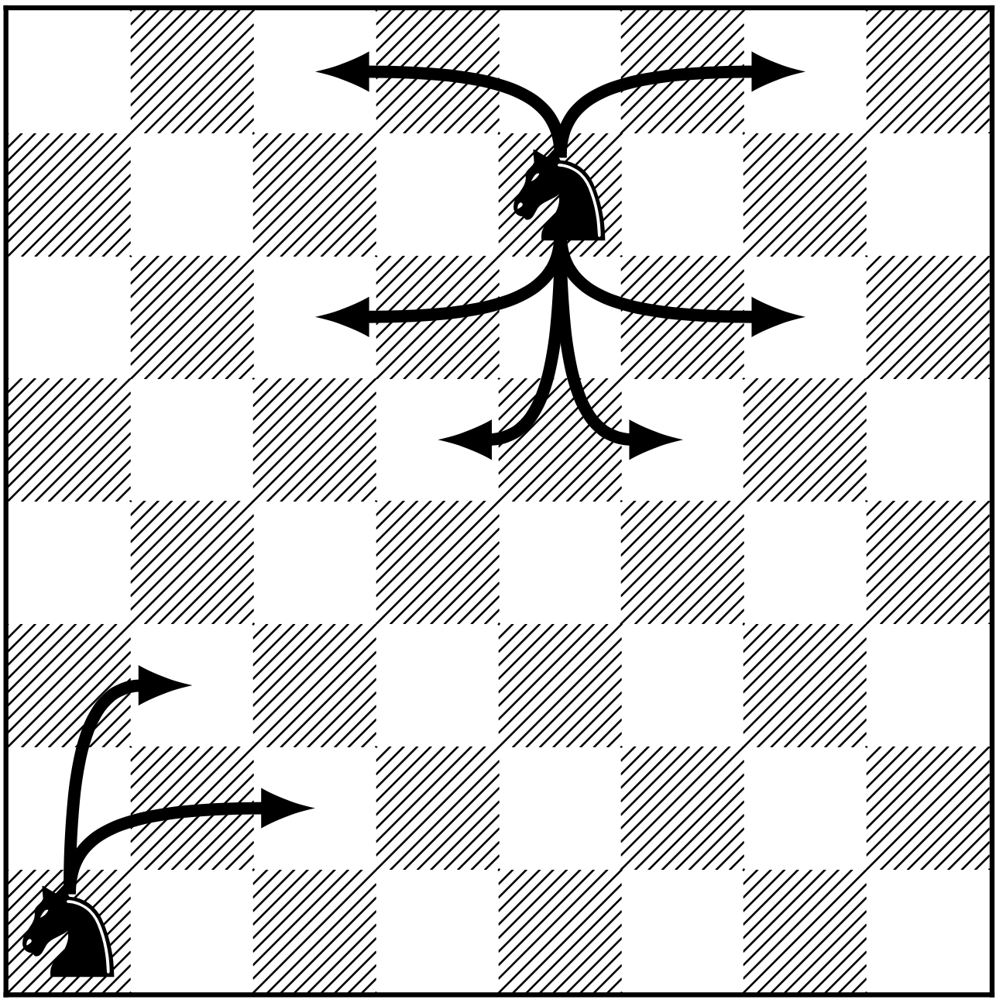

---
title:
output: 
  revealjs::revealjs_presentation:
    highlight: tango
    transition: none
    self_contained: false
    output_dir: '.'
    slide_level: 1
    css: presentation.css
    center: true
    # reveal_plugins: ["chalkboard"]
    reveal_options:
      controls: false
      slideNumber: true
      previewLinks: true
      progress: false
      # chalkboard:
      #   theme: whiteboard
      #   color: ['rgba(255, 0, 0, 0.3)'] # red
---
# Welcome to M362M <br> *Introduction to Stochastic Processes*

 ```{r echo=FALSE, fig.align = "center", out.width= "50%" }
knitr::include_graphics('../pics/jittered_walk_transp.png')
```


# What are Stochastic Processes?

---


**Question 1** In a simplistic model, the price of a  share of a stock goes either up or down by `$`1 each day, with equal probabilities (1/2).  

You own a single share whose value today is `$`100, so that its tomorrow's price will be either

-  `$`101 with probability $\frac{1}{2}$, or
-  `$`99 with probability $\frac{1}{2}$.

Your strategy is to hold onto your share until one of the following two things happen: you go bankrupt (the stock price hits 0), or you make a `$`50 dollar profit (the stock price hits `$`150.) 

---

1. How likely is it that your strategy will result in a profit?

2. How long will it take? 

3. Is it possible that it takes forever, i.e., that the stock price hovers beween `$`1 and `$`149 forever? 

---

**Question 2.** A person carrying a certain disease infects either $0$, $1$, $2$ or $4$ people in given week, with probability $1/4$, and then stops being infectious. Different infectious individuals may infect different numberss of people and behave independently of each other.

1. What is the probability that the disease will ever be eradicated?
2. What is the probability that every single individual in the  population of $328,000,000$ will eventually be infected?

---

**Question 3.** In a game of tennis, Player $1$ wins against Player $2$ in each rally with probability $p$. 

What is the probability that Player $1$ wins 

1. A game 
2. A set? The entire match?
3. Is the game of tennis set up in such a way that is *amplifies* or *reduces* the difference in skill between players?

---


**Question 4.** 
A knight starts in the lower left corner of the chess board and starts moving ``randomly''.

```{r echo=FALSE, fig.align = "center", out.width= "55%" }

```

--- 

1. What is the expected number of moves the knight will make before it returns to "square one"?

2. How about the same problem, but using a different chess piece? Which one do you think will come back is the smallest (expected) number of steps?

3. (\*) How about the same problem, but until *all* squares have been visited at least once?

---


**Question 5.** How does Google search work?


# Syllabus highlights

---

## Basic info


**Course number.** M362M (53875)

**Course meets.** online, TTh 12:30am - 2:00pm

**Flags.** QR (quantitative reasoning)

**Instructor.** Gordan Žitković

**Email.** Use Canvas to email

**Individual Office Hours.** Contact me for an appointment.

------------------------------------------------------------------------

## Prerequisites

- This course is all about probability. Please go on Canvas to assess your probability knowledge!

- Other than that, we will work with matrices, so some linear algebra is necessary, too. 

- Basics of R will be covered from scratch, but it would really help if you had some (not necessarily formal) programming experience. Nothing fancy, but you should understand the concept of a loop, if-then statement or a function. 

---

## Online resources.

1. **Zoom**. Transcripts of the lectures and chat logs will be available.

2. **Canvas** will be used to keep track of grades, host links and relay  announcements. Make sure that *Announcements* in your account's *Notification* menu are turned on.

3. **Piazza** will be used for class discussions. All questions about the material should be posted on Piazza first. I will check in regularly to answer questions. So will the grader if there is time. 

4. **Online lecture notes** written by the instructor will be provided. The link will appear on Canvas soon. All the materials (except for solutions to hw problems) are on Github, too. 

---

## Class format

- Lecture notes will be posted online, and reading assignments (with short "motivational" quizzed) assigned.

- No attendance is required.

- There will be no classical lecturing. Class time be used to answer questions, clarify concepts, etc. Think office hours, but only for questions about the material. 

- Use the Piazza tag `topic_suggestions` to suggest topics or problems for the following lecture. 

---

## Assessment

1. **Quizzes**. A short Canvas quiz will be assigned in parallel with each reading assignment. *Two* lowest quiz scores will be dropped. 

2. **Homework assignments.** A weekly or bi-weekly homework will be assigned (with the assignments
posted on Canvas). The submission will be **electronic**, through
Canvas. You will get detailed instructions on the proper format of your submissions soon.

You can work on your homework in groups of up to 4 people, 
and to submit a single document per group.  Do not forget to include the names of all group members.
*Two* lowest hw scores will be dropped.

---

3. **Exams.** There will be three longer, take-home exams. They will be designed to take not more than two hours, but you will get a 24-hour period for each of them. Here is the schedule:
    -  **In-term 1** : Oct 1
    -  **In-term 2** : Nov 12
    -  **In-term 3** : Dec 12 (date of the final exam)

---

## Extra credit

 - **2%**: if you give a correct answer to a student question on Piazza.  Each student can accumulate at most 6% extra credit this way.
 
   <class style="font-size: x-large;">
   *The instructor will choose the best among all the answers, and assign its author 2%. The instructor reserved the right not to assign any extra credit is the question is not meaningful or too easy, or is none of the answers is correct and/or complete.*
   </class>
 
 - **1%**: for each topic suggestion made on Piazza. 
 
    <class style="font-size: x-large;">*At most one person may get credit for a given suggestion, and the instructor will be the final arbiter of what deserves a point and what does not. Each student can accumulate at most 4% extra credit this way. *</class>


 - **5%**: if you submit all your homework in R markdown. This includes both theoretical and programming questions. 

---

## The final grade

|      Assignment      | Percentage of final grade |
|--------------------- |---------------------------|
| Quizzes              |           15%             |
| Homework             |           25%             |
| Exams                |      60% (20% each)       |

<br>

There is *no curve* in this class and the letter grades are assigned
according to the following table:

<br>


A | A-|  B+  | B | B- |  C+ | C |
---|---|---|---|---|---|---|
94 - 100| 90-94 |  86 - 90 |  83 - 86 | 80 - 83 | 75 - 80 | 70-75 |

 C- | D+ | D |  D- | 
---|---|---|---|---
 65 - 70 | 60 - 65 | 55 - 60 | 50 - 55 | 0 - 50

---

## Zoom etiquette

- Mute yourself unless you are speaking.
- Keep your camera on unless you have a good reason not to (bandwidth problems, 
  privacy concerns, etc.)
- Use your real name unless you are shy :)
- Be on time
- Keep chat messages relevant to the lesson

If you have any suggestions about additional rules we should adopt, feel free to post them on Piazza.

